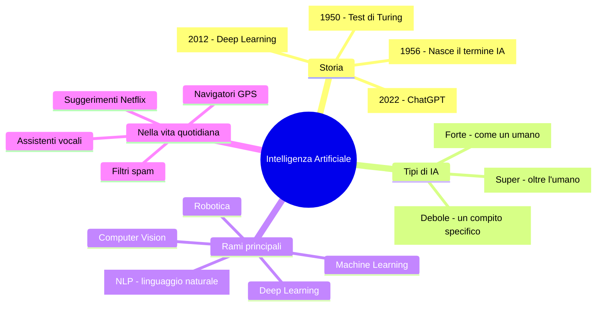

# Cos'è l'Intelligenza Artificiale

## Un computer che "pensa"?

Partiamo dalla domanda delle domande: **un computer può pensare?** Nel 1950 un certo Alan Turing (sì, quello del film "The Imitation Game") se lo chiese per primo. La risposta breve è: no, i computer non pensano davvero. Ma possono **imparare dai dati** e fare cose che *sembrano* intelligenti. E a volte lo fanno pure meglio di noi!

L'**Intelligenza Artificiale** (IA, o AI in inglese) è quel ramo dell'informatica che si occupa di creare programmi capaci di svolgere compiti che normalmente richiedono intelligenza umana: riconoscere volti, tradurre lingue, giocare a scacchi, guidare un'auto...

---

## Breve storia dell'IA

L'IA non è nata ieri! Ha una storia lunga e piena di alti e bassi:

| Anno | Evento | Cosa è successo |
|------|--------|-----------------|
| 1950 | Test di Turing | Turing propone: "se non distingui la macchina dall'umano, è intelligente" |
| 1956 | Conferenza di Dartmouth | Nasce ufficialmente il termine "Intelligenza Artificiale" |
| 1966 | ELIZA | Il primo chatbot! Simulava uno psicoterapeuta (male) |
| 1997 | Deep Blue vs Kasparov | Un computer IBM batte il campione mondiale di scacchi |
| 2011 | Siri | Apple lancia il primo assistente vocale mainstream |
| 2012 | Deep Learning boom | Le reti neurali profonde iniziano a spaccare tutto |
| 2016 | AlphaGo | L'IA di Google batte il campione mondiale di Go (gioco MOLTO più complesso degli scacchi) |
| 2022 | ChatGPT | OpenAI lancia il chatbot che cambia tutto. 100 milioni di utenti in 2 mesi! |

!!! tip "L'inverno dell'IA"

    Tra gli anni '70 e '90 ci sono stati i cosiddetti "inverni dell'IA": periodi in cui tutti pensavano che l'IA fosse un flop e i fondi venivano tagliati. Poi è arrivato il deep learning e... boom!

---

## Tipi di Intelligenza Artificiale

Non tutte le IA sono uguali. Si dividono in tre categorie:

| Tipo | Descrizione | Esiste oggi? |
|------|-------------|-------------|
| **IA Debole** (Narrow AI) | Sa fare UNA cosa bene (giocare a scacchi, riconoscere gatti nelle foto...) | Sì! È tutta l'IA che usiamo |
| **IA Forte** (General AI) | Sa fare TUTTO quello che fa un umano, con la stessa flessibilità | No, non ancora |
| **Super IA** (Super AI) | Più intelligente di qualsiasi umano in qualsiasi campo | Fantascienza (per ora!) |

Quando senti parlare di "IA" nel 2024, si parla **sempre** di IA Debole. ChatGPT? IA Debole (anche se sembra fortissimo). Alexa? IA Debole. Il filtro di Instagram? IA Debole. Nessuna offesa a loro, eh — fanno cose incredibili, ma ognuna è specializzata in un compito preciso.

---

## L'IA nella tua vita quotidiana

Sorpresa: usi l'IA **tutti i giorni** senza saperlo!

- **Spotify/YouTube**: "Consigliato per te" — un algoritmo di IA analizza cosa ascolti e suggerisce musica simile
- **Instagram/TikTok**: Il feed è ordinato dall'IA per mostrarti quello che ti tiene incollato allo schermo
- **Google Translate**: Traduce usando reti neurali (prima era pessimo, ora è quasi decente!)
- **Autocorrettore**: Prevede la parola successiva che stai per scrivere
- **Filtri facciali**: Riconoscimento facciale in tempo reale
- **Videogiochi**: I nemici che ti inseguono usano algoritmi di IA
- **ChatGPT & co.**: Generano testo, codice, immagini...

---

## Il Test di Turing

L'idea di Turing era semplice: metti un umano a chattare con qualcuno (o qualcosa). Se dopo la conversazione non riesce a capire se stava parlando con un umano o con un computer, allora il computer ha "superato il test".

Proviamo a creare un chatbot semplicissimo basato su **regole if/elif**. Vedrai subito i limiti di questo approccio:

```pyodide
def chatbot(messaggio):
    messaggio = messaggio.lower().strip()

    if "ciao" in messaggio or "salve" in messaggio:
        return "Ciao! Come stai?"
    elif "come stai" in messaggio:
        return "Bene grazie! E tu?"
    elif "nome" in messaggio:
        return "Mi chiamo BottiBot 3000!"
    elif "tempo" in messaggio or "meteo" in messaggio:
        return "Non ho finestre, ma spero ci sia il sole!"
    elif "scuola" in messaggio:
        return "La scuola è importante! Soprattutto informatica"
    elif "musica" in messaggio:
        return "Mi piace il rock! (in realtà non ho orecchie)"
    elif "calcio" in messaggio or "sport" in messaggio:
        return "Non ho gambe, ma tifo per tutti!"
    elif "grazie" in messaggio:
        return "Di niente! Sono qui per aiutarti."
    elif "addio" in messaggio or "ciao ciao" in messaggio:
        return "Arrivederci! A presto!"
    else:
        return "Hmm, non ho capito. Prova a dirlo in un altro modo!"

# Prova il chatbot!
while True:
    frase = input("Tu: ")
    if frase.lower() in ["esci", "quit", "exit"]:
        print("BottiBot: Ciao ciao!")
        break
    risposta = chatbot(frase)
    print(f"BottiBot: {risposta}")
```

!!! warning "I limiti del chatbot a regole"

    Hai notato? Basta scrivere qualcosa di non previsto e il chatbot va in tilt. Con 10 regole gestisci 10 situazioni. Con 1000 regole ne gestisci 1000. Ma il linguaggio umano è **infinito**! Ecco perché servono approcci diversi... tipo il **Machine Learning** (prossimo capitolo!).

---

## IA vs Automazione: non confondiamole

Un errore comune è confondere l'IA con la semplice automazione:

| Automazione | Intelligenza Artificiale |
|-------------|------------------------|
| Segue regole fisse | Impara dai dati |
| Fa sempre la stessa cosa | Si adatta a situazioni nuove |
| "Se piove, apri l'ombrello" | "Guarda le nuvole e prevedi se pioverà" |
| Lavatrice | Riconoscimento facciale |

Il chatbot che abbiamo scritto sopra è **automazione** (regole fisse), non vera IA. Un chatbot come ChatGPT invece è IA: ha *imparato* da miliardi di testi come rispondere.

---

## Come funziona l'IA (in breve)

Il segreto dell'IA moderna si riassume in tre parole: **dati, algoritmi, potenza di calcolo**.

1. **Dati**: Tonnellate di esempi da cui imparare (foto di gatti, testi, partite di scacchi...)
2. **Algoritmi**: Le "ricette" matematiche che permettono alla macchina di trovare pattern nei dati
3. **Potenza di calcolo**: Servono computer potentissimi (soprattutto GPU) per elaborare tutti quei dati

```pyodide
# Un esempio semplicissimo: l'IA "impara" una regola
# Questi sono i nostri "dati di addestramento"
ore_studio = [1, 2, 3, 4, 5, 6, 7, 8]
voti =       [3, 4, 5, 6, 6, 7, 8, 9]

# L'IA deve "scoprire" la relazione tra ore di studio e voti
# Proviamo a trovare la formula: voto = ore_studio * ??? + ???
# (Spoiler: lo faremo per davvero nei prossimi capitoli!)

print("Ore di studio -> Voto")
print("-" * 25)
for ore, voto in zip(ore_studio, voti):
    print(f"    {ore} ore      ->  {voto}")

print("\nSe studio 10 ore, che voto prendero'?")
print("(Lo scopriremo con la regressione lineare!)")
```

---

## I rami dell'IA

L'IA è un campo enorme. Ecco le aree principali che esploreremo:

- **Machine Learning**: La macchina impara dai dati (è il cuore di questa sezione!)
- **Deep Learning**: Machine Learning con reti neurali profonde (tipo quelle di ChatGPT)
- **Computer Vision**: Riconoscere oggetti nelle immagini
- **Natural Language Processing (NLP)**: Capire e generare il linguaggio umano
- **Robotica**: Robot che interagiscono con il mondo fisico

Noi ci concentreremo sul **Machine Learning**: è la base di tutto il resto e si può imparare (e provare!) anche senza supercomputer.

---

## Mappa concettuale



---

## Esercizi

### Esercizio 1: IA o non IA?

Per ognuno di questi scenari, decidi se si tratta di IA o semplice automazione e stampa il risultato:

```pyodide
scenari = [
    "Un termostato che accende il riscaldamento sotto i 18 gradi",
    "Spotify che ti consiglia una playlist personalizzata",
    "Un semaforo che diventa verde ogni 60 secondi",
    "Google Foto che riconosce il tuo volto nelle foto",
    "Una sveglia che suona alle 7:00",
    "Gmail che filtra le email di spam",
]

# Per ogni scenario, stampa se e' IA o automazione e perche'

```

### Esercizio 2: Migliora il chatbot

Aggiungi almeno 5 nuove regole al chatbot per renderlo più "intelligente". Prova ad aggiungere risposte su argomenti che ti interessano!

```pyodide
def chatbot_migliorato(messaggio):
    messaggio = messaggio.lower().strip()

    if "ciao" in messaggio:
        return "Ciao! Come stai?"
    # Aggiungi le tue regole qui!

    else:
        return "Non ho capito, scusa!"

# Testa il tuo chatbot migliorato
frase = input("Tu: ")
print(f"Bot: {chatbot_migliorato(frase)}")
```

### Esercizio 3: Timeline dell'IA

Crea un dizionario con almeno 5 eventi importanti nella storia dell'IA e stampali in ordine cronologico:

```pyodide
# Crea un dizionario anno -> evento
storia_ia = {}

# Aggiungi almeno 5 eventi

# Stampa la timeline in ordine cronologico

```
