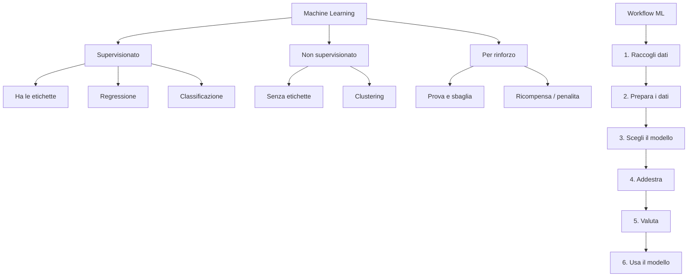

# Machine Learning

## Da "fai così" a "impara da solo"

Nella programmazione tradizionale, **tu** scrivi le regole: "se il voto è maggiore di 6, lo studente è promosso". Il computer esegue le tue istruzioni alla lettera, senza capire nulla.

Con il **Machine Learning** (apprendimento automatico) il gioco cambia completamente: invece di scrivere le regole, **dai al computer un sacco di esempi** e lui si trova le regole da solo!

```text
Programmazione tradizionale:
  REGOLE + DATI  →  [Computer]  →  RISULTATI

Machine Learning:
  DATI + RISULTATI  →  [Computer]  →  REGOLE
```

Tipo: invece di spiegare al computer cos'è un gatto ("ha le orecchie a punta, i baffi, la coda..."), gli mostri 10.000 foto di gatti e 10.000 foto di non-gatti. E lui *impara* da solo a riconoscerli. Magia? No, matematica!

---

## I tre tipi di apprendimento

Il Machine Learning si divide in tre grandi famiglie, a seconda di come il computer impara:

### 1. Apprendimento supervisionato (Supervised Learning)

Il computer impara da esempi **con le risposte già date**. Tipo studiare con il libro delle soluzioni!

- **Input**: dati + etichette (le risposte corrette)
- **Obiettivo**: imparare a predire l'etichetta per dati nuovi
- **Esempi**: prevedere il prezzo di una casa, riconoscere se una email è spam, diagnosticare malattie

### 2. Apprendimento non supervisionato (Unsupervised Learning)

Il computer deve **trovare pattern da solo**, senza risposte. Tipo ordinare i calzini nel cassetto senza che nessuno ti dica come raggruppali!

- **Input**: dati senza etichette
- **Obiettivo**: trovare strutture nascoste nei dati
- **Esempi**: raggruppare clienti simili, comprimere immagini, trovare anomalie

### 3. Apprendimento per rinforzo (Reinforcement Learning)

Il computer impara **per tentativi ed errori**, tipo un videogioco: se fa bene prende un premio, se fa male prende una penalità. Come insegnare dei trick al cane con i biscottini!

- **Input**: un ambiente e delle regole
- **Obiettivo**: massimizzare il premio totale
- **Esempi**: IA che gioca a videogiochi, auto a guida autonoma, robot che camminano

| Tipo | Metafora | Ha le risposte? | Esempio |
|------|----------|----------------|---------|
| Supervisionato | Studiare con le soluzioni | Sì | Prevedere voti |
| Non supervisionato | Ordinare i calzini | No | Raggruppare clienti |
| Rinforzo | Imparare un videogioco | Solo feedback (premio/penalità) | AlphaGo |

---

## Il concetto di "modello"

Quando il computer "impara" dai dati, quello che produce è un **modello**: una specie di "formula" che trasforma gli input in output. Pensa al modello come a una funzione matematica che il computer ha scoperto da solo.

```pyodide
# Esempio: il computer ha "imparato" che
# il voto è circa uguale a (ore_studio * 0.8 + 2)
# Questo È il modello!

def modello(ore_studio):
    return ore_studio * 0.8 + 2

# Proviamolo!
for ore in range(1, 11):
    voto_previsto = modello(ore)
    print(f"Se studi {ore} ore → voto previsto: {voto_previsto:.1f}")
```

!!! tip "Ma da dove salta fuori 0.8 e 2?"

    Il computer li ha trovati analizzando i dati! Nei prossimi capitoli vedrai COME fa a trovarli. Per ora ricorda: il modello è una "formula" che il computer scopre dai dati di esempio.

---

## Dataset, Features e Labels

Prima di far imparare un modello, servono i **dati**. E i dati nel ML hanno un vocabolario preciso:

- **Dataset**: la tabella completa di tutti gli esempi (tipo un foglio Excel)
- **Features** (caratteristiche): le colonne di INPUT, le informazioni che il modello usa per fare previsioni
- **Label** (etichetta): la colonna di OUTPUT, quello che il modello deve prevedere
- **Sample** (campione): una singola riga del dataset

Esempio con i dati di uno studente:

| Ore studio | Assenze | Voto precedente | **Voto finale** |
|-----------|---------|----------------|-----------------|
| 5 | 2 | 7 | **7** |
| 8 | 0 | 8 | **9** |
| 2 | 10 | 5 | **4** |
| 6 | 3 | 6 | **6** |

In questa tabella:

- **Features**: Ore studio, Assenze, Voto precedente (le colonne che usiamo per prevedere)
- **Label**: Voto finale (quello che vogliamo prevedere)
- **Samples**: le 4 righe (4 studenti)
- **Dataset**: tutta la tabella

```pyodide
# Creiamo il dataset come liste Python
# Ogni studente: [ore_studio, assenze, voto_precedente]
features = [
    [5, 2, 7],
    [8, 0, 8],
    [2, 10, 5],
    [6, 3, 6],
    [7, 1, 7],
    [3, 8, 4],
    [9, 0, 9],
    [4, 5, 6],
]

# Le etichette (voti finali)
labels = [7, 9, 4, 6, 8, 4, 9, 5]

# Stampa il dataset in modo leggibile
print(f"{'Ore':>4} {'Ass':>4} {'Prec':>5} {'Voto':>5}")
print("-" * 22)
for feat, lab in zip(features, labels):
    print(f"{feat[0]:>4} {feat[1]:>4} {feat[2]:>5} {lab:>5}")

print(f"\nNumero di campioni: {len(features)}")
print(f"Numero di features: {len(features[0])}")
```

---

## Training set e Test set

Ecco una regola d'oro del ML: **non puoi testare il modello sugli stessi dati con cui l'hai addestrato!**

Perché? Tipo a scuola: se il prof ti dà l'esame con le stesse identiche domande del libro di esercizi, non sta testando se hai CAPITO, ma solo se hai MEMORIZZATO. L'esame vero deve avere domande NUOVE.

Per questo si dividono i dati in:

- **Training set** (~80%): i dati su cui il modello impara
- **Test set** (~20%): i dati su cui verifichiamo quanto ha imparato

```pyodide
# I nostri dati
dati = [
    {"ore": 5, "assenze": 2, "voto_prec": 7, "voto": 7},
    {"ore": 8, "assenze": 0, "voto_prec": 8, "voto": 9},
    {"ore": 2, "assenze": 10, "voto_prec": 5, "voto": 4},
    {"ore": 6, "assenze": 3, "voto_prec": 6, "voto": 6},
    {"ore": 7, "assenze": 1, "voto_prec": 7, "voto": 8},
    {"ore": 3, "assenze": 8, "voto_prec": 4, "voto": 4},
    {"ore": 9, "assenze": 0, "voto_prec": 9, "voto": 9},
    {"ore": 4, "assenze": 5, "voto_prec": 6, "voto": 5},
    {"ore": 1, "assenze": 12, "voto_prec": 4, "voto": 3},
    {"ore": 6, "assenze": 2, "voto_prec": 7, "voto": 7},
]

# Dividiamo: 80% training, 20% test
punto_taglio = int(len(dati) * 0.8)
training = dati[:punto_taglio]
test = dati[punto_taglio:]

print(f"Dataset totale: {len(dati)} campioni")
print(f"Training set:   {len(training)} campioni ({len(training)/len(dati)*100:.0f}%)")
print(f"Test set:       {len(test)} campioni ({len(test)/len(dati)*100:.0f}%)")

print("\n📚 Training set:")
for d in training:
    print(f"  Ore={d['ore']}, Ass={d['assenze']}, Prec={d['voto_prec']} → Voto={d['voto']}")

print("\n📝 Test set:")
for d in test:
    print(f"  Ore={d['ore']}, Ass={d['assenze']}, Prec={d['voto_prec']} → Voto={d['voto']}")
```

---

## Il workflow del Machine Learning

Ogni progetto ML segue più o meno gli stessi passi:

1. **Raccogli i dati** — il "carburante" del ML
2. **Prepara i dati** — puliscili, normalizzali, dividili in train/test
3. **Scegli un modello** — quale algoritmo usare? (KNN, albero di decisione, rete neurale...)
4. **Addestra il modello** — fallo imparare dal training set
5. **Valuta il modello** — quanto è bravo sul test set?
6. **Usa il modello** — fai previsioni su dati nuovi!

```text
  Dati ──→ Preparazione ──→ Training ──→ Valutazione ──→ Previsioni
   │                           │              │
   │                    Training set      Test set
   └──────── Split ────────────┘              │
                                              ↓
                                       "Quanto è bravo?"
```

Nei prossimi capitoli seguiremo questo workflow passo per passo. Pronti?

---

## Mappa concettuale



---

## Esercizi

### Esercizio 1: Classifica il tipo di apprendimento

Per ognuno di questi problemi, stampa se si tratta di apprendimento supervisionato, non supervisionato o per rinforzo:

```pyodide
problemi = [
    "Prevedere se pioverà domani basandosi sui dati meteo storici",
    "Raggruppare le canzoni di Spotify per genere senza etichette",
    "Insegnare a un drone a volare evitando ostacoli",
    "Riconoscere le cifre scritte a mano (con immagini etichettate)",
    "Trovare gruppi di clienti simili in un negozio online",
    "Allenare un'IA a giocare a Mario Kart",
]

# Per ogni problema, stampa il tipo di apprendimento e perché

```

??? success "Soluzione"

    ```pyodide
    problemi = [
        ("Prevedere se pioverà domani basandosi sui dati meteo storici", "Supervisionato", "ha dati etichettati (pioggia si/no)"),
        ("Raggruppare le canzoni di Spotify per genere senza etichette", "Non supervisionato", "nessuna etichetta, trova gruppi"),
        ("Insegnare a un drone a volare evitando ostacoli", "Per rinforzo", "impara per tentativi ed errori"),
        ("Riconoscere le cifre scritte a mano (con immagini etichettate)", "Supervisionato", "ha le etichette delle cifre"),
        ("Trovare gruppi di clienti simili in un negozio online", "Non supervisionato", "clustering senza etichette"),
        ("Allenare un'IA a giocare a Mario Kart", "Per rinforzo", "impara giocando e ricevendo premi"),
    ]
    for problema, tipo, motivo in problemi:
        print(f"- {problema}")
        print(f"  -> {tipo}: {motivo}\n")
    ```

### Esercizio 2: Crea un dataset

Crea un dataset (come lista di dizionari) con almeno 8 studenti. Ogni studente deve avere: ore di studio, partecipazione (1-10), voto. Poi dividilo in training e test set.

```pyodide
# Crea il dataset

# Dividi in training (80%) e test (20%)

# Stampa entrambi i set

```

??? success "Soluzione"

    ```pyodide
    studenti = [
        {"ore_studio": 5, "partecipazione": 8, "voto": 8},
        {"ore_studio": 2, "partecipazione": 4, "voto": 5},
        {"ore_studio": 7, "partecipazione": 9, "voto": 9},
        {"ore_studio": 1, "partecipazione": 3, "voto": 4},
        {"ore_studio": 4, "partecipazione": 7, "voto": 7},
        {"ore_studio": 6, "partecipazione": 8, "voto": 8},
        {"ore_studio": 3, "partecipazione": 5, "voto": 6},
        {"ore_studio": 8, "partecipazione": 10, "voto": 10},
        {"ore_studio": 2, "partecipazione": 6, "voto": 5},
        {"ore_studio": 5, "partecipazione": 7, "voto": 7},
    ]
    split = int(len(studenti) * 0.8)
    training = studenti[:split]
    test = studenti[split:]
    print(f"Training set ({len(training)} studenti):")
    for s in training:
        print(f"  {s}")
    print(f"\nTest set ({len(test)} studenti):")
    for s in test:
        print(f"  {s}")
    ```

### Esercizio 3: Trova il pattern

Il computer ha analizzato questi dati e ha trovato un pattern. Riesci a scoprirlo anche tu? Scrivi la formula!

```pyodide
# Input → Output (il computer ha scoperto la regola)
dati = [
    (1, 5),
    (2, 8),
    (3, 11),
    (4, 14),
    (5, 17),
    (6, 20),
]

print("Input → Output")
for x, y in dati:
    print(f"  {x}    →  {y}")

# Che formula collega input e output?
# Scrivi la funzione e testa con input = 10

def formula(x):
    pass  # Scrivi la formula qui!

# Test
# print(f"Se input = 10 → output = {formula(10)}")
```

??? success "Soluzione"

    ```pyodide
    dati = [(1, 5), (2, 8), (3, 11), (4, 14), (5, 17), (6, 20)]
    print("Input -> Output")
    for x, y in dati:
        print(f"  {x}    ->  {y}")

    def formula(x):
        return 3 * x + 2

    print(f"\nLa formula e': y = 3x + 2")
    print(f"Se input = 10 -> output = {formula(10)}")
    print(f"Verifica: {formula(1)} {formula(2)} {formula(3)}")
    ```
