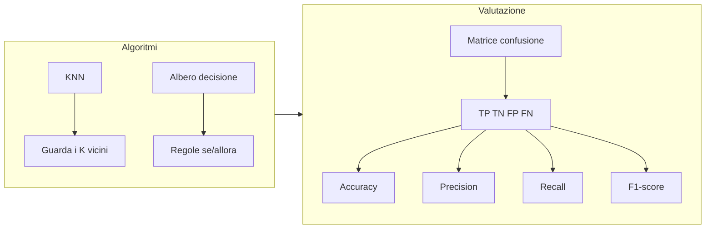

# Classificazione

## Mettere le cose nei cassetti giusti

Con la regressione prevediamo un **numero** (il voto, il prezzo...). Con la classificazione prevediamo una **categoria**: spam o non spam? Gatto o cane? Promosso o bocciato?

È tipo il gioco "indovina chi": in base alle caratteristiche, il modello decide a quale gruppo appartiene un dato.

---

## K-Nearest Neighbors (KNN)

Il KNN è l'algoritmo di classificazione più intuitivo che esiste. L'idea: **dimmi chi sono i tuoi vicini e ti dirò chi sei**.

Come funziona:

1. Hai un nuovo punto da classificare
2. Guardi i **K punti più vicini** nel training set
3. La categoria più comune tra quei K vicini vince!

Tipo: se ti trasferisci in una nuova classe e i 3 compagni più vicini a te sono tutti fan del basket, il KNN direbbe "anche tu sei fan del basket"!

```pyodide install="numpy,matplotlib"
import numpy as np
import matplotlib.pyplot as plt

np.random.seed(42)

# Due gruppi di studenti: promossi (1) e bocciati (0)
# Feature 1: ore di studio, Feature 2: voto precedente
promossi_x = np.random.normal(7, 1.2, 30)
promossi_y = np.random.normal(7.5, 1, 30)
bocciati_x = np.random.normal(3, 1.2, 30)
bocciati_y = np.random.normal(4.5, 1, 30)

plt.figure(figsize=(8, 6))
plt.scatter(promossi_x, promossi_y, c='green', label='Promossi', alpha=0.7, s=60)
plt.scatter(bocciati_x, bocciati_y, c='red', label='Bocciati', alpha=0.7, s=60)

# Nuovo studente da classificare
nuovo_x, nuovo_y = 5, 6
plt.scatter(nuovo_x, nuovo_y, c='blue', marker='*', s=300, zorder=5, label='Nuovo studente')

plt.xlabel('Ore di studio')
plt.ylabel('Voto precedente')
plt.title('KNN: chi sono i vicini del nuovo studente?')
plt.legend()
plt.grid(True, alpha=0.3)
plt.show()

print(f"Il nuovo studente studia {nuovo_x} ore e ha voto precedente {nuovo_y}")
print("Secondo te, sara' promosso o bocciato?")
```

### KNN con scikit-learn

```pyodide install="scikit-learn,numpy"
import numpy as np
from sklearn.neighbors import KNeighborsClassifier
from sklearn.model_selection import train_test_split
from sklearn.metrics import accuracy_score

np.random.seed(42)

# Creiamo il dataset
n = 100
ore = np.concatenate([np.random.normal(7, 1.5, n//2), np.random.normal(3, 1.5, n//2)])
voti_prec = np.concatenate([np.random.normal(7.5, 1, n//2), np.random.normal(4.5, 1, n//2)])
etichette = np.array([1] * (n//2) + [0] * (n//2))  # 1=promosso, 0=bocciato

X = np.column_stack([ore, voti_prec])
y = etichette

# Split
X_train, X_test, y_train, y_test = train_test_split(X, y, test_size=0.2, random_state=42)

# KNN con K=5
knn = KNeighborsClassifier(n_neighbors=5)
knn.fit(X_train, y_train)

# Previsioni
y_pred = knn.predict(X_test)
acc = accuracy_score(y_test, y_pred)

print(f"Accuracy: {acc:.2%}")
print(f"\nPrevisioni vs Realta':")
for i in range(len(y_test)):
    stato_pred = "Promosso" if y_pred[i] == 1 else "Bocciato"
    stato_vero = "Promosso" if y_test[i] == 1 else "Bocciato"
    ok = "OK" if y_pred[i] == y_test[i] else "SBAGLIATO"
    print(f"  Previsto: {stato_pred:10} | Vero: {stato_vero:10} | {ok}")
```

---

## Alberi di decisione

Un albero di decisione è tipo il **gioco delle 20 domande**: fa una serie di domande sì/no sui dati e arriva a una decisione.

Per esempio:

```text
Ore di studio > 5?
├── Sì → Voto precedente > 6?
│        ├── Sì → PROMOSSO
│        └── No → BOCCIATO
└── No → BOCCIATO
```

Semplice, leggibile, intuitivo! Ecco perché gli alberi di decisione sono così popolari.

```pyodide install="scikit-learn,numpy"
import numpy as np
from sklearn.tree import DecisionTreeClassifier
from sklearn.model_selection import train_test_split
from sklearn.metrics import accuracy_score

np.random.seed(42)

# Dataset
n = 100
ore = np.concatenate([np.random.normal(7, 1.5, n//2), np.random.normal(3, 1.5, n//2)])
voti_prec = np.concatenate([np.random.normal(7.5, 1, n//2), np.random.normal(4.5, 1, n//2)])
etichette = np.array([1] * (n//2) + [0] * (n//2))

X = np.column_stack([ore, voti_prec])
y = etichette
X_train, X_test, y_train, y_test = train_test_split(X, y, test_size=0.2, random_state=42)

# Albero di decisione
albero = DecisionTreeClassifier(max_depth=3, random_state=42)
albero.fit(X_train, y_train)

y_pred = albero.predict(X_test)
acc = accuracy_score(y_test, y_pred)

print(f"Accuracy albero: {acc:.2%}")
print(f"\nFeature importances:")
print(f"  Ore di studio:    {albero.feature_importances_[0]:.2%}")
print(f"  Voto precedente:  {albero.feature_importances_[1]:.2%}")
print("\nL'albero ci dice anche QUALI features contano di piu'!")
```

!!! tip "Feature importance"

    Un vantaggio degli alberi: ti dicono **quali features sono più importanti**! Nell'esempio sopra puoi vedere se contano di più le ore di studio o il voto precedente.

---

## Matrice di confusione

La matrice di confusione è una tabella che mostra DOVE il modello sbaglia. Fondamentale per capire se il modello ha dei punti deboli:

```text
                  Previsto
               Bocciato  Promosso
Reale Bocciato [  TN   |   FP   ]    TN = Veri Negativi (giusto!)
      Promosso [  FN   |   TP   ]    TP = Veri Positivi (giusto!)
                                      FP = Falsi Positivi (errore!)
                                      FN = Falsi Negativi (errore!)
```

```pyodide install="scikit-learn,numpy"
import numpy as np
from sklearn.neighbors import KNeighborsClassifier
from sklearn.model_selection import train_test_split
from sklearn.metrics import confusion_matrix, accuracy_score

np.random.seed(42)

# Dataset
n = 200
ore = np.concatenate([np.random.normal(7, 1.5, n//2), np.random.normal(3, 1.5, n//2)])
voti_prec = np.concatenate([np.random.normal(7.5, 1, n//2), np.random.normal(4.5, 1, n//2)])
etichette = np.array([1] * (n//2) + [0] * (n//2))

X = np.column_stack([ore, voti_prec])
y = etichette
X_train, X_test, y_train, y_test = train_test_split(X, y, test_size=0.2, random_state=42)

knn = KNeighborsClassifier(n_neighbors=5)
knn.fit(X_train, y_train)
y_pred = knn.predict(X_test)

# Matrice di confusione
cm = confusion_matrix(y_test, y_pred)

print("Matrice di confusione:")
print(f"              Previsto")
print(f"             Bocc  Prom")
print(f"Vero Bocc  [{cm[0][0]:4} {cm[0][1]:4} ]")
print(f"     Prom  [{cm[1][0]:4} {cm[1][1]:4} ]")
print(f"\nAccuracy: {accuracy_score(y_test, y_pred):.2%}")
print(f"Errori totali: {cm[0][1] + cm[1][0]} su {len(y_test)}")
```

---

## Accuracy, Precision, Recall

L'accuracy non basta! Immagina un filtro anti-spam:

- **Accuracy**: quante email hai classificato correttamente in totale
- **Precision**: di quelle che hai marcato come spam, quante lo erano DAVVERO? (Se è bassa, stai buttando email buone nello spam!)
- **Recall**: di tutte le email spam, quante ne hai beccate? (Se è basso, lo spam passa!)

```pyodide install="scikit-learn,numpy"
import numpy as np
from sklearn.neighbors import KNeighborsClassifier
from sklearn.model_selection import train_test_split
from sklearn.metrics import accuracy_score, precision_score, recall_score, f1_score

np.random.seed(42)

n = 200
ore = np.concatenate([np.random.normal(7, 1.5, n//2), np.random.normal(3, 1.5, n//2)])
voti_prec = np.concatenate([np.random.normal(7.5, 1, n//2), np.random.normal(4.5, 1, n//2)])
etichette = np.array([1] * (n//2) + [0] * (n//2))

X = np.column_stack([ore, voti_prec])
y = etichette
X_train, X_test, y_train, y_test = train_test_split(X, y, test_size=0.2, random_state=42)

knn = KNeighborsClassifier(n_neighbors=5)
knn.fit(X_train, y_train)
y_pred = knn.predict(X_test)

print("Metriche di classificazione:")
print(f"  Accuracy:  {accuracy_score(y_test, y_pred):.2%}  (% corrette totali)")
print(f"  Precision: {precision_score(y_test, y_pred):.2%}  (% di promossi previsti che lo sono davvero)")
print(f"  Recall:    {recall_score(y_test, y_pred):.2%}  (% di promossi veri che abbiamo trovato)")
print(f"  F1-score:  {f1_score(y_test, y_pred):.2%}  (media armonica di precision e recall)")
```

| Metrica | Domanda che risponde | Quando e' importante |
|---------|---------------------|---------------------|
| Accuracy | Quante ne ho azzeccate in totale? | Quando le classi sono bilanciate |
| Precision | Quanti dei "positivi" previsti sono veri? | Quando i falsi positivi costano caro |
| Recall | Quanti dei veri positivi ho trovato? | Quando i falsi negativi costano caro |
| F1-score | Compromesso tra precision e recall | Quando vuoi bilanciare entrambi |

---

## Confronto: KNN vs Albero di decisione

```pyodide install="scikit-learn,numpy"
import numpy as np
from sklearn.neighbors import KNeighborsClassifier
from sklearn.tree import DecisionTreeClassifier
from sklearn.model_selection import train_test_split
from sklearn.metrics import accuracy_score

np.random.seed(42)

n = 200
ore = np.concatenate([np.random.normal(7, 1.5, n//2), np.random.normal(3, 1.5, n//2)])
voti_prec = np.concatenate([np.random.normal(7.5, 1, n//2), np.random.normal(4.5, 1, n//2)])
etichette = np.array([1] * (n//2) + [0] * (n//2))

X = np.column_stack([ore, voti_prec])
y = etichette
X_train, X_test, y_train, y_test = train_test_split(X, y, test_size=0.2, random_state=42)

# KNN
knn = KNeighborsClassifier(n_neighbors=5)
knn.fit(X_train, y_train)
acc_knn = accuracy_score(y_test, knn.predict(X_test))

# Albero
albero = DecisionTreeClassifier(max_depth=3, random_state=42)
albero.fit(X_train, y_train)
acc_albero = accuracy_score(y_test, albero.predict(X_test))

print("Confronto modelli:")
print(f"  KNN (K=5):                {acc_knn:.2%}")
print(f"  Albero (max_depth=3):     {acc_albero:.2%}")

if acc_knn > acc_albero:
    print("\nKNN vince questa volta!")
elif acc_albero > acc_knn:
    print("\nL'albero vince questa volta!")
else:
    print("\nPareggio!")

print("\nNota: il risultato dipende dai dati e dai parametri.")
print("Non esiste un modello 'sempre migliore'!")
```

---

## Mappa concettuale



---

## Esercizi

### Esercizio 1: Classificatore KNN

Crea un dataset di 150 studenti con 3 features (ore_studio, assenze, media_precedente) e una label (promosso/bocciato). Addestra un KNN e calcola accuracy, precision e recall.

```pyodide install="scikit-learn,numpy"
import numpy as np
from sklearn.neighbors import KNeighborsClassifier
from sklearn.model_selection import train_test_split
from sklearn.metrics import accuracy_score, precision_score, recall_score

np.random.seed(42)

# Crea il dataset

# Addestra KNN

# Calcola e stampa le metriche

```

??? success "Soluzione"

    ```pyodide install="scikit-learn,numpy"
    import numpy as np
    from sklearn.neighbors import KNeighborsClassifier
    from sklearn.model_selection import train_test_split
    from sklearn.metrics import accuracy_score, precision_score, recall_score
    np.random.seed(42)
    n = 150
    ore = np.random.uniform(0, 10, n)
    assenze = np.random.randint(0, 30, n)
    media = np.random.uniform(3, 10, n)
    promosso = ((ore > 4) & (assenze < 15) & (media > 5.5)).astype(int)
    X = np.column_stack([ore, assenze, media])
    y = promosso
    X_train, X_test, y_train, y_test = train_test_split(X, y, test_size=0.2, random_state=42)
    knn = KNeighborsClassifier(n_neighbors=5)
    knn.fit(X_train, y_train)
    y_pred = knn.predict(X_test)
    print(f"Accuracy:  {accuracy_score(y_test, y_pred):.3f}")
    print(f"Precision: {precision_score(y_test, y_pred):.3f}")
    print(f"Recall:    {recall_score(y_test, y_pred):.3f}")
    ```

### Esercizio 2: Scegliere K

Prova KNN con diversi valori di K (1, 3, 5, 7, 9, 11) e trova quello che dà l'accuracy migliore sul test set.

```pyodide install="scikit-learn,numpy"
import numpy as np
from sklearn.neighbors import KNeighborsClassifier
from sklearn.model_selection import train_test_split
from sklearn.metrics import accuracy_score

np.random.seed(42)

# Crea un dataset

# Prova diversi K e stampa i risultati

# Qual e' il K migliore?

```

??? success "Soluzione"

    ```pyodide install="scikit-learn,numpy"
    import numpy as np
    from sklearn.neighbors import KNeighborsClassifier
    from sklearn.model_selection import train_test_split
    from sklearn.metrics import accuracy_score
    np.random.seed(42)
    n = 150
    X = np.random.rand(n, 3) * 10
    y = (X[:, 0] + X[:, 1] > 10).astype(int)
    X_train, X_test, y_train, y_test = train_test_split(X, y, test_size=0.2, random_state=42)
    migliore_k = 1
    migliore_acc = 0
    print("K  | Accuracy")
    print("---|--------")
    for k in [1, 3, 5, 7, 9, 11]:
        knn = KNeighborsClassifier(n_neighbors=k)
        knn.fit(X_train, y_train)
        acc = accuracy_score(y_test, knn.predict(X_test))
        print(f"{k:2d} | {acc:.3f}")
        if acc > migliore_acc:
            migliore_acc = acc
            migliore_k = k
    print(f"\nMigliore: K={migliore_k} con accuracy={migliore_acc:.3f}")
    ```

### Esercizio 3: Albero vs KNN

Confronta un albero di decisione e un KNN sullo stesso dataset. Prova diversi parametri (max_depth per l'albero, n_neighbors per KNN) e crea una tabella dei risultati.

```pyodide install="scikit-learn,numpy"
import numpy as np
from sklearn.neighbors import KNeighborsClassifier
from sklearn.tree import DecisionTreeClassifier
from sklearn.model_selection import train_test_split
from sklearn.metrics import accuracy_score

np.random.seed(42)

# Crea il dataset

# Prova diverse combinazioni di parametri

# Stampa una tabella con i risultati

```

??? success "Soluzione"

    ```pyodide install="scikit-learn,numpy"
    import numpy as np
    from sklearn.neighbors import KNeighborsClassifier
    from sklearn.tree import DecisionTreeClassifier
    from sklearn.model_selection import train_test_split
    from sklearn.metrics import accuracy_score
    np.random.seed(42)
    n = 200
    X = np.random.rand(n, 3) * 10
    y = (X[:, 0] * 0.5 + X[:, 1] * 0.3 + X[:, 2] * 0.2 > 5).astype(int)
    X_train, X_test, y_train, y_test = train_test_split(X, y, test_size=0.2, random_state=42)
    print("Modello              | Parametro      | Accuracy")
    print("---------------------|----------------|--------")
    for k in [3, 5, 7]:
        knn = KNeighborsClassifier(n_neighbors=k)
        knn.fit(X_train, y_train)
        acc = accuracy_score(y_test, knn.predict(X_test))
        print(f"KNN                  | K={k}            | {acc:.3f}")
    for d in [3, 5, None]:
        tree = DecisionTreeClassifier(max_depth=d, random_state=42)
        tree.fit(X_train, y_train)
        acc = accuracy_score(y_test, tree.predict(X_test))
        label = f"max_depth={d}" if d else "max_depth=None"
        print(f"Albero decisione     | {label:14s} | {acc:.3f}")
    ```
