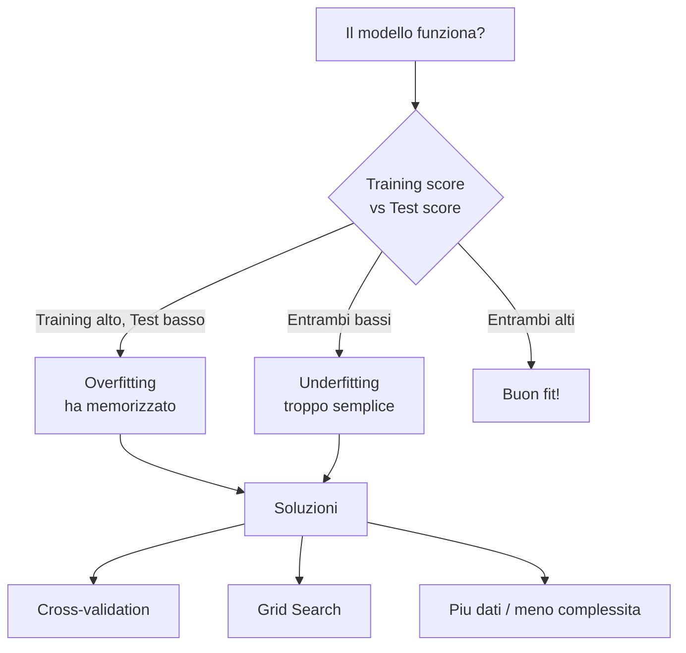

# Valutare un modello

## Il tuo modello e' bravo o sta barando?

Hai addestrato un modello e l'accuracy è 99%. Festeggi? **Aspetta.** Potrebbe star barando! In questo capitolo impariamo a valutare SERIAMENTE un modello e a evitare le trappole più comuni.

---

## Overfitting: il secchione che memorizza

L'**overfitting** è il nemico numero 1 del ML. Succede quando il modello **memorizza** i dati di training invece di **capire** il pattern generale.

Metafora: è come lo studente che impara a memoria tutte le risposte del libro, ma al compito con domande nuove va nel panico. Ha memorizzato, non ha capito!

L'opposto è l'**underfitting**: il modello è troppo semplice e non riesce a catturare neanche il pattern di base. Tipo lo studente che non ha studiato proprio.

| Problema | Cosa succede | Metafora |
|----------|-------------|----------|
| Underfitting | Modello troppo semplice, sbaglia su tutto | Non ha studiato |
| Buon fit | Modello equilibrato, generalizza bene | Ha capito la materia |
| Overfitting | Modello troppo complesso, perfetto su training ma pessimo su test | Ha memorizzato le risposte |

---

## Visualizzare l'overfitting

Il modo migliore per capire l'overfitting: la regressione polinomiale! Aumentando il grado del polinomio, la curva diventa sempre più contorta per passare per TUTTI i punti... ma perde completamente il senso.

```pyodide
import numpy as np
import matplotlib.pyplot as plt

np.random.seed(42)

# Dati con relazione lineare + rumore
X = np.linspace(0, 10, 20)
y = 2 * X + 5 + np.random.randn(20) * 3

fig, axes = plt.subplots(1, 3, figsize=(15, 4))

for idx, grado in enumerate([1, 5, 15]):
    coeffs = np.polyfit(X, y, grado)
    p = np.poly1d(coeffs)
    x_line = np.linspace(0, 10, 200)

    axes[idx].scatter(X, y, color='dodgerblue', s=50, zorder=5)
    axes[idx].plot(x_line, p(x_line), color='red', linewidth=2)
    axes[idx].set_title(f'Grado {grado}')
    axes[idx].set_ylim(-10, 40)
    axes[idx].grid(True, alpha=0.3)

    # Calcola errore
    errore_train = np.mean((y - p(X)) ** 2)
    axes[idx].set_xlabel(f'Errore training: {errore_train:.1f}')

fig.suptitle('Underfitting vs Good Fit vs Overfitting', fontsize=14)
plt.tight_layout()
plt.show()

print("Grado 1:  Buon fit - la retta cattura il trend")
print("Grado 5:  Inizia a seguire troppo il rumore")
print("Grado 15: Overfitting totale! Passa per tutti i punti ma e' assurda")
```

### Training score vs Test score

La prova del nove: confrontare le prestazioni su training e test.

```pyodide
import numpy as np
import matplotlib.pyplot as plt

np.random.seed(42)

X = np.linspace(0, 10, 30)
y = 2 * X + 5 + np.random.randn(30) * 3

# Split
X_train, X_test = X[:20], X[20:]
y_train, y_test = y[:20], y[20:]

gradi = range(1, 16)
errori_train = []
errori_test = []

for g in gradi:
    coeffs = np.polyfit(X_train, y_train, g)
    p = np.poly1d(coeffs)
    errori_train.append(np.mean((y_train - p(X_train)) ** 2))
    errori_test.append(np.mean((y_test - p(X_test)) ** 2))

plt.figure(figsize=(8, 5))
plt.plot(list(gradi), errori_train, 'b-o', label='Errore Training')
plt.plot(list(gradi), errori_test, 'r-o', label='Errore Test')
plt.xlabel('Grado del polinomio')
plt.ylabel('Errore (MSE)')
plt.title('Training vs Test Error')
plt.legend()
plt.grid(True, alpha=0.3)
plt.ylim(0, max(errori_test) * 1.1)
plt.show()

print("L'errore di training SCENDE sempre (ovvio, memorizza!)")
print("L'errore di test prima SCENDE poi RISALE (overfitting!)")
print("Il punto ideale e' dove l'errore di test e' minimo.")
```

!!! danger "La trappola del training score"

    Se valuti il modello SOLO sul training set, l'overfitting non si vede mai! L'errore scende sempre. Per questo il test set è fondamentale: ti mostra la verità.

---

## Cross-Validation

Un solo split train/test potrebbe essere "fortunato" o "sfortunato". La **cross-validation** risolve il problema dividendo i dati in K parti (fold) e facendo K esperimenti diversi:

```text
Fold 1: [TEST] [train] [train] [train] [train]
Fold 2: [train] [TEST] [train] [train] [train]
Fold 3: [train] [train] [TEST] [train] [train]
Fold 4: [train] [train] [train] [TEST] [train]
Fold 5: [train] [train] [train] [train] [TEST]

Risultato finale = media dei 5 score
```

```pyodide
import numpy as np
from sklearn.neighbors import KNeighborsClassifier
from sklearn.model_selection import cross_val_score

np.random.seed(42)

# Dataset
n = 200
ore = np.concatenate([np.random.normal(7, 1.5, n//2), np.random.normal(3, 1.5, n//2)])
voti_prec = np.concatenate([np.random.normal(7.5, 1, n//2), np.random.normal(4.5, 1, n//2)])
etichette = np.array([1] * (n//2) + [0] * (n//2))
X = np.column_stack([ore, voti_prec])
y = etichette

# Cross-validation con 5 fold
knn = KNeighborsClassifier(n_neighbors=5)
scores = cross_val_score(knn, X, y, cv=5)

print("Cross-validation con 5 fold:")
for i, score in enumerate(scores):
    print(f"  Fold {i+1}: {score:.2%}")
print(f"\nMedia:  {scores.mean():.2%}")
print(f"Std:    {scores.std():.2%}")
print(f"\nQuesto e' molto piu' affidabile di un singolo train/test split!")
```

---

## Scegliere gli iperparametri

Gli **iperparametri** sono le "manopole" che regoli TU (non il modello). Per KNN è il numero K, per gli alberi è la profondità massima, ecc.

Come trovi il valore migliore? **Provi!** Si chiama Grid Search.

```pyodide
import numpy as np
import matplotlib.pyplot as plt
from sklearn.neighbors import KNeighborsClassifier
from sklearn.model_selection import cross_val_score

np.random.seed(42)

n = 200
ore = np.concatenate([np.random.normal(7, 1.5, n//2), np.random.normal(3, 1.5, n//2)])
voti_prec = np.concatenate([np.random.normal(7.5, 1, n//2), np.random.normal(4.5, 1, n//2)])
etichette = np.array([1] * (n//2) + [0] * (n//2))
X = np.column_stack([ore, voti_prec])
y = etichette

# Proviamo diversi K
valori_k = [1, 3, 5, 7, 9, 11, 15, 21]
medie = []

print(f"{'K':>4} {'Accuracy media':>16} {'Std':>8}")
print("-" * 30)

for k in valori_k:
    knn = KNeighborsClassifier(n_neighbors=k)
    scores = cross_val_score(knn, X, y, cv=5)
    medie.append(scores.mean())
    print(f"{k:>4} {scores.mean():>16.2%} {scores.std():>8.2%}")

migliore_k = valori_k[np.argmax(medie)]
print(f"\nMigliore K: {migliore_k} (accuracy: {max(medie):.2%})")

plt.figure(figsize=(8, 5))
plt.plot(valori_k, medie, 'b-o')
plt.xlabel('K (numero di vicini)')
plt.ylabel('Accuracy media (CV)')
plt.title('Grid Search: trovare il K migliore')
plt.grid(True, alpha=0.3)
plt.show()
```

---

## Riassunto delle metriche

| Tipo di problema | Metrica | Quando usarla |
|-----------------|---------|---------------|
| Regressione | MSE | Errore medio (penalizza errori grandi) |
| Regressione | R² | Quanto il modello "spiega" i dati (0-1) |
| Classificazione | Accuracy | Classi bilanciate |
| Classificazione | Precision | Falsi positivi costano caro |
| Classificazione | Recall | Falsi negativi costano caro |
| Classificazione | F1-score | Bilanciare precision e recall |
| Tutti | Cross-validation | Stima piu' robusta delle prestazioni |

---

## Mappa concettuale



---

## Esercizi

### Esercizio 1: Visualizza l'overfitting

Crea un dataset non lineare (es. `y = sin(x) + rumore`) e mostra l'overfitting con polinomi di grado crescente. Plotta training error e test error.

```pyodide
import numpy as np
import matplotlib.pyplot as plt

np.random.seed(42)

# Crea dati non lineari

# Dividi in train/test

# Prova polinomi di grado 1, 3, 5, 10, 15

# Plotta i risultati

```

??? success "Soluzione"

    ```pyodide
    install="numpy,matplotlib"
    import numpy as np
    import matplotlib.pyplot as plt
    np.random.seed(42)
    X = np.linspace(0, 6, 30)
    y = np.sin(X) + np.random.normal(0, 0.3, 30)
    split = 20
    X_train, X_test = X[:split], X[split:]
    y_train, y_test = y[:split], y[split:]
    gradi = [1, 3, 5, 10, 15]
    fig, axes = plt.subplots(1, len(gradi), figsize=(15, 3))
    for ax, grado in zip(axes, gradi):
        coeff = np.polyfit(X_train, y_train, grado)
        p = np.poly1d(coeff)
        train_err = np.mean((y_train - p(X_train))**2)
        test_err = np.mean((y_test - p(X_test))**2)
        X_plot = np.linspace(0, 6, 100)
        ax.scatter(X_train, y_train, c="blue", s=20)
        ax.scatter(X_test, y_test, c="red", s=20)
        ax.plot(X_plot, p(X_plot), "g-")
        ax.set_title(f"Grado {grado}\nTrain:{train_err:.2f} Test:{test_err:.2f}")
        ax.set_ylim(-2, 2)
    plt.tight_layout()
    plt.show()
    ```

### Esercizio 2: Cross-validation

Usa la cross-validation per confrontare KNN e albero di decisione sullo stesso dataset. Quale modello e' piu' stabile (std piu' bassa)?

```pyodide
import numpy as np
from sklearn.neighbors import KNeighborsClassifier
from sklearn.tree import DecisionTreeClassifier
from sklearn.model_selection import cross_val_score

np.random.seed(42)

# Crea il dataset

# Cross-validation per entrambi i modelli

# Confronta media e deviazione standard

```

??? success "Soluzione"

    ```pyodide
    install="scikit-learn,numpy"
    import numpy as np
    from sklearn.neighbors import KNeighborsClassifier
    from sklearn.tree import DecisionTreeClassifier
    from sklearn.model_selection import cross_val_score
    np.random.seed(42)
    n = 200
    X = np.random.rand(n, 3) * 10
    y = (X[:, 0] + X[:, 1] > 10).astype(int)
    modelli = {
        "KNN (k=5)": KNeighborsClassifier(n_neighbors=5),
        "Albero (depth=5)": DecisionTreeClassifier(max_depth=5, random_state=42),
    }
    print("Modello          | Media    | Std")
    print("-----------------|----------|-----")
    for nome, modello in modelli.items():
        scores = cross_val_score(modello, X, y, cv=5)
        print(f"{nome:17s}| {scores.mean():.3f}    | {scores.std():.3f}")
        stabile = "KNN" if scores.std() < 0.05 else "Albero"
    print(f"\nPiu' stabile: quello con std piu' bassa")
    ```

### Esercizio 3: Grid Search completo

Fai un grid search per un albero di decisione provando diverse combinazioni di max_depth (1-10) e min_samples_split (2, 5, 10). Trova la combinazione migliore.

```pyodide
import numpy as np
from sklearn.tree import DecisionTreeClassifier
from sklearn.model_selection import cross_val_score

np.random.seed(42)

# Crea il dataset

# Grid search su max_depth e min_samples_split

# Stampa la tabella dei risultati e il vincitore

```

??? success "Soluzione"

    ```pyodide
    install="scikit-learn,numpy"
    import numpy as np
    from sklearn.tree import DecisionTreeClassifier
    from sklearn.model_selection import cross_val_score
    np.random.seed(42)
    n = 200
    X = np.random.rand(n, 4) * 10
    y = (X[:, 0] + X[:, 1] * 0.5 > 7).astype(int)
    migliore_score = 0
    migliore_params = {}
    print("max_depth | min_samples_split | CV Score")
    print("----------|-------------------|--------")
    for depth in range(1, 11):
        for min_split in [2, 5, 10]:
            tree = DecisionTreeClassifier(max_depth=depth, min_samples_split=min_split, random_state=42)
            score = cross_val_score(tree, X, y, cv=5).mean()
            print(f"    {depth:2d}    |        {min_split:2d}         | {score:.3f}")
            if score > migliore_score:
                migliore_score = score
                migliore_params = {"max_depth": depth, "min_samples_split": min_split}
    print(f"\nMigliore: {migliore_params} con score={migliore_score:.3f}")
    ```
