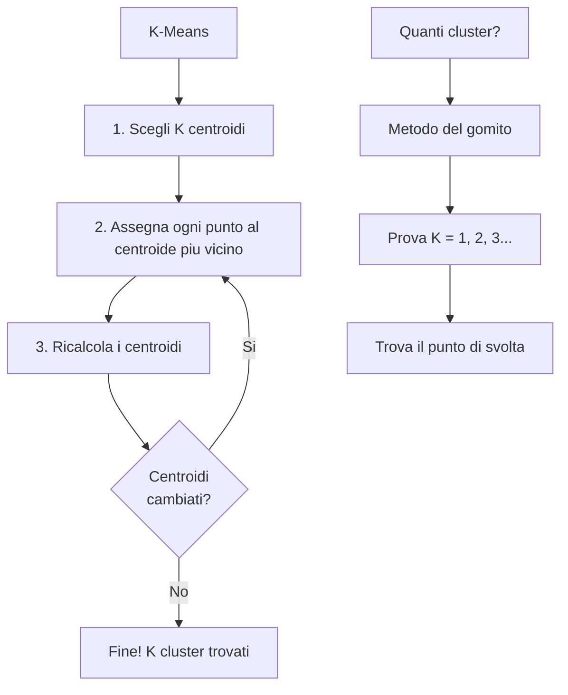

# Clustering

## Raggruppare senza istruzioni

Finora abbiamo fatto **apprendimento supervisionato**: il modello aveva le risposte giuste (le etichette) e imparava da quelle. Ora cambiamo gioco: l'apprendimento **non supervisionato**!

Il **clustering** è come entrare in una stanza piena di gente e dire: "formate dei gruppi!". Nessuno ti dice quanti gruppi, né chi deve stare con chi. Devi trovare i raggruppamenti naturali basandoti sulle somiglianze.

---

## K-Means: l'algoritmo

Il K-Means è l'algoritmo di clustering più famoso. Il nome dice tutto: **K** = quanti gruppi vuoi, **Means** = si basa sulle medie (centroidi).

Come funziona, passo per passo:

1. **Scegli K** (il numero di cluster)
2. **Piazza K centroidi** in posizioni casuali
3. **Assegna ogni punto** al centroide più vicino
4. **Sposta ogni centroide** al centro del suo gruppo
5. **Ripeti** i passi 3-4 finché i centroidi non si muovono più

```pyodide install="numpy,matplotlib"
import numpy as np
import matplotlib.pyplot as plt

np.random.seed(42)

# Generiamo 3 gruppi di punti
g1 = np.random.randn(30, 2) + [2, 2]
g2 = np.random.randn(30, 2) + [8, 2]
g3 = np.random.randn(30, 2) + [5, 7]
X = np.vstack([g1, g2, g3])

# Mescoliamo
np.random.shuffle(X)

plt.figure(figsize=(8, 6))
plt.scatter(X[:, 0], X[:, 1], c='gray', alpha=0.6, s=50)
plt.title('90 punti... riesci a vedere 3 gruppi?')
plt.grid(True, alpha=0.3)
plt.show()

print("A occhio si vedono 3 gruppi, giusto?")
print("Il K-Means li trovera' automaticamente!")
```

### K-Means passo per passo

```pyodide install="numpy,matplotlib"
import numpy as np
import matplotlib.pyplot as plt

np.random.seed(42)

# Dati
g1 = np.random.randn(30, 2) + [2, 2]
g2 = np.random.randn(30, 2) + [8, 2]
g3 = np.random.randn(30, 2) + [5, 7]
X = np.vstack([g1, g2, g3])
np.random.shuffle(X)

K = 3
# Step 1: centroidi iniziali casuali
centroidi = X[np.random.choice(len(X), K, replace=False)]

fig, axes = plt.subplots(1, 4, figsize=(18, 4))
colori = ['#e74c3c', '#3498db', '#2ecc71']

for step in range(4):
    # Step 2: assegna ogni punto al centroide piu' vicino
    distanze = np.array([np.sqrt(np.sum((X - c) ** 2, axis=1)) for c in centroidi])
    assegnamenti = np.argmin(distanze, axis=0)

    # Plotta
    ax = axes[step]
    for k in range(K):
        punti = X[assegnamenti == k]
        ax.scatter(punti[:, 0], punti[:, 1], c=colori[k], alpha=0.5, s=30)
        ax.scatter(centroidi[k, 0], centroidi[k, 1], c=colori[k],
                   marker='X', s=200, edgecolors='black', linewidths=2)
    ax.set_title(f'Step {step + 1}')
    ax.grid(True, alpha=0.3)

    # Step 3: sposta i centroidi al centro del gruppo
    for k in range(K):
        punti = X[assegnamenti == k]
        if len(punti) > 0:
            centroidi[k] = punti.mean(axis=0)

plt.suptitle('K-Means: 4 iterazioni (X = centroidi)', fontsize=14)
plt.tight_layout()
plt.show()

print("Le X grandi sono i centroidi. Vedi come si spostano?")
print("Dopo pochi step i gruppi sono gia' ben definiti!")
```

---

## K-Means con scikit-learn

Ovviamente scikit-learn lo fa in 3 righe:

```pyodide install="scikit-learn,numpy,matplotlib"
import numpy as np
import matplotlib.pyplot as plt
from sklearn.cluster import KMeans

np.random.seed(42)

g1 = np.random.randn(30, 2) + [2, 2]
g2 = np.random.randn(30, 2) + [8, 2]
g3 = np.random.randn(30, 2) + [5, 7]
X = np.vstack([g1, g2, g3])
np.random.shuffle(X)

# K-Means con sklearn
kmeans = KMeans(n_clusters=3, random_state=42, n_init=10)
kmeans.fit(X)

# Risultati
etichette = kmeans.labels_          # A quale cluster appartiene ogni punto
centroidi = kmeans.cluster_centers_  # Posizioni dei centroidi

plt.figure(figsize=(8, 6))
colori = ['#e74c3c', '#3498db', '#2ecc71']
for k in range(3):
    punti = X[etichette == k]
    plt.scatter(punti[:, 0], punti[:, 1], c=colori[k], alpha=0.6, s=50, label=f'Cluster {k+1}')
plt.scatter(centroidi[:, 0], centroidi[:, 1], c='black', marker='X', s=200, zorder=5, label='Centroidi')
plt.title('K-Means con scikit-learn')
plt.legend()
plt.grid(True, alpha=0.3)
plt.show()

print(f"Centroidi trovati:")
for i, c in enumerate(centroidi):
    print(f"  Cluster {i+1}: ({c[0]:.2f}, {c[1]:.2f})")
```

---

## Quanti cluster? Il metodo del gomito

Ok, ma come scegli K? Non puoi sempre "vedere" i gruppi a occhio. Il **metodo del gomito** (Elbow Method) ti aiuta:

1. Prova K = 1, 2, 3, 4, ... 10
2. Per ogni K, calcola l'**inerzia** (quanto i punti sono distanti dal loro centroide)
3. Plotta: l'inerzia scende sempre, ma a un certo punto la discesa rallenta — quello è il "gomito"!

```pyodide install="scikit-learn,numpy,matplotlib"
import numpy as np
import matplotlib.pyplot as plt
from sklearn.cluster import KMeans

np.random.seed(42)

g1 = np.random.randn(50, 2) + [2, 2]
g2 = np.random.randn(50, 2) + [8, 2]
g3 = np.random.randn(50, 2) + [5, 7]
X = np.vstack([g1, g2, g3])

inerzie = []
range_k = range(1, 11)

for k in range_k:
    kmeans = KMeans(n_clusters=k, random_state=42, n_init=10)
    kmeans.fit(X)
    inerzie.append(kmeans.inertia_)

plt.figure(figsize=(8, 5))
plt.plot(list(range_k), inerzie, 'b-o')
plt.axvline(x=3, color='red', linestyle='--', alpha=0.7, label='Gomito (K=3)')
plt.xlabel('Numero di cluster (K)')
plt.ylabel('Inerzia')
plt.title('Metodo del gomito')
plt.legend()
plt.grid(True, alpha=0.3)
plt.show()

print("Vedi il 'gomito' a K=3?")
print("Dopo 3 cluster, aggiungerne altri migliora pochissimo.")
print("Quindi K=3 e' la scelta giusta!")
```

---

## Esempio pratico: segmentare gli studenti

Usiamo il clustering per trovare "profili" di studenti basandoci sulle loro abitudini:

```pyodide install="scikit-learn,numpy,matplotlib"
import numpy as np
import matplotlib.pyplot as plt
from sklearn.cluster import KMeans
from sklearn.preprocessing import MinMaxScaler

np.random.seed(42)

# Tre profili di studenti (che noi conosciamo ma il modello NO!)
# Secchioni: tante ore, poche assenze
# Nella media: ore medie, assenze medie
# Svogliati: poche ore, tante assenze
secchioni = np.column_stack([np.random.normal(8, 1, 30), np.random.normal(1, 1, 30)])
medi = np.column_stack([np.random.normal(5, 1.2, 30), np.random.normal(5, 1.5, 30)])
svogliati = np.column_stack([np.random.normal(2, 1, 30), np.random.normal(10, 2, 30)])

X = np.vstack([secchioni, medi, svogliati])
X = np.clip(X, 0, 15)
np.random.shuffle(X)

# Normalizziamo
scaler = MinMaxScaler()
X_norm = scaler.fit_transform(X)

# Clustering
kmeans = KMeans(n_clusters=3, random_state=42, n_init=10)
etichette = kmeans.fit_predict(X_norm)

# Visualizziamo (sui dati originali per leggibilita')
plt.figure(figsize=(8, 6))
nomi_cluster = {0: 'Profilo A', 1: 'Profilo B', 2: 'Profilo C'}
colori = ['#e74c3c', '#3498db', '#2ecc71']

for k in range(3):
    punti = X[etichette == k]
    plt.scatter(punti[:, 0], punti[:, 1], c=colori[k], alpha=0.6, s=50, label=nomi_cluster[k])

plt.xlabel('Ore di studio')
plt.ylabel('Assenze')
plt.title('Profili degli studenti trovati dal K-Means')
plt.legend()
plt.grid(True, alpha=0.3)
plt.show()

# Statistiche per cluster
print("Statistiche per profilo:")
for k in range(3):
    punti = X[etichette == k]
    print(f"\n{nomi_cluster[k]} ({len(punti)} studenti):")
    print(f"  Ore studio medie: {punti[:, 0].mean():.1f}")
    print(f"  Assenze medie:    {punti[:, 1].mean():.1f}")
```

---

## Mappa concettuale



---

## Esercizi

### Esercizio 1: K-Means a mano

Implementa il K-Means da zero con numpy (senza sklearn) per K=2. Mostra i centroidi che si spostano ad ogni iterazione.

```pyodide install="numpy,matplotlib"
import numpy as np
import matplotlib.pyplot as plt

np.random.seed(42)

# Genera 2 gruppi di punti
g1 = np.random.randn(40, 2) + [3, 3]
g2 = np.random.randn(40, 2) + [7, 7]
X = np.vstack([g1, g2])
np.random.shuffle(X)

# Implementa K-Means (K=2) da zero

```

??? success "Soluzione"

    ```pyodide install="numpy,matplotlib"
    import numpy as np
    import matplotlib.pyplot as plt
    np.random.seed(42)
    g1 = np.random.randn(40, 2) + [3, 3]
    g2 = np.random.randn(40, 2) + [7, 7]
    X = np.vstack([g1, g2])
    np.random.shuffle(X)
    K = 2
    idx = np.random.choice(len(X), K, replace=False)
    centroidi = X[idx].copy()
    for iterazione in range(10):
        distanze = np.array([[np.sqrt(((x - c)**2).sum()) for c in centroidi] for x in X])
        cluster = distanze.argmin(axis=1)
        nuovi = np.array([X[cluster == k].mean(axis=0) for k in range(K)])
        if np.allclose(centroidi, nuovi):
            print(f"Convergenza dopo {iterazione + 1} iterazioni!")
            break
        centroidi = nuovi
        print(f"Iterazione {iterazione+1}: centroidi = {centroidi.round(2)}")
    plt.scatter(X[:, 0], X[:, 1], c=cluster, cmap="viridis", alpha=0.5)
    plt.scatter(centroidi[:, 0], centroidi[:, 1], c="red", marker="X", s=200)
    plt.title("K-Means fatto a mano!")
    plt.show()
    ```

### Esercizio 2: Trovare K con il gomito

Genera un dataset con 5 cluster e usa il metodo del gomito per trovare il numero corretto.

```pyodide install="scikit-learn,numpy,matplotlib"
import numpy as np
import matplotlib.pyplot as plt
from sklearn.cluster import KMeans

np.random.seed(42)

# Genera 5 cluster

# Metodo del gomito

# Plotta il risultato

```

??? success "Soluzione"

    ```pyodide install="scikit-learn,numpy,matplotlib"
    import numpy as np
    import matplotlib.pyplot as plt
    from sklearn.cluster import KMeans
    np.random.seed(42)
    centri = [[2, 2], [8, 8], [2, 8], [8, 2], [5, 5]]
    X = np.vstack([np.random.randn(30, 2) + c for c in centri])
    inertie = []
    K_range = range(1, 11)
    for k in K_range:
        km = KMeans(n_clusters=k, random_state=42, n_init=10)
        km.fit(X)
        inertie.append(km.inertia_)
    plt.plot(K_range, inertie, "bo-")
    plt.xlabel("Numero di cluster (K)")
    plt.ylabel("Inerzia")
    plt.title("Metodo del gomito")
    plt.axvline(x=5, color="r", linestyle="--", label="K ottimale = 5")
    plt.legend()
    plt.show()
    ```

### Esercizio 3: Segmentazione

Crea un dataset di "clienti" con 3 features (eta, spesa_mensile, visite_mensili) e usa K-Means per trovare profili di clienti. Descrivi i profili trovati.

```pyodide install="scikit-learn,numpy"
import numpy as np
from sklearn.cluster import KMeans
from sklearn.preprocessing import MinMaxScaler

np.random.seed(42)

# Genera il dataset clienti

# Clustering

# Analizza e descrivi i profili trovati

```

??? success "Soluzione"

    ```pyodide install="scikit-learn,numpy"
    import numpy as np
    from sklearn.cluster import KMeans
    from sklearn.preprocessing import MinMaxScaler
    np.random.seed(42)
    n = 150
    eta = np.random.randint(18, 70, n)
    spesa = np.random.uniform(10, 500, n)
    visite = np.random.randint(1, 30, n)
    X = np.column_stack([eta, spesa, visite])
    scaler = MinMaxScaler()
    X_norm = scaler.fit_transform(X)
    km = KMeans(n_clusters=3, random_state=42, n_init=10)
    cluster = km.fit_predict(X_norm)
    print("Profili clienti trovati:\n")
    for k in range(3):
        punti = X[cluster == k]
        print(f"Cluster {k+1} ({len(punti)} clienti):")
        print(f"  Eta media: {punti[:, 0].mean():.0f} anni")
        print(f"  Spesa media: {punti[:, 1].mean():.0f} euro")
        print(f"  Visite medie: {punti[:, 2].mean():.0f} al mese\n")
    ```
