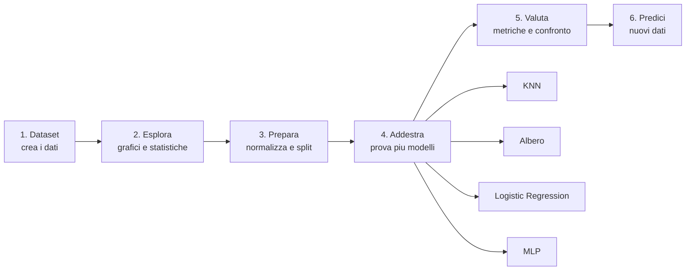

# Progetto finale

## Mettiamo tutto insieme

Hai imparato cos'è l'IA, come preparare i dati, la regressione, la classificazione, la valutazione dei modelli, il clustering e le reti neurali. Ora è il momento di mettere tutto insieme in un **progetto completo**!

Il nostro obiettivo: prevedere se uno studente sarà **promosso o bocciato** basandosi sulle sue abitudini di studio.

---

## Step 1: Creare il dataset

```pyodide
import numpy as np

np.random.seed(42)
n = 200

# Generiamo dati realistici
ore_studio = np.random.uniform(0, 10, n)
assenze = np.random.randint(0, 20, n)
voto_precedente = np.random.uniform(3, 10, n)
partecipazione = np.random.uniform(1, 10, n)

# La promozione dipende da una combinazione di fattori
punteggio = (
    ore_studio * 0.3
    + voto_precedente * 0.3
    + partecipazione * 0.2
    - assenze * 0.15
    + np.random.randn(n) * 0.5
)

# Promosso se il punteggio supera una soglia
promosso = (punteggio > 3.5).astype(int)

X = np.column_stack([ore_studio, assenze, voto_precedente, partecipazione])
y = promosso

feature_names = ['Ore studio', 'Assenze', 'Voto prec.', 'Partecip.']

print(f"Dataset creato: {X.shape[0]} studenti, {X.shape[1]} features")
print(f"Promossi: {sum(y)} ({sum(y)/len(y)*100:.0f}%)")
print(f"Bocciati: {len(y)-sum(y)} ({(len(y)-sum(y))/len(y)*100:.0f}%)")

print(f"\nPrimi 5 studenti:")
print(f"{'Ore':>6} {'Ass':>5} {'Prec':>6} {'Part':>6} {'Esito':>7}")
print("-" * 34)
for i in range(5):
    esito = "Prom" if y[i] == 1 else "Bocc"
    print(f"{X[i,0]:>6.1f} {X[i,1]:>5.0f} {X[i,2]:>6.1f} {X[i,3]:>6.1f} {esito:>7}")
```

---

## Step 2: Esplorare i dati

Prima di far partire qualsiasi algoritmo, **guardiamo i dati**!

```pyodide
import numpy as np
import matplotlib.pyplot as plt

np.random.seed(42)
n = 200
ore_studio = np.random.uniform(0, 10, n)
assenze = np.random.randint(0, 20, n)
voto_precedente = np.random.uniform(3, 10, n)
partecipazione = np.random.uniform(1, 10, n)
punteggio = ore_studio * 0.3 + voto_precedente * 0.3 + partecipazione * 0.2 - assenze * 0.15 + np.random.randn(n) * 0.5
y = (punteggio > 3.5).astype(int)
X = np.column_stack([ore_studio, assenze, voto_precedente, partecipazione])
feature_names = ['Ore studio', 'Assenze', 'Voto prec.', 'Partecip.']

fig, axes = plt.subplots(2, 2, figsize=(12, 10))
colori = ['red' if yi == 0 else 'green' for yi in y]

for idx, (ax, nome) in enumerate(zip(axes.flat, feature_names)):
    promossi = X[y == 1, idx]
    bocciati = X[y == 0, idx]
    ax.hist(promossi, bins=15, alpha=0.6, color='green', label='Promossi')
    ax.hist(bocciati, bins=15, alpha=0.6, color='red', label='Bocciati')
    ax.set_title(nome)
    ax.legend()
    ax.grid(True, alpha=0.3)

plt.suptitle('Distribuzione features per esito', fontsize=14)
plt.tight_layout()
plt.show()

# Statistiche
print("Statistiche per gruppo:")
for i, nome in enumerate(feature_names):
    media_prom = X[y == 1, i].mean()
    media_bocc = X[y == 0, i].mean()
    print(f"  {nome:15}: promossi={media_prom:.1f}, bocciati={media_bocc:.1f}")
```

---

## Step 3: Preparare i dati

```pyodide
import numpy as np
from sklearn.preprocessing import MinMaxScaler
from sklearn.model_selection import train_test_split

np.random.seed(42)
n = 200
ore_studio = np.random.uniform(0, 10, n)
assenze = np.random.randint(0, 20, n)
voto_precedente = np.random.uniform(3, 10, n)
partecipazione = np.random.uniform(1, 10, n)
punteggio = ore_studio * 0.3 + voto_precedente * 0.3 + partecipazione * 0.2 - assenze * 0.15 + np.random.randn(n) * 0.5
y = (punteggio > 3.5).astype(int)
X = np.column_stack([ore_studio, assenze, voto_precedente, partecipazione])

# Normalizzazione
scaler = MinMaxScaler()
X_scaled = scaler.fit_transform(X)

# Split
X_train, X_test, y_train, y_test = train_test_split(
    X_scaled, y, test_size=0.2, random_state=42
)

print(f"Training set: {X_train.shape[0]} studenti")
print(f"Test set:     {X_test.shape[0]} studenti")
print(f"\nBilanciamento training: {sum(y_train)} promossi, {len(y_train)-sum(y_train)} bocciati")
print(f"Bilanciamento test:     {sum(y_test)} promossi, {len(y_test)-sum(y_test)} bocciati")
```

---

## Step 4: Provare diversi modelli

Qui arriva il bello: proviamo 4 modelli diversi e vediamo chi vince!

```pyodide
import numpy as np
from sklearn.preprocessing import MinMaxScaler
from sklearn.model_selection import train_test_split, cross_val_score
from sklearn.neighbors import KNeighborsClassifier
from sklearn.tree import DecisionTreeClassifier
from sklearn.linear_model import LogisticRegression
from sklearn.neural_network import MLPClassifier

np.random.seed(42)
n = 200
ore_studio = np.random.uniform(0, 10, n)
assenze = np.random.randint(0, 20, n)
voto_precedente = np.random.uniform(3, 10, n)
partecipazione = np.random.uniform(1, 10, n)
punteggio = ore_studio * 0.3 + voto_precedente * 0.3 + partecipazione * 0.2 - assenze * 0.15 + np.random.randn(n) * 0.5
y = (punteggio > 3.5).astype(int)
X = np.column_stack([ore_studio, assenze, voto_precedente, partecipazione])

scaler = MinMaxScaler()
X_scaled = scaler.fit_transform(X)
X_train, X_test, y_train, y_test = train_test_split(X_scaled, y, test_size=0.2, random_state=42)

# I 4 contendenti
modelli = {
    "KNN (K=5)": KNeighborsClassifier(n_neighbors=5),
    "Albero decisione": DecisionTreeClassifier(max_depth=4, random_state=42),
    "Regressione logistica": LogisticRegression(random_state=42),
    "Rete neurale (MLP)": MLPClassifier(hidden_layer_sizes=(10, 5), max_iter=500, random_state=42),
}

print(f"{'Modello':<25} {'CV Media':>10} {'CV Std':>8} {'Test':>8}")
print("-" * 55)

migliore_nome = ""
migliore_score = 0

for nome, modello in modelli.items():
    # Cross-validation
    cv_scores = cross_val_score(modello, X_train, y_train, cv=5)

    # Addestra e testa
    modello.fit(X_train, y_train)
    test_score = modello.score(X_test, y_test)

    print(f"{nome:<25} {cv_scores.mean():>10.2%} {cv_scores.std():>8.2%} {test_score:>8.2%}")

    if cv_scores.mean() > migliore_score:
        migliore_score = cv_scores.mean()
        migliore_nome = nome

print(f"\nVincitore: {migliore_nome} ({migliore_score:.2%})")
```

---

## Step 5: Valutare il vincitore

```pyodide
import numpy as np
from sklearn.preprocessing import MinMaxScaler
from sklearn.model_selection import train_test_split
from sklearn.linear_model import LogisticRegression
from sklearn.metrics import accuracy_score, precision_score, recall_score, f1_score, confusion_matrix

np.random.seed(42)
n = 200
ore_studio = np.random.uniform(0, 10, n)
assenze = np.random.randint(0, 20, n)
voto_precedente = np.random.uniform(3, 10, n)
partecipazione = np.random.uniform(1, 10, n)
punteggio = ore_studio * 0.3 + voto_precedente * 0.3 + partecipazione * 0.2 - assenze * 0.15 + np.random.randn(n) * 0.5
y = (punteggio > 3.5).astype(int)
X = np.column_stack([ore_studio, assenze, voto_precedente, partecipazione])

scaler = MinMaxScaler()
X_scaled = scaler.fit_transform(X)
X_train, X_test, y_train, y_test = train_test_split(X_scaled, y, test_size=0.2, random_state=42)

# Usiamo il modello migliore
modello = LogisticRegression(random_state=42)
modello.fit(X_train, y_train)
y_pred = modello.predict(X_test)

# Metriche complete
print("VALUTAZIONE DETTAGLIATA")
print("=" * 40)
print(f"Accuracy:  {accuracy_score(y_test, y_pred):.2%}")
print(f"Precision: {precision_score(y_test, y_pred):.2%}")
print(f"Recall:    {recall_score(y_test, y_pred):.2%}")
print(f"F1-score:  {f1_score(y_test, y_pred):.2%}")

# Matrice di confusione
cm = confusion_matrix(y_test, y_pred)
print(f"\nMatrice di confusione:")
print(f"              Previsto")
print(f"             Bocc  Prom")
print(f"Vero Bocc  [{cm[0][0]:4} {cm[0][1]:4} ]")
print(f"     Prom  [{cm[1][0]:4} {cm[1][1]:4} ]")
```

---

## Step 6: Fare previsioni

Il momento della verita': usiamo il modello per prevedere su studenti completamente nuovi!

```pyodide
import numpy as np
from sklearn.preprocessing import MinMaxScaler
from sklearn.model_selection import train_test_split
from sklearn.linear_model import LogisticRegression

np.random.seed(42)
n = 200
ore_studio = np.random.uniform(0, 10, n)
assenze = np.random.randint(0, 20, n)
voto_precedente = np.random.uniform(3, 10, n)
partecipazione = np.random.uniform(1, 10, n)
punteggio = ore_studio * 0.3 + voto_precedente * 0.3 + partecipazione * 0.2 - assenze * 0.15 + np.random.randn(n) * 0.5
y = (punteggio > 3.5).astype(int)
X = np.column_stack([ore_studio, assenze, voto_precedente, partecipazione])

scaler = MinMaxScaler()
X_scaled = scaler.fit_transform(X)
X_train, X_test, y_train, y_test = train_test_split(X_scaled, y, test_size=0.2, random_state=42)

modello = LogisticRegression(random_state=42)
modello.fit(X_train, y_train)

# Nuovi studenti!
nuovi_studenti = [
    {"nome": "Mario",  "ore": 8, "assenze": 2, "prec": 7.5, "partecip": 8},
    {"nome": "Luigi",  "ore": 3, "assenze": 12, "prec": 5.0, "partecip": 4},
    {"nome": "Peach",  "ore": 6, "assenze": 5, "prec": 6.5, "partecip": 7},
    {"nome": "Bowser", "ore": 1, "assenze": 18, "prec": 4.0, "partecip": 2},
]

print("PREVISIONI PER NUOVI STUDENTI")
print("=" * 60)

for s in nuovi_studenti:
    x_nuovo = np.array([[s["ore"], s["assenze"], s["prec"], s["partecip"]]])
    x_scaled = scaler.transform(x_nuovo)
    previsione = modello.predict(x_scaled)[0]
    probabilita = modello.predict_proba(x_scaled)[0]

    esito = "PROMOSSO" if previsione == 1 else "BOCCIATO"
    print(f"\n{s['nome']}:")
    print(f"  Ore studio: {s['ore']}, Assenze: {s['assenze']}, Voto prec: {s['prec']}, Partecip: {s['partecip']}")
    print(f"  Previsione: {esito}")
    print(f"  Probabilita': bocciato {probabilita[0]:.0%} | promosso {probabilita[1]:.0%}")
```

---

## Sfide extra

Vuoi andare oltre? Prova queste sfide:

```pyodide
# SFIDA 1: Aggiungi una nuova feature (es. "ore di sonno") e vedi se migliora il modello

# SFIDA 2: Usa il clustering per trovare "profili" di studenti nel dataset

# SFIDA 3: Crea un'interfaccia interattiva che chiede i dati di uno studente e prevede l'esito

ore = float(input("Ore di studio: "))
assenze = int(input("Numero assenze: "))
voto_prec = float(input("Voto precedente: "))
partecip = float(input("Partecipazione (1-10): "))

print(f"\nAnalizzando lo studente...")
print(f"(Implementa la previsione qui!)")
```

---

## Mappa concettuale



---

## Esercizi

### Esercizio 1: Pipeline personalizzata

Ricrea l'intera pipeline con un dataset diverso: prevedi se un cliente comprera' un prodotto basandosi su eta', reddito e numero di visite al sito.

```pyodide
import numpy as np
from sklearn.model_selection import train_test_split, cross_val_score
from sklearn.preprocessing import MinMaxScaler

np.random.seed(42)

# Crea il dataset clienti

# Prepara i dati

# Prova almeno 3 modelli diversi

# Valuta il vincitore

# Fai previsioni su nuovi clienti

```

??? success "Soluzione"

    ```pyodide
    install="scikit-learn,numpy"
    import numpy as np
    from sklearn.model_selection import train_test_split, cross_val_score
    from sklearn.preprocessing import MinMaxScaler
    from sklearn.neighbors import KNeighborsClassifier
    from sklearn.tree import DecisionTreeClassifier
    from sklearn.neural_network import MLPClassifier
    np.random.seed(42)
    n = 200
    eta = np.random.randint(18, 65, n)
    reddito = np.random.uniform(15000, 80000, n)
    visite = np.random.randint(1, 50, n)
    compra = ((reddito > 35000) & (visite > 15) | (eta < 30) & (visite > 25)).astype(int)
    X = np.column_stack([eta, reddito, visite])
    y = compra
    scaler = MinMaxScaler()
    X_norm = scaler.fit_transform(X)
    X_train, X_test, y_train, y_test = train_test_split(X_norm, y, test_size=0.2, random_state=42)
    modelli = {
        "KNN": KNeighborsClassifier(n_neighbors=5),
        "Albero": DecisionTreeClassifier(max_depth=5, random_state=42),
        "MLP": MLPClassifier(hidden_layer_sizes=(50, 25), max_iter=500, random_state=42),
    }
    print("Modello | CV Score")
    print("--------|--------")
    for nome, modello in modelli.items():
        score = cross_val_score(modello, X_train, y_train, cv=5).mean()
        print(f"{nome:7s} | {score:.3f}")
    nuovo_cliente = scaler.transform([[25, 45000, 30]])
    print(f"\nNuovo cliente (25 anni, 45000 reddito, 30 visite):")
    for nome, modello in modelli.items():
        modello.fit(X_train, y_train)
        pred = modello.predict(nuovo_cliente)
        print(f"  {nome}: {'Comprera!' if pred[0] else 'Non comprera'}")
    ```

### Esercizio 2: Migliora il modello

Partendo dal progetto di questo capitolo, prova a migliorare l'accuracy con:
- Feature engineering (crea nuove features combinando quelle esistenti)
- Grid search sugli iperparametri
- Prova un modello diverso

```pyodide
# Il tuo codice per migliorare il modello

```

??? success "Soluzione"

    ```pyodide
    install="scikit-learn,numpy"
    import numpy as np
    from sklearn.model_selection import train_test_split, cross_val_score
    from sklearn.preprocessing import MinMaxScaler
    from sklearn.tree import DecisionTreeClassifier
    np.random.seed(42)
    n = 300
    ore = np.random.uniform(0, 10, n)
    assenze = np.random.randint(0, 30, n)
    media = np.random.uniform(3, 10, n)
    ore_x_media = ore * media
    studio_netto = ore - assenze * 0.2
    X = np.column_stack([ore, assenze, media, ore_x_media, studio_netto])
    y = ((ore > 4) & (assenze < 15) & (media > 5.5)).astype(int)
    scaler = MinMaxScaler()
    X_norm = scaler.fit_transform(X)
    X_train, X_test, y_train, y_test = train_test_split(X_norm, y, test_size=0.2, random_state=42)
    print("Grid Search su Albero di Decisione con feature engineering:\n")
    migliore = {"score": 0}
    for depth in [3, 5, 7, 10]:
        for min_split in [2, 5, 10]:
            tree = DecisionTreeClassifier(max_depth=depth, min_samples_split=min_split, random_state=42)
            score = cross_val_score(tree, X_train, y_train, cv=5).mean()
            if score > migliore["score"]:
                migliore = {"depth": depth, "split": min_split, "score": score}
    print(f"Migliori parametri: max_depth={migliore['depth']}, min_samples_split={migliore['split']}")
    print(f"CV Score: {migliore['score']:.3f}")
    print(f"\n5 features usate (3 originali + 2 ingegnerizzate)")
    ```
