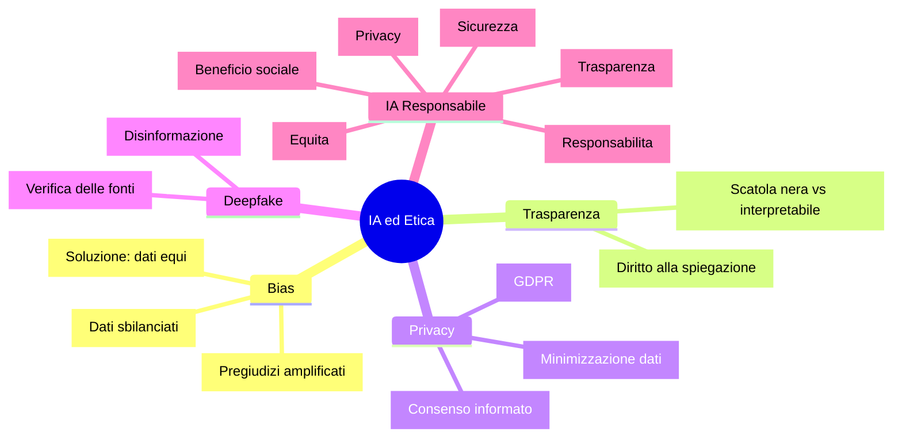

# IA ed etica

## Da grandi poteri derivano grandi responsabilita'

L'IA è uno strumento potentissimo. Ma come ogni strumento potente, può essere usato bene o male. In questo capitolo parliamo dei **rischi**, dei **problemi etici** e di come sviluppare IA in modo **responsabile**.

Non è roba teorica: sono problemi reali che succedono ADESSO e che riguardano tutti noi.

---

## Bias nei dati, bias nelle decisioni

Il **bias** (pregiudizio) è il problema numero 1 dell'IA. Se i dati con cui addestri il modello contengono pregiudizi, il modello li impara e li amplifica!

Esempi reali (e inquietanti):

- **Amazon** (2018): un sistema di recruiting AI scartava i CV delle donne perché era stato addestrato su 10 anni di assunzioni passate... dove venivano assunti quasi solo uomini
- **COMPAS** (USA): un algoritmo usato nei tribunali per prevedere la recidiva dava punteggi di rischio più alti alle persone di colore
- **Riconoscimento facciale**: funziona peggio sulle persone con pelle scura perché i dataset di addestramento contengono soprattutto foto di persone bianche

### Vediamolo con il codice

```pyodide
import numpy as np
from sklearn.linear_model import LogisticRegression
from sklearn.metrics import accuracy_score

np.random.seed(42)

# DATASET BIASATO: nel training set i ragazzi hanno voti mediamente piu' alti
# (non perche' siano piu' bravi, ma perche' i DATI sono sbilanciati!)
n = 100

# Ragazzi: voti alti nel training (bias!)
ore_m = np.random.normal(6, 1.5, n)
voti_m = np.random.normal(7.5, 1, n)  # Media artificialmente alta
genere_m = np.zeros(n)  # 0 = ragazzo

# Ragazze: voti piu' bassi nel training (bias nei dati!)
ore_f = np.random.normal(6, 1.5, n)
voti_f = np.random.normal(5.5, 1, n)  # Media artificialmente bassa
genere_f = np.ones(n)  # 1 = ragazza

# Uniamo tutto
X = np.column_stack([
    np.concatenate([ore_m, ore_f]),
    np.concatenate([voti_m, voti_f]),
    np.concatenate([genere_m, genere_f])
])
y = (X[:, 1] > 6).astype(int)  # Promosso se voto > 6

modello_biasato = LogisticRegression(random_state=42)
modello_biasato.fit(X, y)

# Test su nuovi studenti CON LE STESSE CAPACITA'
print("Previsioni con modello BIASATO:")
print("(Stesso ore studio e voto, diverso genere)\n")

test_cases = [
    ([7, 6.5, 0], "Ragazzo,  7 ore, voto 6.5"),
    ([7, 6.5, 1], "Ragazza, 7 ore, voto 6.5"),
    ([5, 5.5, 0], "Ragazzo,  5 ore, voto 5.5"),
    ([5, 5.5, 1], "Ragazza, 5 ore, voto 5.5"),
]

for features, desc in test_cases:
    prob = modello_biasato.predict_proba([features])[0][1]
    pred = "Promosso" if prob > 0.5 else "Bocciato"
    print(f"  {desc} -> {pred} (prob: {prob:.0%})")

print("\nNoti la differenza? Stesse capacita', risultati diversi!")
print("Questo e' il BIAS nell'IA!")
```

### Come si risolve?

```pyodide
import numpy as np
from sklearn.linear_model import LogisticRegression

np.random.seed(42)
n = 100

# DATASET CORRETTO: stesse distribuzioni per tutti
ore_m = np.random.normal(6, 1.5, n)
voti_m = np.random.normal(6.5, 1.2, n)

ore_f = np.random.normal(6, 1.5, n)
voti_f = np.random.normal(6.5, 1.2, n)  # Stessa distribuzione!

# Usiamo SOLO le features rilevanti (no genere!)
X_fair = np.column_stack([
    np.concatenate([ore_m, ore_f]),
    np.concatenate([voti_m, voti_f]),
])
y_fair = (X_fair[:, 1] > 6).astype(int)

modello_equo = LogisticRegression(random_state=42)
modello_equo.fit(X_fair, y_fair)

print("Previsioni con modello EQUO:")
print("(Senza genere come feature, dati bilanciati)\n")

test_fair = [
    ([7, 6.5], "Studente A, 7 ore, voto 6.5"),
    ([5, 5.5], "Studente B, 5 ore, voto 5.5"),
    ([8, 7.0], "Studente C, 8 ore, voto 7.0"),
]

for features, desc in test_fair:
    prob = modello_equo.predict_proba([features])[0][1]
    pred = "Promosso" if prob > 0.5 else "Bocciato"
    print(f"  {desc} -> {pred} (prob: {prob:.0%})")

print("\nOra le previsioni dipendono SOLO da capacita' e impegno!")
```

!!! danger "Il bias e' subdolo"

    Il problema non e' sempre ovvio. A volte il genere o l'etnia non sono nelle features esplicitamente, ma sono "nascoste" in altre variabili (CAP, nome, scuola frequentata...). Riconoscere e rimuovere il bias richiede attenzione costante.

---

## La scatola nera

Molti modelli di IA sono delle **black box** (scatole nere): danno una risposta ma non spiegano il perche'. Questo è un grosso problema quando l'IA prende decisioni importanti:

- Un'IA ti nega un prestito bancario... ma non ti dice perche'
- Un'IA diagnostica una malattia... ma il dottore non capisce il ragionamento
- Un'IA ti boccia a un colloquio... ma nessuno sa su cosa si è basata

| Modello | Spiegabile? | Note |
|---------|------------|------|
| Regressione lineare | Molto | Vedi i pesi di ogni feature |
| Albero di decisione | Molto | Puoi leggere le regole |
| KNN | Abbastanza | Puoi vedere i vicini |
| Rete neurale | Poco | Troppi pesi, impossibile interpretarli |
| Deep Learning | Quasi zero | Milioni di parametri, scatola nera totale |

---

## Privacy e dati personali

L'IA ha fame di dati. Ma quei dati sono spesso **dati personali**: le tue foto, i tuoi messaggi, la tua posizione, le tue ricerche...

### Il GDPR (Regolamento Generale sulla Protezione dei Dati)

In Europa abbiamo il GDPR, che protegge i nostri dati. Alcuni principi chiave:

- **Consenso**: devi dare il permesso esplicito per l'uso dei tuoi dati
- **Minimizzazione**: devono raccogliere solo i dati strettamente necessari
- **Diritto all'oblio**: puoi chiedere che i tuoi dati vengano cancellati
- **Diritto alla spiegazione**: hai diritto a sapere COME una decisione automatizzata ti riguarda

!!! tip "Sai quanti dati dai via ogni giorno?"

    Ogni like su Instagram, ogni ricerca su Google, ogni messaggio su WhatsApp genera dati. Le aziende li usano per addestrare IA che ti profilano, ti mostrano pubblicita' mirate, e a volte prendono decisioni su di te.

---

## Deepfake e disinformazione

I **deepfake** sono video o immagini generati dall'IA dove una persona sembra dire o fare cose che non ha mai detto o fatto. La tecnologia è così avanzata che a volte è impossibile distinguerli dalla realtà.

Rischi:

- **Politica**: video falsi di politici che dicono cose mai dette
- **Truffe**: voci clonate per ingannare le persone al telefono
- **Cyberbullismo**: foto false di compagni di scuola
- **Disinformazione**: notizie false rese credibili con immagini generate

### Come difendersi?

- Verificare SEMPRE la fonte delle informazioni
- Cercare incongruenze (ombre strane, bordi sfocati, movimenti innaturali)
- Usare strumenti di rilevamento deepfake
- Non fidarsi di un singolo video o immagine: cercare conferme da fonti diverse

---

## IA e lavoro

"L'IA ci ruberà il lavoro?" La risposta onesta: **alcuni sì, molti li trasformerà, altri li creerà**.

| Impatto | Lavori |
|---------|--------|
| **A rischio** | Data entry, cassieri, traduttori base, operatori telefonici |
| **Trasformati** | Medici (IA come assistente), avvocati (ricerca documenti), insegnanti (personalizzazione) |
| **Nuovi** | AI trainer, prompt engineer, etica dell'IA, data scientist |

La chiave non è avere paura dell'IA, ma **imparare a usarla**. Chi sa lavorare CON l'IA avrà un vantaggio enorme. Ed è esattamente quello che stai facendo in questo corso!

---

## IA responsabile: le linee guida

L'UE ha pubblicato delle linee guida per un'IA affidabile. I principi chiave:

1. **Trasparenza**: l'utente deve sapere quando interagisce con un'IA
2. **Equità**: l'IA non deve discriminare
3. **Privacy**: rispetto dei dati personali
4. **Sicurezza**: l'IA deve essere robusta e affidabile
5. **Responsabilità**: deve esserci sempre un umano responsabile delle decisioni
6. **Beneficio sociale**: l'IA deve servire la società, non danneggiarla

---

## Mappa concettuale



---

## Esercizi

### Esercizio 1: Trova il bias

Crea un dataset biasato (es. dove l'età influenza ingiustamente l'esito) e mostra come il modello amplifica il pregiudizio. Poi correggi il dataset e confronta i risultati.

```pyodide
import numpy as np
from sklearn.linear_model import LogisticRegression

np.random.seed(42)

# Crea un dataset biasato

# Addestra un modello

# Mostra il bias nelle previsioni

# Correggi e confronta

```

### Esercizio 2: Discussione

Per ognuno di questi scenari, scrivi (come commento nel codice) se pensi che l'uso dell'IA sia etico o no, e perche':

```pyodide
scenari = [
    "Un'IA che seleziona i CV per un'azienda",
    "Un'IA che consiglia quale film guardare su Netflix",
    "Un'IA che decide se concedere un mutuo",
    "Un'IA che genera i compiti in classe",
    "Un'IA che monitora gli studenti durante un esame online",
    "Un'IA che prevede quali studenti sono a rischio bocciatura",
]

for i, s in enumerate(scenari, 1):
    print(f"{i}. {s}")

# Scrivi le tue risposte come commenti qui sotto!

```

### Esercizio 3: Modello interpretabile vs black box

Addestra sia un albero di decisione che una rete neurale sullo stesso dataset. Mostra come l'albero è interpretabile (puoi vedere le regole) mentre la rete neurale è una scatola nera.

```pyodide
import numpy as np
from sklearn.tree import DecisionTreeClassifier
from sklearn.neural_network import MLPClassifier
from sklearn.model_selection import train_test_split

np.random.seed(42)

# Crea il dataset

# Addestra entrambi i modelli

# Mostra le regole dell'albero (feature_importances_)
# Mostra che la rete neurale non offre la stessa interpretabilita'

```
