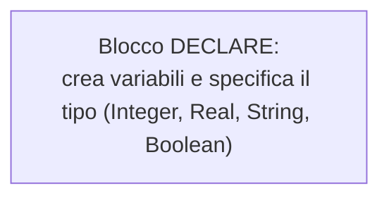
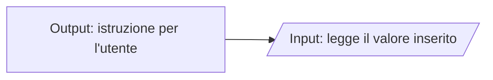
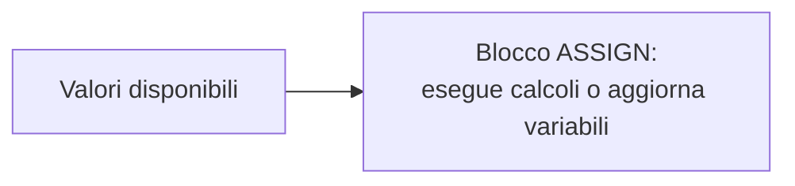
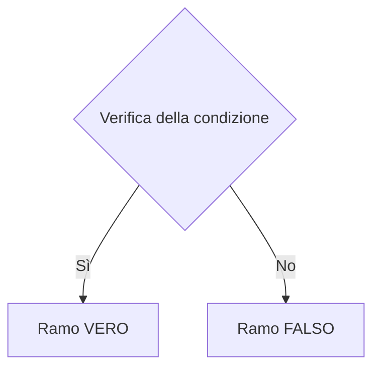
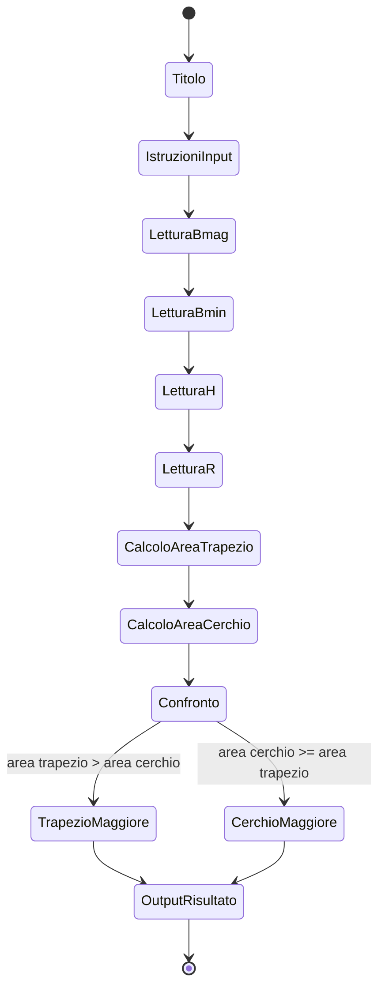
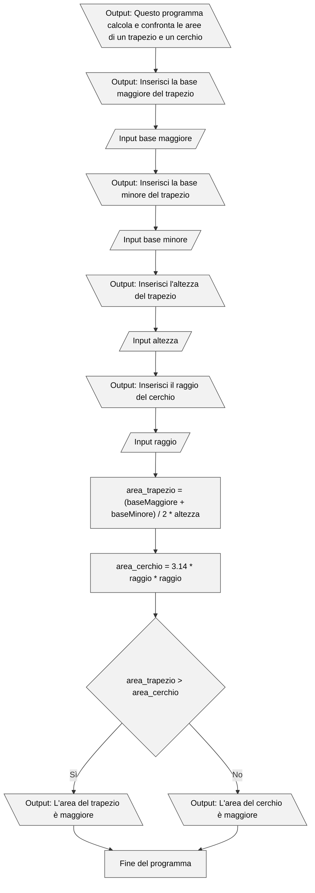

# Codificare un algoritmo con Flowgorithm

## 1. Introduzione a Flowgorithm

Flowgorithm è un ambiente visuale che permette di rappresentare algoritmi attraverso **diagrammi di flusso**.  
Il suo scopo è comprendere la logica della programmazione prima di utilizzare linguaggi testuali.

---

## 2. Download e installazione

### Versione “Executable Only” (consigliata)

Non richiede installazione: basta estrarre lo ZIP e avviare l’eseguibile.

Scaricare da:  
➡️ https://flowgorithm.org/download/index.html

Eseguire:

```bash
Flowgorithm.exe
```

---

## 3. Blocchi principali di Flowgorithm

Ogni blocco ha un ruolo preciso nella costruzione dell’algoritmo.

---

### 3.1 **Declare – Dichiarazione variabili**

Definisce variabili e tipo di dato.



---

### 3.2 **Input – Acquisizione dati**

Legge valori inseriti dall’utente.  
È sempre consigliato inserire prima un blocco Output che dia istruzioni.



---

### 3.3 **Assign – Assegnazione**

Esegue calcoli e assegna il risultato a variabili.



---

### 3.4 **Output – Stampa risultati**

Mostra un testo o un valore a schermo.


---

### 3.5 **If – Struttura condizionale**

Permette di scegliere diversi percorsi in base a una condizione.



---

## 4. Analisi del problema

### Problema

Calcolare:

- l’area di un trapezio (base maggiore, base minore, altezza)  
- l’area di un cerchio (raggio)  

e confrontarle per stabilire quale sia maggiore.

---

## 4.1 Come si individuano input, elaborazioni, output e condizioni

### **1) Individuazione degli INPUT**

Gli input sono dati **necessari** per partire e non ottenibili tramite calcoli.

Dal testo otteniamo:

- baseMaggiore  
- baseMinore  
- altezza  
- raggio  

### **2) Individuazione delle ELABORAZIONI**

Ogni formula richiede una variabile dedicata:

- `area_trapezio = (baseMaggiore + baseMinore) / 2 * altezza`  
- `area_cerchio = 3.14 * raggio * raggio`

Variabili generate:

- area_trapezio  
- area_cerchio  

### **3) Individuazione degli OUTPUT**

Il programma deve comunicare:

- area del trapezio  
- area del cerchio  
- quale area è maggiore

### **4) Individuazione delle CONDIZIONI**

Confronto:

```
area_trapezio > area_cerchio
```

Questa condizione non crea nuove variabili: usa quelle già esistenti.

---

## 4.2 Diagramma degli stati



---

## 4.3 Flowchart dettagliato



---

## 5. Schema delle variabili individuate

| Tipo | Variabili | Origine |
|------|-----------|---------|
| **Input** | baseMaggiore, baseMinore, altezza, raggio | esplicitati nel testo |
| **Elaborazione** | area_trapezio, area_cerchio | derivano dalle formule |
| **Output** | stessi valori delle aree + messaggio finale | richiesti dal problema |
| **Condizioni** | usa variabili esistenti | confronto tra aree |

---
