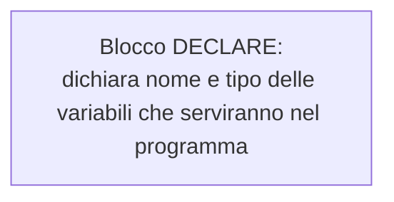
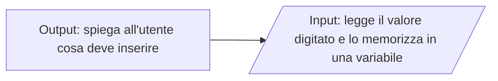
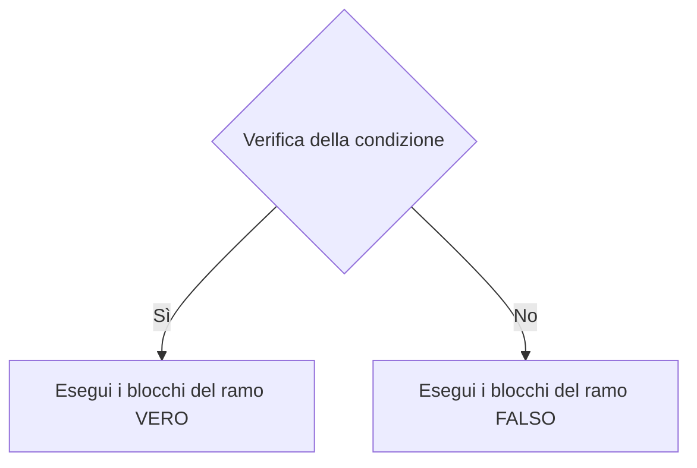
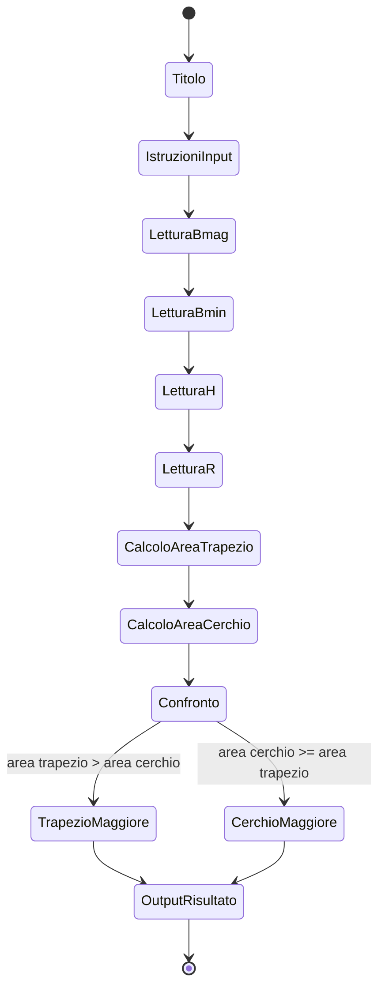
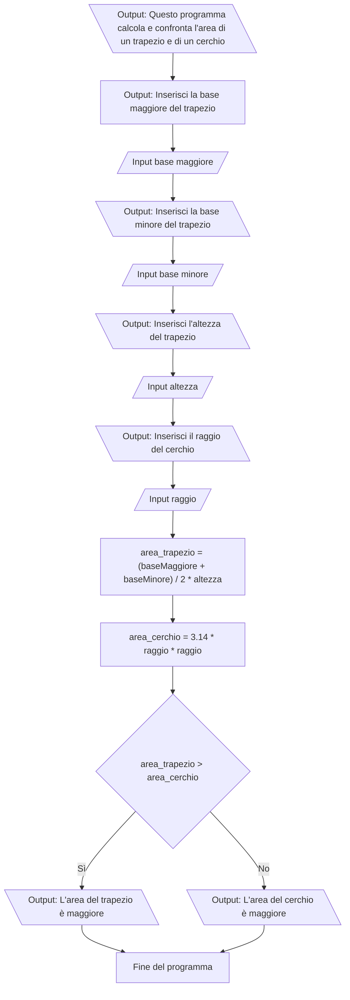

# Dispensa su Flowgorithm

## 1. Introduzione a Flowgorithm

Flowgorithm è un ambiente visuale che permette di rappresentare algoritmi attraverso **diagrammi di flusso**.  
Il suo scopo è aiutare gli studenti a comprendere il pensiero computazionale prima di programmare in un linguaggio reale.

---

## 2. Download e installazione

### Versione “Executable Only” (consigliata)

Non richiede installazione e funziona direttamente dopo aver estratto il contenuto del file ZIP.

Scaricare da:  
➡️ https://flowgorithm.org/download/index.html

Eseguire:

```
Flowgorithm.exe
```

---

## 3. Blocchi principali di Flowgorithm

I blocchi fondamentali permettono di costruire algoritmi chiari e corretti. Ogni blocco ha uno scopo preciso nella rappresentazione logica.

---

### 3.1 **Declare – Dichiarazione variabili**

Il blocco *Declare* definisce le variabili che verranno utilizzate nel programma.  
È una fase essenziale, perché permette di stabilire lo spazio di memoria necessario e il tipo di dato previsto (intero, reale, testo, booleano).



---

### 3.2 **Input – Acquisizione dati**

Il blocco *Input* consente di leggere valori inseriti dall’utente.  
Per migliorare l’esperienza e rendere chiaro cosa si deve digitare, **va sempre preceduto da un blocco Output di istruzione**.



---

### 3.3 **Assign – Assegnazione**

Il blocco *Assign* calcola espressioni e assegna il risultato a una variabile.  
Viene utilizzato per eseguire operazioni matematiche, aggiornare valori o inizializzare variabili.


---

### 3.4 **Output – Stampa di risultati e messaggi**

Il blocco *Output* mostra a schermo un testo o un valore.  
Può essere utilizzato sia per messaggi preliminari (istruzioni) sia per mostrare risultati finali.


---

### 3.5 **If – Struttura condizionale**

Il blocco *If* permette di prendere decisioni in base a una condizione logica.



---

## 4. Dall’analisi del testo alla costruzione del diagramma

### Problema

Calcolare:

- l’area di un **trapezio** usando: base maggiore, base minore, altezza  
- l’area di un **cerchio** usando il raggio

e confrontare i due valori, indicando quale area è maggiore.

---

## 4.1 Analisi dettagliata del testo

### **Input richiesti**

Per eseguire i calcoli servono quattro valori:

- base maggiore (Real)  
- base minore (Real)  
- altezza (Real)  
- raggio (Real)

Ogni input sarà preceduto da un messaggio esplicativo.

---

### **Elaborazioni**

- `area_trapezio = (B + b) / 2 * h`  
- `area_cerchio = π * r²`  
- confronto finale tra i due valori

---

### **Output**

- area del trapezio  
- area del cerchio  
- messaggio finale: quale area è maggiore

---

### **Condizione logica**

- Se area_trapezio > area_cerchio → il trapezio ha area maggiore  
- Altrimenti → il cerchio ha area maggiore

---

## 4.2 Diagramma degli fasi



---

## 4.3 Diagramma di flusso



---
