# Codificare un algoritmo con Flowgorithm

## 1. Introduzione a Flowgorithm

**Flowgorithm** è un ambiente visuale che permette di creare algoritmi con **diagrammi di flusso** (tipo flowchart).

È perfetto per capire la logica della programmazione SENZA dover scrivere codice vero. È tipo disegnare invece di scrivere: più intuitivo e meno frustrante per chi inizia!

Praticamente è la modalità "easy" della programmazione. Una volta capito il concetto, passare a linguaggi veri (Python, Java, C++) sarà molto più semplice.

---

## 2. Download e installazione

### Versione "Executable Only" (consigliata)

La versione più comoda: **non richiede installazione**! Basta scaricare lo ZIP, estrarlo e avviare l'eseguibile. Zero sbattimenti.

📥 **Download**: [Clicca qui per scaricare Flowgorithm](https://flowgorithm.org/download/index.html)

Dopo aver estratto, eseguite:

```bash
Flowgorithm.exe
```

E siete pronti a programmare!

---

## 3. Mappa concettuale: Algoritmi e Flowgorithm 🗺️

Prima di entrare nei dettagli, ecco una **mappa concettuale completa** che mostra tutti i concetti principali e come sono collegati tra loro. Usala come guida di riferimento mentre studi!

```mermaid
mindmap
  root((ALGORITMI<br/>e<br/>FLOWGORITHM))
    COS'È
      Ambiente visuale
      Diagrammi di flusso
      Imparare senza codice
      Base per linguaggi veri
    METODOLOGIA 5 PASSI
      1 Leggere il testo
        Sottolinea parole chiave
        Rileggi 2 volte
      2 INPUT
        Dati da chiedere
        Non calcolabili
        Blocco Input
      3 ELABORAZIONI
        Formule matematiche
        Calcoli
        Blocco Assign
      4 OUTPUT
        Risultati da mostrare
        Messaggi
        Blocco Output
      5 CONDIZIONI
        Confronti
        Decisioni
        Blocco If
    BLOCCHI PRINCIPALI
      Declare
        Crea variabili
        Specifica tipo
      Input
        Riceve dati utente
        Con istruzioni
      Assign
        Esegue calcoli
        Aggiorna variabili
      Output
        Mostra risultati
        Messaggi chiari
      If
        Verifica condizioni
        Vero o Falso
    PROCESSO RISOLUZIONE
      Analisi su carta
      Checklist verifica
      Bozza flowchart
      Creazione in Flowgorithm
      Test con esempi
    CONSIGLI PRATICI
      Usa carta e penna
      Nomi chiari variabili
      Messaggi prima input
      Testa con esempi
      Chiedi aiuto se bloccato
```



### 📖 Come usare questa mappa

**Per studiare:**
- Segui i rami principali per capire i concetti chiave
- Ogni ramo è collegato agli altri: tutto ha senso insieme!
- Usa i colori per distinguere le diverse aree

**Per risolvere problemi:**
- Parti dal ramo **METODOLOGIA 5 PASSI**
- Segui l'ordine: INPUT → ELABORAZIONI → OUTPUT → CONDIZIONI
- Usa il ramo **BLOCCHI PRINCIPALI** per sapere quale forma usare nel diagramma

**Per ripassare:**
- Guarda prima la mappa per avere la visione d'insieme
- Poi approfondisci ogni sezione del materiale
- Torna alla mappa per collegare i concetti

---

## 4. Blocchi principali di Flowgorithm

I diagrammi di flusso sono fatti di **blocchi** (forme geometriche) collegati tra loro. Ogni blocco ha un ruolo preciso.

---

### 3.1 **Declare – Dichiarazione variabili**

Serve a **creare variabili** e specificare il tipo di dato (numero intero, decimale, testo, vero/falso).


---

### 3.2 **Input – Acquisizione dati**

Chiede all'utente di inserire un valore (tipo "Inserisci la tua età").

**Pro tip**: prima dell'Input mettete sempre un blocco Output che spiega COSA deve inserire l'utente. Altrimenti l'utente si ritrova una finestra vuota e pensa "Cosa devo scrivere???"


---

### 3.3 **Assign – Assegnazione**

Fa **calcoli** e assegna il risultato a una variabile. Tipo: `area = base * altezza`. Questo è il blocco dove avviene la "magia matematica".


---

### 3.4 **Output – Stampa risultati**

Mostra un testo o un valore a schermo.


---

### 3.5 **If – Struttura condizionale**

Permette di scegliere diversi percorsi in base a una condizione.


---

## 4. Come analizzare un problema: metodologia passo-passo

Prima di iniziare a programmare (o creare il diagramma di flusso), dobbiamo **analizzare il problema**. Questa è la parte più importante! Se capisci bene il problema, risolverlo diventa facile.

### 📋 La metodologia in 5 passi

Quando ti danno un problema da risolvere, segui SEMPRE questi 5 passi in ordine:

#### **PASSO 1: Leggere attentamente il testo** 📖

- Leggi il problema **almeno 2 volte**
- Sottolinea o evidenzia le **parole chiave**
- Se non capisci qualcosa, rileggila o chiedi chiarimenti

**Domande da farti:**
- Cosa mi chiede di fare il problema?
- Quali informazioni mi dà il testo?
- Cosa devo calcolare o scoprire?

---

#### **PASSO 2: Identificare gli INPUT (dati in ingresso)** ⬇️

Gli **input** sono i dati che:
- Ti vengono **forniti** o che l'utente deve **inserire**
- Servono per iniziare il problema
- NON puoi calcolarli (devi chiederli!)

**Come riconoscerli nel testo:**
- Cerca parole come: "inserisci", "chiedi", "dato", "fornito", "conosciuto"
- Sono spesso i valori necessari per le formule

**Esempi:**
- "Inserisci il raggio del cerchio" → INPUT: `raggio`
- "Date le misure base e altezza" → INPUT: `base`, `altezza`
- "Chiedi all'utente l'età" → INPUT: `età`

**✏️ Fai una lista:** Scrivi tutti gli input con nomi chiari e comprensibili.

---

#### **PASSO 3: Identificare le ELABORAZIONI (calcoli)** 🧮

Le **elaborazioni** sono:
- I **calcoli** che devi fare
- Le **formule** da applicare
- Le **trasformazioni** dei dati

**Come riconoscerle nel testo:**
- Cerca parole come: "calcola", "trova", "somma", "moltiplica", "converti"
- Guarda se ci sono formule matematiche
- Ogni formula richiede una variabile per il risultato!

**Esempi:**
- "Calcola l'area del cerchio" → ELABORAZIONE: `area = 3.14 * raggio * raggio`
- "Trova la somma di due numeri" → ELABORAZIONE: `somma = numero1 + numero2`
- "Converti euro in dollari" → ELABORAZIONE: `dollari = euro * 1.10`

**✏️ Fai una lista:** Scrivi ogni formula e crea una variabile per ogni risultato.

---

#### **PASSO 4: Identificare gli OUTPUT (risultati)** ⬆️

Gli **output** sono:
- I **risultati** che devi mostrare all'utente
- Le **risposte** al problema
- I **messaggi** da visualizzare

**Come riconoscerli nel testo:**
- Cerca parole come: "mostra", "stampa", "visualizza", "comunica", "indica"
- È quello che l'utente deve vedere alla fine

**Esempi:**
- "Mostra l'area calcolata" → OUTPUT: `area`
- "Indica quale numero è maggiore" → OUTPUT: messaggio con il confronto
- "Stampa il risultato finale" → OUTPUT: `risultato`

**✏️ Fai una lista:** Scrivi cosa devi mostrare all'utente.

---

#### **PASSO 5: Identificare le CONDIZIONI (scelte)** 🔀

Le **condizioni** sono:
- I **confronti** tra valori
- Le **decisioni** da prendere
- I percorsi **alternativi** del programma

**Come riconoscerle nel testo:**
- Cerca parole come: "se", "maggiore", "minore", "uguale", "confronta", "verifica"
- Indicano situazioni in cui il programma deve scegliere cosa fare

**Esempi:**
- "Se il numero è positivo..." → CONDIZIONE: `numero > 0`
- "Confronta le due aree" → CONDIZIONE: `area1 > area2`
- "Verifica se l'età è maggiorenne" → CONDIZIONE: `età >= 18`

**✏️ Fai una lista:** Scrivi tutte le condizioni che devi verificare.

---

### 🎯 Schema visivo della metodologia

```mermaid
flowchart TD
    A[📖 Leggi il problema] --> B[⬇️ Trova gli INPUT]
    B --> C[🧮 Trova le ELABORAZIONI]
    C --> D[⬆️ Trova gli OUTPUT]
    D --> E[🔀 Trova le CONDIZIONI]
    E --> F[✅ Crea il diagramma di flusso]

    style A fill:#FFE4B5
    style B fill:#B0E0E6
    style C fill:#98FB98
    style D fill:#FFB6C1
    style E fill:#DDA0DD
    style F fill:#90EE90
```



---

### 📝 Checklist per l'analisi (stampala e usala!)

Prima di iniziare a programmare, verifica di aver fatto tutto:

- [ ] Ho letto il problema almeno 2 volte?
- [ ] Ho individuato TUTTI gli input necessari?
- [ ] Ho scritto TUTTE le formule e creato variabili per i risultati?
- [ ] So quali risultati devo mostrare all'utente?
- [ ] Ho identificato tutte le condizioni/confronti?
- [ ] Ho dato nomi chiari e comprensibili a tutte le variabili?

Se hai risposto SÌ a tutte le domande, sei pronto per creare il diagramma! 🎉

---

## 5. Esempio pratico: primo problema semplice

### Problema base

**Testo:** Scrivi un programma che chieda all'utente di inserire due numeri e mostri la loro somma.

### Analisi seguendo i 5 passi

**PASSO 1: Lettura**
- Il programma deve sommare due numeri
- Devo chiedere i numeri all'utente
- Devo mostrare il risultato

**PASSO 2: INPUT**
- `numero1` (primo numero inserito dall'utente)
- `numero2` (secondo numero inserito dall'utente)

**PASSO 3: ELABORAZIONI**
- `somma = numero1 + numero2`

**PASSO 4: OUTPUT**
- Mostrare il valore di `somma`

**PASSO 5: CONDIZIONI**
- Nessuna (è un problema semplice senza confronti)

### Diagramma di flusso semplificato


**Vedi?** Seguendo i 5 passi è facilissimo! Ora proviamo con un problema più complesso.

---

## 6. Esempio complesso: trapezio e cerchio

### 📜 Testo del problema

**Problema:** Scrivi un programma che:
1. Calcoli l'area di un trapezio (date base maggiore, base minore e altezza)
2. Calcoli l'area di un cerchio (dato il raggio)
3. Confronti le due aree e indichi quale figura ha l'area maggiore

### 🔍 Analisi seguendo i 5 passi

#### PASSO 1: Lettura attenta
- Devo calcolare DUE aree: trapezio e cerchio
- Formule necessarie:
  - Area trapezio = (base maggiore + base minore) / 2 × altezza
  - Area cerchio = π × raggio²
- Alla fine devo confrontare le aree e dire quale è maggiore

#### PASSO 2: INPUT (cosa devo chiedere?)
- `baseMaggiore` → serve per il trapezio
- `baseMinore` → serve per il trapezio
- `altezza` → serve per il trapezio
- `raggio` → serve per il cerchio

**Perché questi sono input?** Perché non posso calcolarli, devo chiederli all'utente!

#### PASSO 3: ELABORAZIONI (cosa devo calcolare?)
- `area_trapezio = (baseMaggiore + baseMinore) / 2 * altezza`
- `area_cerchio = 3.14 * raggio * raggio`

**Nota:** Ho creato DUE variabili nuove per contenere i risultati dei calcoli!

#### PASSO 4: OUTPUT (cosa devo mostrare?)
- Il valore di `area_trapezio`
- Il valore di `area_cerchio`
- Un messaggio che dice quale area è maggiore

#### PASSO 5: CONDIZIONI (quali confronti devo fare?)
- Prima verifico: `area_trapezio = area_cerchio` (sono uguali?)
- Se non sono uguali: `area_trapezio > area_cerchio` (quale è maggiore?)

### 📊 Tabella riassuntiva dell'analisi

| Categoria | Variabili/Operazioni | Spiegazione |
|-----------|---------------------|-------------|
| **INPUT** | `baseMaggiore`, `baseMinore`, `altezza`, `raggio` | Dati da chiedere all'utente |
| **ELABORAZIONI** | `area_trapezio = (baseMaggiore + baseMinore) / 2 * altezza`<br>`area_cerchio = 3.14 * raggio * raggio` | Formule da calcolare |
| **OUTPUT** | `area_trapezio`, `area_cerchio`, messaggio finale | Risultati da mostrare |
| **CONDIZIONI** | `area_trapezio = area_cerchio`<br>`area_trapezio > area_cerchio` | Confronti da verificare |

**Importante:** Le condizioni NON creano nuove variabili, usano quelle già esistenti!

---

### 🎯 Ordine logico delle operazioni

Ora che abbiamo analizzato il problema, dobbiamo decidere **in che ordine** fare le cose:

1. **Mostrare un messaggio iniziale** (spiegare cosa fa il programma)
2. **Chiedere tutti gli input** (uno alla volta, con istruzioni chiare)
3. **Fare i calcoli** (prima area trapezio, poi area cerchio)
4. **Fare i confronti** (prima verifico se sono uguali, poi quale è maggiore)
5. **Mostrare i risultati** (le aree calcolate e il messaggio finale)

**Regola d'oro:** Prima raccogli i dati, poi calcola, poi confronta, infine mostra i risultati!

---

## 6.1 Diagramma degli stati


---

## 6.2 Flowchart dettagliato con spiegazioni

Ora guardiamo il diagramma di flusso completo. Ogni blocco è spiegato:

**Legenda forme:**
- 🔵 Ovale = Inizio/Fine
- 📋 Parallelogramma inclinato = Input (riceve dati)
- 📄 Parallelogramma = Output (mostra dati)
- ▭ Rettangolo = Elaborazione (calcoli)
- ◇ Rombo = Decisione (condizione da verificare)


[Scarica il programma in formato Flowgorithm](./algoritmo_trapeziocerchio.fprg)

[Scarica il programma in formato Immagine (PNG)](./algoritmo_trapeziocerchio_img.png)

**💡 Spiegazione del flowchart:**

1. **Blocchi Output iniziali** (righe 193-200): Spiegano all'utente cosa inserire
2. **Blocchi Input** (C, E, G, I): Ricevono i 4 valori necessari
3. **Blocchi Assign** (J, K): Calcolano le due aree
4. **Blocco Decision** (L): Prima condizione - verifica se le aree sono uguali
5. **Blocco Decision** (L2): Seconda condizione - verifica quale è maggiore
6. **Blocchi Output finali** (M, N, P): Mostrano il risultato appropriato

**Nota bene:** Il programma segue SEMPRE un percorso lineare dall'alto verso il basso, ma può prendere strade diverse in base alle condizioni!

---

## 7. Schema delle variabili individuate

| Tipo | Variabili | Origine |
|------|-----------|---------|
| **Input** | baseMaggiore, baseMinore, altezza, raggio | esplicitati nel testo |
| **Elaborazione** | area_trapezio, area_cerchio | derivano dalle formule |
| **Output** | stessi valori delle aree + messaggio finale | richiesti dal problema |
| **Condizioni** | usa variabili esistenti | confronto tra aree |

---

## 8. Errori comuni da evitare ⚠️

Quando si analizzano i problemi, gli studenti commettono spesso questi errori. Evitali!

### ❌ Errore 1: Non leggere bene il testo
**Problema:** Saltare la lettura attenta e iniziare subito a programmare.
**Soluzione:** Leggi SEMPRE il problema almeno 2 volte prima di iniziare.

### ❌ Errore 2: Confondere input ed elaborazioni
**Problema:** Pensare che una formula sia un input.
**Esempio sbagliato:** Considerare "area" come input invece che come elaborazione.
**Soluzione:** Gli input sono SOLO i dati che devi chiedere. Le formule sono elaborazioni!

### ❌ Errore 3: Dimenticare di creare variabili per i risultati
**Problema:** Calcolare qualcosa ma non salvarlo in una variabile.
**Esempio sbagliato:** Scrivere la formula `3.14 * raggio * raggio` senza assegnarla a `area_cerchio`.
**Soluzione:** OGNI calcolo deve avere una variabile per il risultato!

### ❌ Errore 4: Non dare nomi chiari alle variabili
**Problema:** Usare nomi come `x`, `y`, `a`, `b` che non spiegano cosa contengono.
**Esempio sbagliato:** `x = y + z` (cosa sono x, y e z???)
**Esempio corretto:** `somma = numero1 + numero2` (chiarissimo!)
**Soluzione:** Dai SEMPRE nomi descrittivi alle variabili!

### ❌ Errore 5: Dimenticare i messaggi di output
**Problema:** Mostrare solo un numero senza spiegare cosa significa.
**Esempio sbagliato:** Output: `25`
**Esempio corretto:** Output: `L'area del cerchio è: 25`
**Soluzione:** Aggiungi sempre messaggi chiari prima dei valori!

### ❌ Errore 6: Non mettere le istruzioni prima degli input
**Problema:** Chiedere un valore senza dire all'utente cosa deve inserire.
**Soluzione:** SEMPRE un Output con istruzioni PRIMA di ogni Input!

---

## 9. Consigli pratici per il successo 💡

### ✅ Consiglio 1: Usa carta e penna
Prima di aprire Flowgorithm, prendi carta e penna e:
- Scrivi il testo del problema
- Sottolinea le parole chiave
- Fai le 5 liste (input, elaborazioni, output, condizioni, ordine)

### ✅ Consiglio 2: Procedi passo-passo
Non cercare di fare tutto insieme! Segui questo ordine:
1. Analizza il problema (5 passi)
2. Disegna una bozza del flowchart su carta
3. Apri Flowgorithm e crea il diagramma
4. Testa il programma con esempi

### ✅ Consiglio 3: Testa con esempi concreti
Dopo aver creato il diagramma, provalo con valori di esempio:
- Scegli numeri semplici (tipo 10, 5, 2)
- Verifica che i calcoli siano corretti
- Controlla che i messaggi abbiano senso

### ✅ Consiglio 4: Usa la checklist
Prima di dire "ho finito", controlla la checklist della sezione 4. Se anche solo una risposta è "no", non hai finito!

### ✅ Consiglio 5: Chiedi aiuto se sei bloccato
Se non riesci a identificare input/elaborazioni/output:
1. Rileggi il testo sottolineando le parole chiave
2. Prova a spiegare il problema a voce alta
3. Chiedi al compagno o al professore

---

## 10. Esercizi guidati per fare pratica 📝

Prova a risolvere questi problemi seguendo i 5 passi!

### Esercizio 1 (facile)
**Testo:** Scrivi un programma che chieda all'utente di inserire il lato di un quadrato e calcoli il perimetro e l'area.

**Suggerimento:**
- INPUT: lato
- ELABORAZIONI: perimetro = lato × 4, area = lato × lato
- OUTPUT: perimetro, area
- CONDIZIONI: nessuna

---

### Esercizio 2 (medio)
**Testo:** Scrivi un programma che chieda due numeri e indichi quale dei due è maggiore (o se sono uguali).

**Suggerimento:**
- INPUT: numero1, numero2
- ELABORAZIONI: nessuna (non servono calcoli!)
- OUTPUT: messaggio che indica quale è maggiore
- CONDIZIONI: numero1 = numero2, numero1 > numero2

---

### Esercizio 3 (difficile)
**Testo:** Scrivi un programma che converta una temperatura da gradi Celsius a Fahrenheit. Se la temperatura risultante è maggiore di 100°F, mostra il messaggio "Fa molto caldo!", altrimenti mostra "Temperatura normale".

**Suggerimento:**
- INPUT: celsius
- ELABORAZIONI: fahrenheit = celsius × 1.8 + 32
- OUTPUT: valore di fahrenheit, messaggio appropriato
- CONDIZIONI: fahrenheit > 100

---

## 11. Riepilogo finale: la strada verso il successo 🎯

Per risolvere QUALSIASI problema con Flowgorithm, segui questa strada:

```mermaid
flowchart LR
    A[📖 Leggi 2 volte] --> B[✏️ 5 passi<br/>su carta]
    B --> C[📋 Checklist<br/>completa?]
    C -->|No| B
    C -->|Sì| D[🎨 Bozza flowchart<br/>su carta]
    D --> E[💻 Crea in<br/>Flowgorithm]
    E --> F[🧪 Testa con<br/>esempi]
    F --> G{Funziona?}
    G -->|No| H[🔍 Trova errori]
    H --> E
    G -->|Sì| I[✅ Completato!]

    style A fill:#FFE4B5
    style B fill:#B0E0E6
    style C fill:#FFB6C1
    style D fill:#98FB98
    style E fill:#DDA0DD
    style F fill:#F0E68C
    style I fill:#90EE90
```



**Ricorda:** La programmazione è come imparare a guidare - all'inizio sembra difficile, ma con la pratica diventa automatico! Non scoraggiarti, segui il metodo e ce la farai! 💪

---

## 12. Risorse aggiuntive

### Link utili
- [Sito ufficiale Flowgorithm](https://flowgorithm.org/)
- [Tutorial video (in inglese)](https://www.youtube.com/results?search_query=flowgorithm+tutorial)

### File da scaricare per questo corso
- [Algoritmo trapezio-cerchio (.fprg)](./algoritmo_trapeziocerchio.fprg)
- [Immagine flowchart (.png)](./algoritmo_trapeziocerchio_img.png)

---

**Buono studio! Se segui il metodo dei 5 passi, diventerai un esperto di algoritmi in poco tempo!** 🚀
