# Codificare un algoritmo con Flowgorithm

## 1. Introduzione a Flowgorithm

**Flowgorithm** è un ambiente visuale che permette di creare algoritmi con **diagrammi di flusso** (tipo flowchart).

Odiate scrivere codice? Niente panico: qui **disegnate** invece di digitare. È tipo giocare con i blocchetti LEGO invece di scrivere un tema: decisamente più intuitivo e zero "SyntaxError" che ti fanno impazzire!

Praticamente è la modalità "tutorial facile" della programmazione. Una volta che hai capito la logica qui dentro, passare a Python, Java o C++ sarà come passare dalla bici con le rotelle alla mountain bike: un upgrade naturale, non un salto nel vuoto.

---

## 2. Download e installazione

### Versione "Executable Only" (consigliata)

La versione più comoda: **non richiede installazione**! Scarichi lo ZIP, lo estrai, clicchi sull'eseguibile e boom: sei operativo. Zero sbattimenti, zero configurazioni assurde, zero "ma sul mio PC non funziona".

📥 **Download**: [Clicca qui per scaricare Flowgorithm](https://flowgorithm.org/download/index.html)

Dopo aver estratto, eseguite:

```bash
Flowgorithm.exe
```

E siete pronti a programmare!

---

## 3. Mappa concettuale: Algoritmi e Flowgorithm 🗺️

Prima di entrare nei dettagli, ecco una **mappa concettuale completa** che mostra tutti i concetti principali e come sono collegati tra loro. Usala come guida di riferimento mentre studi!

```mermaid
mindmap
  root((ALGORITMI<br/>e<br/>FLOWGORITHM))
    COS'È
      Ambiente visuale
      Diagrammi di flusso
      Imparare senza codice
      Base per linguaggi veri
    METODOLOGIA 5 PASSI
      1 Leggere il testo
        Sottolinea parole chiave
        Rileggi 2 volte
      2 INPUT
        Dati da chiedere
        Non calcolabili
        Blocco Input
      3 ELABORAZIONI
        Formule matematiche
        Calcoli
        Blocco Assign
      4 OUTPUT
        Risultati da mostrare
        Messaggi
        Blocco Output
      5 CONDIZIONI
        Confronti
        Decisioni
        Blocco If
    BLOCCHI PRINCIPALI
      Declare
        Crea variabili
        Specifica tipo
      Input
        Riceve dati utente
        Con istruzioni
      Assign
        Esegue calcoli
        Aggiorna variabili
      Output
        Mostra risultati
        Messaggi chiari
      If
        Verifica condizioni
        Vero o Falso
    PROCESSO RISOLUZIONE
      Analisi su carta
      Checklist verifica
      Bozza flowchart
      Creazione in Flowgorithm
      Test con esempi
    CONSIGLI PRATICI
      Usa carta e penna
      Nomi chiari variabili
      Messaggi prima input
      Testa con esempi
      Chiedi aiuto se bloccato
```



### 📖 Come usare questa mappa

**Per studiare:**

- Segui i rami principali per capire i concetti chiave
- Ogni ramo è collegato agli altri: tutto ha senso insieme!
- Usa i colori per distinguere le diverse aree

**Per risolvere problemi:**

- Parti dal ramo **METODOLOGIA 5 PASSI**
- Segui l'ordine: INPUT → ELABORAZIONI → OUTPUT → CONDIZIONI
- Usa il ramo **BLOCCHI PRINCIPALI** per sapere quale forma usare nel diagramma

**Per ripassare:**

- Guarda prima la mappa per avere la visione d'insieme
- Poi approfondisci ogni sezione del materiale
- Torna alla mappa per collegare i concetti

---

## 4. Blocchi principali di Flowgorithm

I diagrammi di flusso sono fatti di **blocchi** (forme geometriche) collegati tra loro. Ogni forma ha un superpotere specifico. Tipo gli Avengers, ma versione nerd.

---

### 3.1 **Declare – Dichiarazione variabili**

Serve a **creare variabili** e specificare il tipo di dato (numero intero, decimale, testo, vero/falso).


---

### 3.2 **Input – Acquisizione dati**

Chiede all'utente di inserire un valore (tipo "Inserisci la tua età").

**Pro tip da esperti**: prima dell'Input mettete SEMPRE un blocco Output che spiega COSA deve inserire l'utente. Altrimenti compare una finestra vuota e il povero utente pensa "Devo scrivere il mio nome? Un numero? La risposta alla vita, l'universo e tutto quanto?" Evitate questa tortura psicologica.


---

### 3.3 **Assign – Assegnazione**

Fa **calcoli** e assegna il risultato a una variabile. Tipo: `area = base * altezza`. Questo è il blocco dove avviene la "magia matematica".


---

### 3.4 **Output – Stampa risultati**

Mostra un testo o un valore a schermo.


---

### 3.5 **If – Struttura condizionale**

Permette di scegliere diversi percorsi in base a una condizione.


---

## 4. Come analizzare un problema: metodologia passo-passo

Prima di iniziare a programmare (o creare il diagramma di flusso), dobbiamo **analizzare il problema**. Questa è LA parte più importante! È come leggere le istruzioni IKEA PRIMA di montare l'armadio: sì, lo so che nessuno lo fa, ma fidatevi, vi salverà ore di frustrazione. Se capisci bene il problema, risolverlo diventa un gioco da ragazzi.

### 📋 La metodologia in 5 passi

Quando ti danno un problema da risolvere, segui SEMPRE questi 5 passi in ordine. Tipo ricetta di cucina: se salti un ingrediente, poi il piatto fa schifo.

#### **PASSO 1: Leggere attentamente il testo** 📖

- Leggi il problema **almeno 2 volte** (sì, anche se pensi di aver capito al volo)
- Sottolinea o evidenzia le **parole chiave** (diventa un evidenziatore umano)
- Se non capisci qualcosa, rileggila o chiedi chiarimenti (non fare finta di aver capito, poi piangi dopo)

**Domande esistenziali da farti:**

- Cosa diavolo mi chiede di fare questo problema?
- Quali informazioni utili mi dà il testo (e quali sono solo fuffa)?
- Cosa devo calcolare o scoprire alla fine di tutto?

---

#### **PASSO 2: Identificare gli INPUT (dati in ingresso)** ⬇️

Gli **input** sono i dati che:

- Ti vengono **forniti** o che l'utente deve **inserire** (tipo ingredienti di una ricetta)
- Servono per far partire il problema (senza questi, sei fermo al palo)
- NON puoi calcolarli (se potessi calcolarli, non sarebbero input, genio!)

**Come riconoscerli nel testo (diventa un detective):**

- Cerca parole magiche tipo: "inserisci", "chiedi", "dato", "fornito", "conosciuto"
- Sono quasi sempre i valori che ti servono per le formule (tipo X e Y nell'equazione)

**Esempi:**

- "Inserisci il raggio del cerchio" → INPUT: `raggio`
- "Date le misure base e altezza" → INPUT: `base`, `altezza`
- "Chiedi all'utente l'età" → INPUT: `età`

**✏️ Fai una lista:** Scrivi tutti gli input con nomi chiari e comprensibili.

---

#### **PASSO 3: Identificare le ELABORAZIONI (calcoli)** 🧮

Le **elaborazioni** sono la parte dove fai effettivamente qualcosa:

- I **calcoli** che devi fare (la matematica vera e propria)
- Le **formule** da applicare (tipo quelle che hai studiato a geometria)
- Le **trasformazioni** dei dati (prendi una cosa e la converti in un'altra)

**Come riconoscerle nel testo:**

- Cerca verbi d'azione tipo: "calcola", "trova", "somma", "moltiplica", "converti", "determina"
- Guarda se ci sono formule matematiche (tipo "area del cerchio = π × r²")
- Ogni formula richiede una variabile per il risultato (altrimenti calcoli a vuoto come un criceto nella ruota!)

**Esempi:**

- "Calcola l'area del cerchio" → ELABORAZIONE: `area = 3.14 * raggio * raggio`
- "Trova la somma di due numeri" → ELABORAZIONE: `somma = numero1 + numero2`
- "Converti euro in dollari" → ELABORAZIONE: `dollari = euro * 1.10`

**✏️ Fai una lista:** Scrivi ogni formula e crea una variabile per ogni risultato.

---

#### **PASSO 4: Identificare gli OUTPUT (risultati)** ⬆️

Gli **output** sono il momento della gloria, quando mostri cosa hai fatto:

- I **risultati** che devi mostrare all'utente (tipo "TA-DA, ecco il risultato!")
- Le **risposte** al problema (quello per cui hai fatto tutto questo lavoro)
- I **messaggi** da visualizzare (comunicazione chiara = utente felice)

**Come riconoscerli nel testo:**

- Cerca parole tipo: "mostra", "stampa", "visualizza", "comunica", "indica", "restituisci"
- È la risposta finale che l'utente si aspetta di vedere (non lasciarlo a bocca asciutta!)

**Esempi:**

- "Mostra l'area calcolata" → OUTPUT: `area`
- "Indica quale numero è maggiore" → OUTPUT: messaggio con il confronto
- "Stampa il risultato finale" → OUTPUT: `risultato`

**✏️ Fai una lista:** Scrivi cosa devi mostrare all'utente.

---

#### **PASSO 5: Identificare le CONDIZIONI (scelte)** 🔀

Le **condizioni** sono i bivi del programma (tipo "scegli la tua avventura"):

- I **confronti** tra valori (chi è più grande? Chi è uguale?)
- Le **decisioni** da prendere (se succede X fai A, altrimenti fai B)
- I percorsi **alternativi** del programma (il programma "decide" cosa fare)

**Come riconoscerle nel testo:**

- Cerca parole tipo: "se", "maggiore", "minore", "uguale", "confronta", "verifica", "altrimenti"
- Indicano situazioni in cui il programma deve fare una scelta (tipo Sliding Doors, ma in versione codice)

**Esempi:**

- "Se il numero è positivo..." → CONDIZIONE: `numero > 0`
- "Confronta le due aree" → CONDIZIONE: `area1 > area2`
- "Verifica se l'età è maggiorenne" → CONDIZIONE: `età >= 18`

**✏️ Fai una lista:** Scrivi tutte le condizioni che devi verificare.

---

### 🎯 Schema visivo della metodologia

```mermaid
flowchart TD
    A[📖 Leggi il problema] --> B[⬇️ Trova gli INPUT]
    B --> C[🧮 Trova le ELABORAZIONI]
    C --> D[⬆️ Trova gli OUTPUT]
    D --> E[🔀 Trova le CONDIZIONI]
    E --> F[✅ Crea il diagramma di flusso]

    style A fill:#FFE4B5
    style B fill:#B0E0E6
    style C fill:#98FB98
    style D fill:#FFB6C1
    style E fill:#DDA0DD
    style F fill:#90EE90
```



---

### 📝 Checklist per l'analisi (salvala, stampala, tatuatela!)

Prima di iniziare a programmare, verifica di aver fatto tutto (seriamente, TUTTO):

- [ ] Ho letto il problema almeno 2 volte?
- [ ] Ho individuato TUTTI gli input necessari?
- [ ] Ho scritto TUTTE le formule e creato variabili per i risultati?
- [ ] So quali risultati devo mostrare all'utente?
- [ ] Ho identificato tutte le condizioni/confronti?
- [ ] Ho dato nomi chiari e comprensibili a tutte le variabili?

Se hai risposto SÌ a tutte le domande, complimenti: sei pronto per creare il diagramma! 🎉 Se anche solo UNA risposta è "no", torna indietro e sistema prima di procedere (fidati, ti ringrazierai dopo).

---

## 5. Esempio pratico: primo problema semplice

### Problema base

**Testo:** Scrivi un programma che chieda all'utente di inserire due numeri e mostri la loro somma.

### Analisi seguendo i 5 passi

#### PASSO 1: Lettura

- Il programma deve sommare due numeri
- Devo chiedere i numeri all'utente
- Devo mostrare il risultato

#### PASSO 2: INPUT

- `numero1` (primo numero inserito dall'utente)
- `numero2` (secondo numero inserito dall'utente)

#### PASSO 3: ELABORAZIONI

- `somma = numero1 + numero2`

#### PASSO 4: OUTPUT

- Mostrare il valore di `somma`

#### PASSO 5: CONDIZIONI

- Nessuna (è un problema semplice senza confronti)

### Diagramma di flusso semplificato


**Vedi come funziona?** Seguendo i 5 passi è facilissimo! Ora che hai capito il meccanismo, alziamo il livello con un problema più tosto.

---

## 6. Esempio complesso: trapezio e cerchio

### 📜 Testo del problema

**Problema:** Scrivi un programma che:

1. Calcoli l'area di un trapezio (date base maggiore, base minore e altezza)
2. Calcoli l'area di un cerchio (dato il raggio)
3. Confronti le due aree e indichi quale figura ha l'area maggiore

### 🔍 Analisi seguendo i 5 passi

#### PASSO 1: Lettura attenta

- Devo calcolare DUE aree: trapezio e cerchio
- Formule necessarie:

  - Area trapezio = (base maggiore + base minore) / 2 × altezza
  - Area cerchio = π × raggio²
- Alla fine devo confrontare le aree e dire quale è maggiore

#### PASSO 2: INPUT (cosa devo chiedere?)

- `baseMaggiore` → serve per il trapezio
- `baseMinore` → serve per il trapezio
- `altezza` → serve per il trapezio
- `raggio` → serve per il cerchio

**Perché questi sono input?** Semplice: non puoi calcolarli dal nulla, devi chiederli all'utente! Se non chiedi questi valori, il programma non può partire.

#### PASSO 3: ELABORAZIONI (cosa devo calcolare?)

- `area_trapezio = (baseMaggiore + baseMinore) / 2 * altezza`
- `area_cerchio = 3.14 * raggio * raggio`

**Nota importante:** Ho creato DUE variabili nuove per contenere i risultati dei calcoli! Ogni formula produce un risultato → ogni risultato va salvato in una variabile. Matematica base.

#### PASSO 4: OUTPUT (cosa devo mostrare?)

- Il valore di `area_trapezio`
- Il valore di `area_cerchio`
- Un messaggio che dice quale area è maggiore

#### PASSO 5: CONDIZIONI (quali confronti devo fare?)

- Prima verifico: `area_trapezio = area_cerchio` (sono uguali?)
- Se non sono uguali: `area_trapezio > area_cerchio` (quale è maggiore?)

### 📊 Tabella riassuntiva dell'analisi

| Categoria | Variabili/Operazioni | Spiegazione |
|-----------|---------------------|-------------|
| **INPUT** | `baseMaggiore`, `baseMinore`, `altezza`, `raggio` | Dati da chiedere all'utente |
| **ELABORAZIONI** | `area_trapezio = (baseMaggiore + baseMinore) / 2 * altezza`<br>`area_cerchio = 3.14 * raggio * raggio` | Formule da calcolare |
| **OUTPUT** | `area_trapezio`, `area_cerchio`, messaggio finale | Risultati da mostrare |
| **CONDIZIONI** | `area_trapezio = area_cerchio`<br>`area_trapezio > area_cerchio` | Confronti da verificare |

**Importante (e spesso dimenticato):** Le condizioni NON creano nuove variabili, usano solo quelle che hai già calcolato prima! Riutilizzano i risultati per fare confronti.

---

### 🎯 Ordine logico delle operazioni

Ora che abbiamo analizzato il problema, dobbiamo decidere **in che ordine** fare le cose:

1. **Mostrare un messaggio iniziale** (spiegare cosa fa il programma)
2. **Chiedere tutti gli input** (uno alla volta, con istruzioni chiare)
3. **Fare i calcoli** (prima area trapezio, poi area cerchio)
4. **Fare i confronti** (prima verifico se sono uguali, poi quale è maggiore)
5. **Mostrare i risultati** (le aree calcolate e il messaggio finale)

**Regola d'oro (incidila nella pietra):** Prima raccogli i dati, poi calcola, poi confronta, infine mostra i risultati! Questo ordine non è casuale, è LOGICO. Non puoi calcolare prima di avere i dati, né confrontare prima di aver calcolato. Easy.

---

## 6.1 Diagramma degli stati


---

## 6.2 Flowchart dettagliato con spiegazioni

Ora guardiamo il diagramma di flusso completo. Ogni blocco è spiegato:

**Legenda forme:**

- 🔵 Ovale = Inizio/Fine
- 📋 Parallelogramma inclinato = Input (riceve dati)
- 📄 Parallelogramma = Output (mostra dati)
- ▭ Rettangolo = Elaborazione (calcoli)
- ◇ Rombo = Decisione (condizione da verificare)


[Scarica il programma in formato Flowgorithm](./algoritmo_trapeziocerchio.fprg)

[Scarica il programma in formato Immagine (PNG)](./algoritmo_trapeziocerchio_img.png)

**💡 Spiegazione del flowchart:**

1. **START** (ovale): Blocco di inizio del programma
2. **Blocco A** (output): Messaggio introduttivo che spiega cosa fa il programma
3. **Blocchi B, D, F, H** (output): Istruzioni per l'utente su cosa inserire
4. **Blocchi C, E, G, I** (input): Ricevono i 4 valori necessari (baseMaggiore, baseMinore, altezza, raggio)
5. **Blocchi J, K** (assign): Calcolano le due aree con le formule
6. **Blocco L** (decision - rombo): Prima condizione - verifica se le aree sono uguali
7. **Blocco L2** (decision - rombo): Seconda condizione - verifica quale area è maggiore
8. **Blocchi M, N, P** (output): Mostrano il risultato appropriato in base alle condizioni
9. **END** (ovale): Blocco di fine del programma

**Nota bene:** Il programma segue SEMPRE un percorso dall'alto verso il basso (come l'acqua che scende), ma può prendere strade diverse in base alle condizioni verificate nei blocchi L e L2! È tipo un fiume con bivi: la direzione dipende dalla condizione.

---

## 7. Schema delle variabili individuate

| Tipo | Variabili | Origine |
|------|-----------|---------|
| **Input** | baseMaggiore, baseMinore, altezza, raggio | esplicitati nel testo |
| **Elaborazione** | area_trapezio, area_cerchio | derivano dalle formule |
| **Output** | stessi valori delle aree + messaggio finale | richiesti dal problema |
| **Condizioni** | usa variabili esistenti | confronto tra aree |

---

## 8. Errori comuni da evitare ⚠️

Quando si analizzano i problemi, gli studenti commettono SEMPRE gli stessi errori. Tipo errori da manuale. Evitali e risparmia ore di debugging!

### ❌ Errore 1: Non leggere bene il testo

**Problema:** Vedere il testo, pensare "ho capito" in 3 secondi, e partire in quarta col diagramma.

**Soluzione:** Leggi SEMPRE il problema almeno 2 volte LENTAMENTE prima di iniziare. Non sei The Flash, rallenta. La fretta è la madre di tutti i bug.

### ❌ Errore 2: Confondere input ed elaborazioni

**Problema:** Pensare che una formula sia un input (tipo confondere le uova con la frittata).

**Esempio sbagliato:** Considerare "area" come input. No! L'area si CALCOLA, non la chiedi all'utente!

**Soluzione:** Gli input sono SOLO i dati che devi chiedere all'utente. Le formule sono elaborazioni! Se c'è un segno "=" con un calcolo, NON è un input.

### ❌ Errore 3: Dimenticare di creare variabili per i risultati

**Problema:** Calcolare qualcosa ma non salvarlo da nessuna parte (tipo fare la spesa e lasciare tutto al supermercato).

**Esempio sbagliato:** Scrivere `3.14 * raggio * raggio` e basta. Ok, e il risultato dove va? Nel vuoto cosmico?

**Soluzione:** OGNI calcolo deve avere una variabile per il risultato! Tipo `area_cerchio = 3.14 * raggio * raggio`. Calcola E salva.

### ❌ Errore 4: Non dare nomi chiari alle variabili

**Problema:** Chiamare le variabili con nomi criptici tipo `x`, `y`, `a`, `b`, `temp`, `var1` che non spiegano un cavolo.

**Esempio sbagliato:** `x = y + z` ← Ma cosa diavolo sono x, y e z??? Mistero.

**Esempio corretto:** `somma = numero1 + numero2` ← Ahhhh, ora è tutto chiaro!

**Soluzione:** Dai SEMPRE nomi descrittivi alle variabili! Tra 2 giorni rileggi il codice e devi capire cosa fa SENZA sforzo mentale.

### ❌ Errore 5: Dimenticare i messaggi di output

**Problema:** Mostrare un numero a caso tipo oracolo di Delfi e sperare che l'utente capisca.

**Esempio sbagliato:** Output: `25` ← 25 cosa? Anni? Euro? Gradi? L'età di mia zia?

**Esempio corretto:** Output: `L'area del cerchio è: 25` ← Perfetto, ora è chiaro!

**Soluzione:** Aggiungi SEMPRE messaggi esplicativi prima dei valori! L'utente non è un telepate.

### ❌ Errore 6: Non mettere le istruzioni prima degli input

**Problema:** Aprire una finestra di input vuota e aspettare che l'utente indovini cosa scrivere (tipo gioco d'azzardo).

**Soluzione:** SEMPRE un Output con istruzioni chiare PRIMA di ogni Input! Tipo "Inserisci il raggio del cerchio". Così l'utente sa cosa fare e non ti maledice.

---

## 9. Consigli pratici per il successo 💡

### ✅ Consiglio 1: Usa carta e penna (sì, roba old school)

Prima di aprire Flowgorithm, prendi carta e penna (o tablet se sei super tech) e:

- Scrivi il testo del problema per intero
- Sottolinea le parole chiave come un forsennato
- Fai le 5 liste sacre (input, elaborazioni, output, condizioni, ordine)

Sì, sembra un lavoro in più. Ma ti fa risparmiare TONNELLATE di tempo dopo. Provare per credere.

### ✅ Consiglio 2: Procedi passo-passo (no multitasking da eroe)

Non cercare di fare tutto insieme tipo supereroe! Il multitasking è un mito. Segui questo ordine preciso:

1. Analizza il problema (5 passi, vedi sopra)
2. Disegna una bozza del flowchart su carta (brutti schizzi vanno benissimo)
3. Apri Flowgorithm e crea il diagramma (copia dalla bozza)
4. Testa il programma con esempi (prova vari numeri e controlla)

### ✅ Consiglio 3: Testa con esempi concreti (debug precoce = successo)

Dopo aver creato il diagramma, NON dire "beh, sembra giusto". Provalo DAVVERO con valori reali:

- Scegli numeri semplici tipo 10, 5, 2 (facili da verificare a mente)
- Verifica che i calcoli siano corretti (usa la calcolatrice se serve)
- Controlla che i messaggi abbiano senso (rileggili come se fossi l'utente finale)

### ✅ Consiglio 4: Usa la checklist (non fregarti da solo)

Prima di dire "ho finito" e chiudere tutto, controlla la checklist della sezione 4. Se anche solo UNA risposta è "no", indovina un po'? NON hai finito! Torna indietro e sistema.

### ✅ Consiglio 5: Chiedi aiuto se sei bloccato (nessuna vergogna)

Se sei bloccato e non riesci a identificare input/elaborazioni/output, NON fissare lo schermo per ore:

1. Rileggi il testo sottolineando TUTTE le parole chiave (magari ti è sfuggito qualcosa)
2. Prova a spiegare il problema a voce alta (anche al tuo gatto funziona, sul serio)
3. Chiedi al compagno o al professore (meglio 5 minuti di domande che 3 ore di blocco mentale)

---

## 10. Esercizi guidati per fare pratica 📝

Prova a risolvere questi problemi seguendo i 5 passi!

### Esercizio 1 (facile)

**Testo:** Scrivi un programma che chieda all'utente di inserire il lato di un quadrato e calcoli il perimetro e l'area.

**Suggerimento:**

- INPUT: lato
- ELABORAZIONI: perimetro = lato × 4, area = lato × lato
- OUTPUT: perimetro, area
- CONDIZIONI: nessuna

---

### Esercizio 2 (medio)

**Testo:** Scrivi un programma che chieda due numeri e indichi quale dei due è maggiore (o se sono uguali).

**Suggerimento:**

- INPUT: numero1, numero2
- ELABORAZIONI: nessuna (non servono calcoli!)
- OUTPUT: messaggio che indica quale è maggiore
- CONDIZIONI: numero1 = numero2, numero1 > numero2

---

### Esercizio 3 (difficile)

**Testo:** Scrivi un programma che converta una temperatura da gradi Celsius a Fahrenheit. Se la temperatura risultante è maggiore di 100°F, mostra il messaggio "Fa molto caldo!", altrimenti mostra "Temperatura normale".

**Suggerimento:**

- INPUT: celsius
- ELABORAZIONI: fahrenheit = celsius × 1.8 + 32
- OUTPUT: valore di fahrenheit, messaggio appropriato
- CONDIZIONI: fahrenheit > 100

---

## 11. Riepilogo finale: la strada verso il successo 🎯

Per risolvere QUALSIASI problema con Flowgorithm, segui questa strada:

```mermaid
flowchart LR
    A[📖 Leggi 2 volte] --> B[✏️ 5 passi<br/>su carta]
    B --> C[📋 Checklist<br/>completa?]
    C -->|No| B
    C -->|Sì| D[🎨 Bozza flowchart<br/>su carta]
    D --> E[💻 Crea in<br/>Flowgorithm]
    E --> F[🧪 Testa con<br/>esempi]
    F --> G{Funziona?}
    G -->|No| H[🔍 Trova errori]
    H --> E
    G -->|Sì| I[✅ Completato!]

    style A fill:#FFE4B5
    style B fill:#B0E0E6
    style C fill:#FFB6C1
    style D fill:#98FB98
    style E fill:#DDA0DD
    style F fill:#F0E68C
    style I fill:#90EE90
```



**Ricorda:** La programmazione è come imparare a guidare - all'inizio sembra impossibile (troppe cose da fare insieme!), ma con la pratica diventa automatico! Il segreto? Pratica, metodo e pazienza. Non scoraggiarti al primo errore. Anche i pro hanno iniziato così. Segui il metodo dei 5 passi e ce la farai! 💪

---

## 12. Risorse aggiuntive

### Link utili

- [Sito ufficiale Flowgorithm](https://flowgorithm.org/)
- [Tutorial video (in inglese)](https://www.youtube.com/results?search_query=flowgorithm+tutorial)

### File da scaricare per questo corso

- [Algoritmo trapezio-cerchio (.fprg)](./algoritmo_trapeziocerchio.fprg)
- [Immagine flowchart (.png)](./algoritmo_trapeziocerchio_img.png)

---

**Buono studio! Se segui il metodo dei 5 passi con costanza, diventerai un esperto di algoritmi in poco tempo. E quando passerai a Python o Java, penserai "ma è facilissimo!". Parola di chi ci è passato.** 🚀
