# Da Flowgorithm a Python: guida pratica alla transizione

## 1. Introduzione

Hai imparato a creare algoritmi con Flowgorithm usando i diagrammi di flusso? Ottimo! Ora è il momento di fare il salto verso la **programmazione vera e propria** con Python.

Non preoccuparti: se hai capito come funzionano i flowchart, passare a Python sarà come tradurre da una lingua all'altra. I concetti sono **esattamente gli stessi**, cambia solo la "sintassi" (il modo di scrivere).

**Ricordi quando ti avevamo detto che Flowgorithm era tipo la bici con le rotelle?** Bene, ora togliamo le rotelle e passiamo alla mountain bike. Stessa logica, più libertà e potenza! 🚴‍♂️➡️🚵

---

## 2. Perché Python?

Python è uno dei linguaggi più usati al mondo per un motivo: **è semplice e potente**. È perfetto per chi inizia, ma anche i professionisti lo usano per:

- Intelligenza artificiale e machine learning
- Analisi dati e data science
- Sviluppo web
- Automazione e scripting
- E molto altro!

**La buona notizia?** La logica che hai imparato con Flowgorithm (i famosi 5 passi: input, elaborazioni, output, condizioni) funziona **IDENTICA** in Python. Cambia solo come la scrivi!

---

## 3. Tabella di traduzione: Flowgorithm → Python

Ecco la tabella più importante di questa guida. Salvala, stampala, mettila come sfondo del desktop!

| Concetto | Flowgorithm (flowchart) | Python (codice) | Note |
|----------|------------------------|-----------------|------|
| **Inizio programma** | Blocco ovale "Start" | Niente di speciale, inizi a scrivere | Python non ha bisogno di dichiarare l'inizio |
| **Fine programma** | Blocco ovale "End" | Niente di speciale, il programma finisce automaticamente | - |
| **Dichiarazione variabile** | Blocco "Declare" con tipo | Nessuna dichiarazione esplicita | Python capisce il tipo automaticamente |
| **Input** | Blocco parallelogramma Input | `variabile = input("messaggio")` | Input restituisce sempre una stringa! |
| **Output** | Blocco parallelogramma Output | `print("messaggio", variabile)` | Puoi stampare testo e variabili insieme |
| **Assegnazione** | Blocco rettangolo Assign | `variabile = espressione` | Usa `=` per assegnare valori |
| **Condizione If** | Blocco rombo Decision | `if condizione:` | Non dimenticare i due punti `:` e l'indentazione! |
| **Commenti** | Blocco "Comment" | `# questo è un commento` | I commenti iniziano con `#` |

---

## 4. I blocchi Flowgorithm tradotti in Python

### 4.1 Declare (Dichiarazione variabili)

**In Flowgorithm:**

```
Declare Integer numero
Declare Real prezzo
Declare String nome
Declare Boolean verifica
```

**In Python:**

```python
# Python NON richiede dichiarazione esplicita!
# Crei la variabile semplicemente assegnandole un valore:

numero = 0          # Python capisce che è un intero
prezzo = 0.0        # Python capisce che è un numero decimale
nome = ""           # Python capisce che è una stringa
verifica = False    # Python capisce che è un booleano
```

**💡 Differenza chiave:** Python è un linguaggio a **tipizzazione dinamica**. Non devi dire "questa è una variabile intera", basta assegnarle un valore e Python capisce da solo! Meno lavoro per te. 🎉

---

### 4.2 Output (Mostrare messaggi)

**In Flowgorithm:**

```
Output: "Ciao!"
Output: "Il risultato è: " & risultato
```

**In Python:**

```python
print("Ciao!")
print("Il risultato è:", risultato)

# Oppure con concatenazione stringa:
print("Il risultato è: " + str(risultato))
```

**💡 Pro tip:** Usa la virgola `,` in `print()` per separare testo e variabili - Python aggiunge automaticamente uno spazio! Se concateni con `+`, devi convertire i numeri in stringhe con `str()`.

**Esempi pratici:**

```python
nome = "Mario"
eta = 20

print("Ciao", nome)                    # Output: Ciao Mario
print("Hai", eta, "anni")              # Output: Hai 20 anni
print(nome + " ha " + str(eta) + " anni")  # Output: Mario ha 20 anni
```

---

### 4.3 Input (Ricevere dati dall'utente)

**In Flowgorithm:**

```
Output: "Inserisci il tuo nome"
Input nome
```

**In Python:**

```python
nome = input("Inserisci il tuo nome: ")
```

**⚠️ ATTENZIONE - SUPER IMPORTANTE!**

`input()` in Python restituisce **SEMPRE una stringa**, anche se l'utente scrive un numero! Se devi fare calcoli, devi **convertire** il valore!

**Conversioni necessarie:**

```python
# Per numeri INTERI:
eta = int(input("Inserisci la tua età: "))

# Per numeri DECIMALI:
prezzo = float(input("Inserisci il prezzo: "))

# Per STRINGHE (testo):
nome = input("Inserisci il nome: ")  # Già stringa, nessuna conversione!
```

**Esempio completo:**

```python
# SBAGLIATO - non funziona per i calcoli!
numero1 = input("Inserisci un numero: ")  # Questo è una stringa "5", non il numero 5
numero2 = input("Inserisci un altro numero: ")
somma = numero1 + numero2  # ❌ Questo concatena stringhe: "5" + "3" = "53"

# CORRETTO - converte in numeri!
numero1 = int(input("Inserisci un numero: "))  # Ora è il numero 5
numero2 = int(input("Inserisci un altro numero: "))
somma = numero1 + numero2  # ✅ Questo somma: 5 + 3 = 8
```

---

### 4.4 Assign (Assegnazione e calcoli)

**In Flowgorithm:**

```
area = base * altezza
somma = numero1 + numero2
```

**In Python:**

```python
area = base * altezza
somma = numero1 + numero2
```

**Operatori matematici in Python:**

| Operazione          | Simbolo | Esempio  | Risultato |
|---------------------|---------|----------|-----------|
| Addizione           | `+`     | `5 + 3`  | `8`       |
| Sottrazione         | `-`     | `5 - 3`  | `2`       |
| Moltiplicazione     | `*`     | `5 * 3`  | `15`      |
| Divisione (decimale)| `/`     | `5 / 2`  | `2.5`     |
| Divisione intera    | `//`    | `5 // 2` | `2`       |
| Resto (modulo)      | `%`     | `5 % 2`  | `1`       |
| Potenza             | `**`    | `5 ** 2` | `25`      |

**Esempi pratici:**

```python
# Calcolo area trapezio
base_maggiore = 10
base_minore = 6
altezza = 5
area_trapezio = (base_maggiore + base_minore) / 2 * altezza

# Calcolo area cerchio
raggio = 3
pi = 3.14159
area_cerchio = pi * raggio ** 2  # ** significa "elevato a"

# Conversione temperature
celsius = 25
fahrenheit = celsius * 1.8 + 32
```

---

### 4.5 If (Condizioni)

**In Flowgorithm:**

```
If numero > 0 Then
    Output: "Positivo"
Else
    Output: "Negativo o zero"
End If
```

**In Python:**

```python
if numero > 0:
    print("Positivo")
else:
    print("Negativo o zero")
```

**⚠️ ATTENZIONE all'indentazione!**

Python usa gli **spazi** (o tab) per capire quali righe fanno parte del blocco `if`. Questo è FONDAMENTALE! Se sbagli l'indentazione, il programma non funziona.

**Operatori di confronto:**

| Confronto          | Simbolo | Esempio  | Significato                     |
|--------------------|---------|----------|---------------------------------|
| Uguale             | `==`    | `x == 5` | x è uguale a 5?                 |
| Diverso            | `!=`    | `x != 5` | x è diverso da 5?               |
| Maggiore           | `>`     | `x > 5`  | x è maggiore di 5?              |
| Minore             | `<`     | `x < 5`  | x è minore di 5?                |
| Maggiore o uguale  | `>=`    | `x >= 5` | x è maggiore o uguale a 5?      |
| Minore o uguale    | `<=`    | `x <= 5` | x è minore o uguale a 5?        |

**⚠️ ERRORE COMUNE:** Usare `=` invece di `==` nelle condizioni!

```python
# ❌ SBAGLIATO:
if x = 5:  # Questo dà errore! = è assegnazione, non confronto!

# ✅ CORRETTO:
if x == 5:  # Questo controlla se x è uguale a 5
```

**Strutture condizionali multiple (if-elif-else):**

```python
# Se hai più condizioni da verificare:
if eta < 18:
    print("Minorenne")
elif eta < 65:
    print("Adulto")
else:
    print("Anziano")
```

**Operatori logici (AND, OR, NOT):**

```python
# AND - entrambe le condizioni devono essere vere
if eta >= 18 and patente == True:
    print("Puoi guidare")

# OR - almeno una condizione deve essere vera
if giorno == "sabato" or giorno == "domenica":
    print("È weekend!")

# NOT - inverte il valore booleano
if not piove:
    print("Possiamo uscire")
```

---

## 5. Esempio completo: Somma di due numeri

### Flowchart Flowgorithm

```mermaid
flowchart TD
    A([Inizio]) --> B["Output: Inserisci il primo numero"]
    B --> C[/Input numero1/]
    C --> D["Output: Inserisci il secondo numero"]
    D --> E[/Input numero2/]
    E --> F["somma = numero1 + numero2"]
    F --> G["Output: La somma è: somma"]
    G --> H([Fine])
```



### Codice Python equivalente

```python
# Programma che somma due numeri

# INPUT
numero1 = int(input("Inserisci il primo numero: "))
numero2 = int(input("Inserisci il secondo numero: "))

# ELABORAZIONE
somma = numero1 + numero2

# OUTPUT
print("La somma è:", somma)
```

**Vedi? Esattamente gli stessi passaggi!** Input → Elaborazione → Output. La struttura è identica, cambia solo la sintassi!

---

## 6. Esempio completo: Trapezio e Cerchio

Ricordi l'esercizio complesso di Flowgorithm con trapezio e cerchio? Ecco la traduzione completa in Python!

### Versione Python completa

```python
# Programma che calcola e confronta le aree di un trapezio e un cerchio

print("Questo programma calcola e confronta le aree di un trapezio e un cerchio")
print()  # Stampa una riga vuota per leggibilità

# INPUT - Raccolta dati
base_maggiore = float(input("Inserisci la base maggiore del trapezio: "))
base_minore = float(input("Inserisci la base minore del trapezio: "))
altezza = float(input("Inserisci l'altezza del trapezio: "))
raggio = float(input("Inserisci il raggio del cerchio: "))

# ELABORAZIONI - Calcoli
area_trapezio = (base_maggiore + base_minore) / 2 * altezza
area_cerchio = 3.14159 * raggio ** 2

# OUTPUT - Mostra i risultati
print()  # Riga vuota per separare
print("Area del trapezio:", area_trapezio)
print("Area del cerchio:", area_cerchio)
print()  # Riga vuota

# CONDIZIONI - Confronto
if area_trapezio == area_cerchio:
    print("Le aree delle due figure sono uguali")
elif area_trapezio > area_cerchio:
    print("L'area del trapezio è maggiore")
else:
    print("L'area del cerchio è maggiore")
```

**💡 Confronta con il flowchart di Flowgorithm!** È IDENTICO nella logica:

1. Messaggio iniziale ✅
2. Richiesta di tutti gli input ✅
3. Calcolo delle due aree ✅
4. Confronto con if-elif-else ✅
5. Output dei risultati ✅

---

## 7. Differenze chiave tra Flowgorithm e Python

### 7.1 Indentazione (fondamentale!)

**Flowgorithm:** Usa le forme grafiche per definire i blocchi

**Python:** Usa gli **spazi** (o tab) per definire i blocchi di codice

```python
# Indentazione corretta:
if eta >= 18:
    print("Sei maggiorenne")  # 4 spazi (o 1 tab) di indentazione
    print("Puoi votare")      # Stesso livello di indentazione

# ❌ Indentazione sbagliata:
if eta >= 18:
print("Sei maggiorenne")  # ERRORE! Manca l'indentazione!
```

**💡 Regola d'oro:** Dopo i due punti `:`, vai a capo e **indenta** (sposta a destra) il codice!

---

### 7.2 Conversione dei tipi

**Flowgorithm:** Devi dichiarare il tipo (Integer, Real, String) all'inizio

**Python:** Devi convertire manualmente quando necessario

```python
# Input come stringa
testo = input("Scrivi qualcosa: ")  # Tipo: stringa

# Input convertito in numero intero
numero_intero = int(input("Inserisci un intero: "))  # Tipo: int

# Input convertito in numero decimale
numero_decimale = float(input("Inserisci un decimale: "))  # Tipo: float

# Conversioni tra tipi:
numero = 42
testo = str(numero)  # Converte numero in stringa: "42"

testo = "100"
numero = int(testo)  # Converte stringa in numero: 100

numero_decimale = float(numero)  # Converte int in float: 100.0
```

---

### 7.3 Operatori logici

**Flowgorithm:** AND, OR, NOT (parole intere)

**Python:** `and`, `or`, `not` (minuscolo!)

```python
# Flowgorithm: x > 0 AND x < 10
# Python equivalente:
if x > 0 and x < 10:
    print("x è tra 0 e 10")

# Flowgorithm: giorno = "sabato" OR giorno = "domenica"
# Python equivalente:
if giorno == "sabato" or giorno == "domenica":
    print("È weekend!")

# Flowgorithm: NOT trovato
# Python equivalente:
if not trovato:
    print("Non trovato")
```

---

## 8. Come eseguire un programma Python

### Metodo 1: IDLE (IDE incluso con Python)

1. Scarica e installa Python da [python.org](https://www.python.org/downloads/)
2. Apri IDLE (viene installato insieme a Python)
3. File → New File
4. Scrivi il tuo codice
5. File → Save (salva con estensione `.py`, esempio: `programma.py`)
6. Run → Run Module (oppure premi F5)

### Metodo 2: Terminale/Prompt dei comandi

```bash
# 1. Crea un file .py con un editor di testo (Notepad, VSCode, etc.)
# 2. Salva il file, esempio: programma.py
# 3. Apri il terminale nella cartella del file
# 4. Esegui:
python programma.py
```

### Metodo 3: Editor online (per iniziare senza installare)

Se vuoi provare subito senza installare nulla:

- [Replit](https://replit.com/) - editor online, gratuito
- [Google Colab](https://colab.research.google.com/) - notebook Python online
- [Python.org Shell](https://www.python.org/shell/) - interprete online

---

## 9. Esercizi di traduzione Flowgorithm → Python

Prova a tradurre questi algoritmi da Flowgorithm a Python!

### Esercizio 1 (facile): Calcolo perimetro e area quadrato

**Flowchart Flowgorithm:**

```
1. Output: "Inserisci il lato del quadrato"
2. Input lato
3. perimetro = lato * 4
4. area = lato * lato
5. Output: perimetro
6. Output: area
```

**Prova a scriverlo in Python!** (Soluzione sotto)

<details>
<summary>💡 Clicca per vedere la soluzione</summary>

```python
# Calcolo perimetro e area di un quadrato

lato = float(input("Inserisci il lato del quadrato: "))

perimetro = lato * 4
area = lato * lato  # oppure: area = lato ** 2

print("Il perimetro è:", perimetro)
print("L'area è:", area)
```

</details>

---

### Esercizio 2 (medio): Confronto tra due numeri

**Flowchart Flowgorithm:**

```
1. Output: "Inserisci il primo numero"
2. Input numero1
3. Output: "Inserisci il secondo numero"
4. Input numero2
5. If numero1 = numero2 Then
       Output: "I numeri sono uguali"
   Else If numero1 > numero2 Then
       Output: "Il primo è maggiore"
   Else
       Output: "Il secondo è maggiore"
```

**Prova a scriverlo in Python!** (Soluzione sotto)

<details>
<summary>💡 Clicca per vedere la soluzione</summary>

```python
# Confronto tra due numeri

numero1 = float(input("Inserisci il primo numero: "))
numero2 = float(input("Inserisci il secondo numero: "))

if numero1 == numero2:
    print("I numeri sono uguali")
elif numero1 > numero2:
    print("Il primo è maggiore")
else:
    print("Il secondo è maggiore")
```

</details>

---

### Esercizio 3 (difficile): Conversione temperatura con messaggio

**Flowchart Flowgorithm:**

```
1. Output: "Inserisci la temperatura in Celsius"
2. Input celsius
3. fahrenheit = celsius * 1.8 + 32
4. Output: fahrenheit
5. If fahrenheit > 100 Then
       Output: "Fa molto caldo!"
   Else
       Output: "Temperatura normale"
```

**Prova a scriverlo in Python!** (Soluzione sotto)

<details>
<summary>💡 Clicca per vedere la soluzione</summary>

```python
# Conversione Celsius → Fahrenheit con verifica

celsius = float(input("Inserisci la temperatura in Celsius: "))

fahrenheit = celsius * 1.8 + 32

print("La temperatura in Fahrenheit è:", fahrenheit)

if fahrenheit > 100:
    print("Fa molto caldo!")
else:
    print("Temperatura normale")
```

</details>

---

## 10. Metodologia dei 5 passi in Python

Ricordi la metodologia dei 5 passi di Flowgorithm? **Funziona IDENTICA** in Python!

### I 5 passi (stesso processo!)

1. **PASSO 1: Leggere attentamente il testo** - Sempre uguale, carta e penna!
2. **PASSO 2: Identificare gli INPUT** - Diventeranno `input()` in Python
3. **PASSO 3: Identificare le ELABORAZIONI** - Diventeranno assegnazioni con `=`
4. **PASSO 4: Identificare gli OUTPUT** - Diventeranno `print()` in Python
5. **PASSO 5: Identificare le CONDIZIONI** - Diventeranno `if`, `elif`, `else`

### Template base di un programma Python

```python
# Messaggio iniziale (opzionale)
print("Descrizione del programma")

# FASE INPUT - Raccolta dati
variabile1 = tipo(input("Messaggio input 1: "))
variabile2 = tipo(input("Messaggio input 2: "))

# FASE ELABORAZIONE - Calcoli
risultato1 = formula1
risultato2 = formula2

# FASE OUTPUT - Mostra risultati
print("Risultato 1:", risultato1)
print("Risultato 2:", risultato2)

# FASE CONDIZIONI (se necessarie)
if condizione1:
    print("Messaggio ramo vero")
elif condizione2:
    print("Messaggio ramo alternativo")
else:
    print("Messaggio ramo falso")
```

**💡 Salva questo template!** Puoi usarlo come base per TUTTI i tuoi programmi iniziali!

---

## 11. Errori comuni da evitare in Python

### ❌ Errore 1: Dimenticare di convertire l'input

```python
# SBAGLIATO:
numero = input("Inserisci un numero: ")
doppio = numero * 2  # ❌ Questo ripete la stringa, non moltiplica!
# Se scrivi "5", ottieni "55" invece di 10!

# CORRETTO:
numero = int(input("Inserisci un numero: "))
doppio = numero * 2  # ✅ Questo moltiplica correttamente
```

---

### ❌ Errore 2: Usare = invece di == nelle condizioni

```python
# SBAGLIATO:
if x = 5:  # ❌ Errore di sintassi! = è assegnazione
    print("x vale 5")

# CORRETTO:
if x == 5:  # ✅ == è confronto
    print("x vale 5")
```

---

### ❌ Errore 3: Sbagliare l'indentazione

```python
# SBAGLIATO:
if eta >= 18:
print("Maggiorenne")  # ❌ IndentationError: manca l'indentazione

# CORRETTO:
if eta >= 18:
    print("Maggiorenne")  # ✅ Indentato correttamente
```

---

### ❌ Errore 4: Dimenticare i due punti dopo if/elif/else

```python
# SBAGLIATO:
if x > 0  # ❌ Mancano i due punti :
    print("Positivo")

# CORRETTO:
if x > 0:  # ✅ Due punti presenti
    print("Positivo")
```

---

### ❌ Errore 5: Usare variabili non definite

```python
# SBAGLIATO:
print(risultato)  # ❌ NameError: risultato non esiste ancora!
risultato = 10

# CORRETTO:
risultato = 10
print(risultato)  # ✅ Prima definisci, poi usi
```

---

## 12. Trucchi e consigli per programmare in Python

### ✅ Consiglio 1: Usa commenti per organizzare il codice

```python
# ======== INPUT ========
numero = int(input("Inserisci un numero: "))

# ======== ELABORAZIONE ========
quadrato = numero ** 2

# ======== OUTPUT ========
print("Il quadrato è:", quadrato)
```

I commenti aiutano te (e gli altri) a capire cosa fa ogni parte del programma!

---

### ✅ Consiglio 2: Dai nomi chiari alle variabili

```python
# ❌ Male:
x = 5
y = 10
z = x * y

# ✅ Bene:
base = 5
altezza = 10
area_rettangolo = base * altezza
```

---

### ✅ Consiglio 3: Testa il codice passo per passo

Non scrivere tutto il programma in una volta! Procedi così:

1. Scrivi solo la parte INPUT e testa
2. Aggiungi le ELABORAZIONI e testa
3. Aggiungi gli OUTPUT e testa
4. Aggiungi le CONDIZIONI e testa

Se qualcosa non funziona, è più facile trovare l'errore!

---

### ✅ Consiglio 4: Usa print() per il debug

Se qualcosa non funziona, aggiungi `print()` per vedere i valori:

```python
numero1 = int(input("Numero 1: "))
numero2 = int(input("Numero 2: "))

print("DEBUG - numero1:", numero1)  # Vedi cosa contiene
print("DEBUG - numero2:", numero2)  # Vedi cosa contiene

somma = numero1 + numero2
print("DEBUG - somma:", somma)  # Vedi il risultato
```

Quando tutto funziona, rimuovi i print di debug!

---

### ✅ Consiglio 5: Formatta l'output in modo carino

```python
# Output base (funziona, ma poco carino):
print("Area:", area)

# Output più carino con messaggi chiari:
print("=" * 40)  # Linea di separazione
print("RISULTATO DEL CALCOLO")
print("=" * 40)
print(f"L'area calcolata è: {area:.2f} cm²")
print("=" * 40)
```

---

## 13. Python avanzato: cosa viene dopo?

Una volta che hai padroneggiato le basi (input, output, variabili, condizioni), puoi esplorare:

### 13.1 Cicli (Loop) - Ripetere operazioni

```python
# For loop - ripete un numero fisso di volte
for i in range(5):
    print("Ripetizione numero", i+1)

# While loop - ripete finché una condizione è vera
numero = 1
while numero <= 10:
    print(numero)
    numero = numero + 1
```

---

### 13.2 Liste - Raccogliere più valori

```python
# Lista di numeri
voti = [8, 7, 9, 6, 8]

# Lista di stringhe
nomi = ["Mario", "Luigi", "Peach"]

# Accesso agli elementi (indice parte da 0!)
print(voti[0])  # Stampa il primo voto: 8
print(nomi[1])  # Stampa il secondo nome: Luigi
```

---

### 13.3 Funzioni - Riutilizzare codice

```python
# Definizione di una funzione
def calcola_area_cerchio(raggio):
    pi = 3.14159
    area = pi * raggio ** 2
    return area

# Uso della funzione
raggio = 5
area = calcola_area_cerchio(raggio)
print("Area del cerchio:", area)
```

---

## 14. Risorse per continuare a imparare

### Siti web consigliati

- [Python.org - Tutorial ufficiale](https://docs.python.org/it/3/tutorial/) (in italiano!)
- [W3Schools Python](https://www.w3schools.com/python/) (in inglese, molto chiaro)
- [Programiz Python](https://www.programiz.com/python-programming) (tutorial ed esempi)

### Editor/IDE consigliati

- **IDLE** - Semplice, già incluso con Python
- **Visual Studio Code** - Professionale, gratuito
- **PyCharm Community** - Completo, ottimo per progetti grandi
- **Replit** - Online, non richiede installazione

### Esercizi online

- [HackerRank](https://www.hackerrank.com/domains/python) - Esercizi graduali
- [Codewars](https://www.codewars.com/) - Sfide di programmazione
- [LeetCode](https://leetcode.com/) - Problemi algoritmici

---

## 15. Riepilogo: il tuo percorso da Flowgorithm a Python

```mermaid
flowchart LR
    A[📊 Flowgorithm<br/>Logica visuale] --> B[🐍 Python<br/>Codice testuale]
    B --> C[🔁 Loop e cicli]
    C --> D[📚 Liste e strutture]
    D --> E[⚙️ Funzioni]
    E --> F[🚀 Progetti reali!]

    style A fill:#FFE4B5
    style B fill:#98FB98
    style C fill:#B0E0E6
    style D fill:#FFB6C1
    style E fill:#DDA0DD
    style F fill:#90EE90
```



---

## 16. Esercizio finale completo

**Testo:** Scrivi un programma Python che:

1. Chieda all'utente tre numeri
2. Calcoli la media dei tre numeri
3. Se la media è >= 6, stampi "Promosso!"
4. Altrimenti stampi "Bocciato!"

### Prova a risolverlo seguendo i 5 passi! (Soluzione sotto)

<details>

<summary>💡 Clicca per vedere la soluzione commentata</summary>

```python
# Programma che calcola la media di tre voti e determina se promosso

print("CALCOLO MEDIA VOTI")
print("=" * 40)

# ======== INPUT ========
voto1 = float(input("Inserisci il primo voto: "))
voto2 = float(input("Inserisci il secondo voto: "))
voto3 = float(input("Inserisci il terzo voto: "))

# ======== ELABORAZIONE ========
media = (voto1 + voto2 + voto3) / 3

# ======== OUTPUT ========
print("=" * 40)
print(f"La tua media è: {media:.2f}")

# ======== CONDIZIONI ========
if media >= 6:
    print("✅ PROMOSSO!")
else:
    print("❌ BOCCIATO!")

print("=" * 40)
```

</details>

---

## 17. Conclusione

**Congratulazioni!** 🎉 Ora sai come tradurre tutto quello che hai imparato con Flowgorithm in Python!

**Ricorda:**

✅ La logica è **identica**: INPUT → ELABORAZIONE → OUTPUT → CONDIZIONI

✅ Cambia solo la **sintassi** (come lo scrivi)

✅ I 5 passi funzionano **sempre**, in qualsiasi linguaggio!

✅ Pratica, pratica, pratica! Più esercizi fai, più diventa naturale.

**Il prossimo passo?** Prendi TUTTI gli esercizi che hai fatto con Flowgorithm e traducili in Python. Vedrai che dopo 5-10 esercizi, inizierai a scrivere Python **senza più pensare al flowchart**! Sarà diventato automatico. 🚀

**Buon coding!** 🐍💻

---

## Appendice: Cheatsheet rapida Flowgorithm → Python

| Flowgorithm            | Python                              |
|------------------------|-------------------------------------|
| `Output: "Testo"`      | `print("Testo")`                    |
| `Input variabile`      | `variabile = input("Messaggio: ")`  |
| `Declare Integer x`    | `x = 0` (nessuna dichiarazione)     |
| `x = 5`                | `x = 5`                             |
| `If x > 0 Then`        | `if x > 0:`                         |
| `Else If x < 0 Then`   | `elif x < 0:`                       |
| `Else`                 | `else:`                             |
| `End If`               | (niente, solo togli indentazione)   |
| `x ^ 2` (potenza)      | `x ** 2`                            |
| `x MOD 2` (resto)      | `x % 2`                             |
| `AND`                  | `and`                               |
| `OR`                   | `or`                                |
| `NOT`                  | `not`                               |
| `Comment`              | `# commento`                        |

**Stampa questa tabella e tienila vicino mentre fai i primi esercizi!** 📄✨
