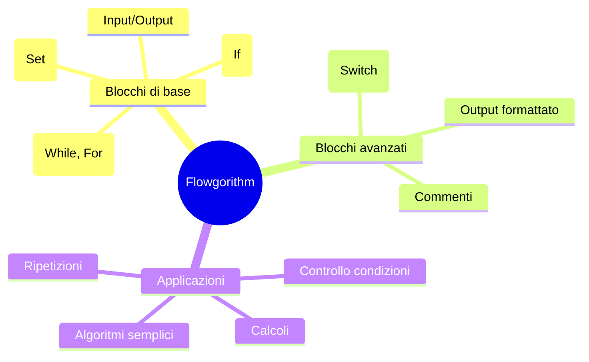

# Manuale Introduttivo a Flowgorithm

## Introduzione

**Flowgorithm** è un software gratuito che permette di creare ed eseguire **diagrammi di flusso**.  
È pensato per imparare i concetti fondamentali della programmazione senza scrivere codice.  

Il programma traduce i diagrammi in diversi linguaggi (C, Java, Python, ecc.), ma nel nostro caso lo useremo solo come **strumento grafico** per capire la logica dei programmi.

> ⚠️ **Nota per gli studenti:** non servono conoscenze pregresse di programmazione. Flowgorithm è un punto di partenza per ragionare sui problemi e trasformarli in soluzioni passo passo.

---

## Installazione e Primo Utilizzo

### Download

1. Vai al sito ufficiale: [https://flowgorithm.org](https://flowgorithm.org)  
2. Scarica la versione più recente per **Windows** (non esiste versione nativa per Mac/Linux, ma funziona con emulatori tipo *Wine*).  
3. Installa il programma seguendo la procedura guidata (tasto *Next* → *Install* → *Finish*).  

### Primo avvio

- All’apertura, vedrai un **diagramma di flusso vuoto**, che parte sempre da:
  - **Blocco Inizio (Start)**
  - **Blocco Fine (End)**  

Il tuo compito sarà inserire i blocchi intermedi per descrivere il procedimento.

---

## I Blocchi di Base

### 1. **Blocco Input/Output**

Serve per leggere o mostrare informazioni.

- **Input**: l’utente inserisce un valore.
- **Output**: il programma scrive a schermo un messaggio o un risultato.

> Esempio:  
> - Input: chiedere all’utente la sua età  
> - Output: stampare “Hai 15 anni”  

---

### 2. **Blocco Assegnazione**

Serve per memorizzare valori in una **variabile**.

> Esempio:  
> - Assegna `somma = a + b`

---

### 3. **Blocco Decisone (If)**
Permette di prendere decisioni con una condizione vera o falsa.

> Esempio:  
> - Se `età >= 18` allora mostra “Sei maggiorenne”  
> - Altrimenti mostra “Sei minorenne”

---

### 4. **Blocco Ciclo (Loop While / For)**
Serve per ripetere un insieme di operazioni.

> Esempio:  
> - Ripeti finché `contatore < 10`  
> - Somma `contatore = contatore + 1`

---

## Blocchi Avanzati

Questi blocchi servono per problemi un po’ più complessi, ma restano accessibili anche ai principianti.

### 1. **Blocco Selezione Multipla (Switch)**
Permette di scegliere tra più alternative.

---

### 2. **Blocco Parallelogramma Avanzato (Formattazione Output)**
Permette di visualizzare testi più complessi, concatenando variabili e messaggi.

> Esempio:  
> Output: “La somma di “ + a + “ e “ + b + “ è “ + somma

---

### 3. **Commento**
Serve a inserire spiegazioni nel diagramma, molto utile per rendere leggibile il lavoro.

---

## Esempio Completo

Calcolare la somma di due numeri inseriti dall’utente:

```
Start
Input a
Input b
Set somma = a + b
Output "La somma è: " + somma
End
```

---

## Esercizi Proposti

1. Crea un diagramma che chieda il nome all’utente e lo saluti.  
2. Crea un diagramma che calcoli l’area di un rettangolo.  
3. Crea un diagramma che stabilisca se un numero è pari o dispari.  
4. Crea un diagramma che stampi i numeri da 1 a 10.  
5. Crea un diagramma che chieda l’età e dica se sei maggiorenne o minorenne.  

---

## Mappa Concettuale Finale (Mermaid)



---
