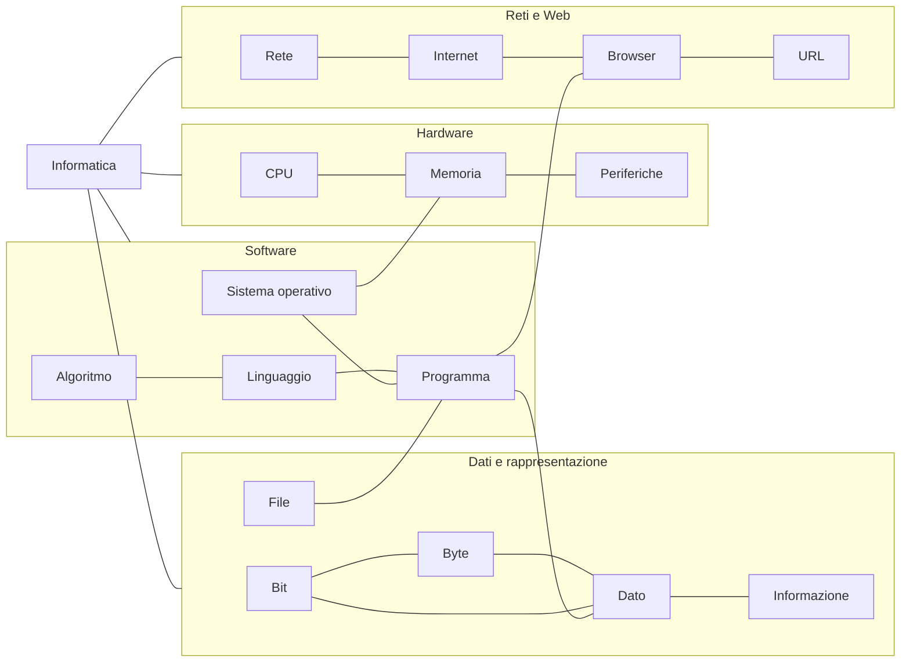

```mermaid

flowchart LR

%% Nodo centrale
A[Informatica]

%% --- CLUSTER HARDWARE ---
subgraph H[Hardware]
  H1[CPU]
  H2[Memoria]
  H3[Periferiche]
end

%% --- CLUSTER SOFTWARE ---
subgraph S[Software]
  S1[Sistema operativo]
  S2[Programma]
  S3[Algoritmo]
  S4[Linguaggio]
end

%% --- CLUSTER DATI ---
subgraph D[Dati e rappresentazione]
  D4[Bit]
  D5[Byte]
  D1[Dato]
  D2[Informazione]
  D3[File]
end

%% --- CLUSTER RETI ---
subgraph R[Reti e Web]
  R1[Rete]
  R2[Internet]
  R3[Browser]
  R4[URL]
end

%% Connessioni principali tra aree
A --- H
A --- S
A --- D
A --- R

%% Hardware
H1 --- H2
H2 --- H3

%% Software
S3 --- S4
S4 --- S2
S1 --- S2

%% Dati
D4 --- D5
D5 --- D1
D1 --- D2
D3 --- S2

%% Connessione del bit alla catena informativa
D4 --- D1

%% Reti
R1 --- R2
R2 --- R3
R3 --- R4

%% Ponti tra aree
S2 --- D1
S2 --- R3
S1 --- H2

```