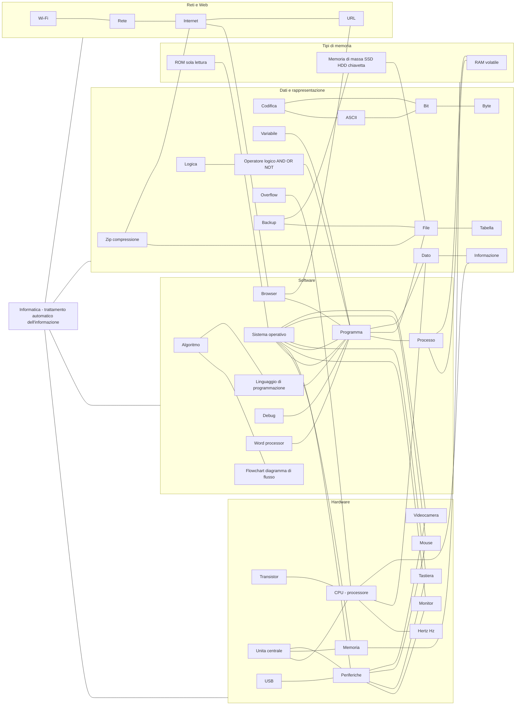

```mermaid
flowchart LR

%% Nodo centrale
A[Informatica - trattamento automatico dell'informazione]

%% --- CLUSTER HARDWARE ---
subgraph H[Hardware]
  H1[CPU - processore]
  H2[Memoria]
  H3[Periferiche]
  H4[Transistor]
  H5[Unita centrale]
  H6[Hertz Hz]
  H7[USB]
  H8[Monitor]
  H9[Tastiera]
  H10[Mouse]
  H11[Videocamera]
end

%% Tipi di memoria
subgraph M[Tipi di memoria]
  M1[RAM volatile]
  M2[ROM sola lettura]
  M3[Memoria di massa SSD HDD chiavetta]
end

%% --- CLUSTER SOFTWARE ---
subgraph S[Software]
  S1[Sistema operativo]
  S2[Programma]
  S3[Processo]
  S4[Linguaggio di programmazione]
  S5[Algoritmo]
  S6[Flowchart diagramma di flusso]
  S7[Debug]
  S8[Word processor]
  S9[Browser]
end

%% --- CLUSTER DATI & RAPPRESENTAZIONE ---
subgraph D[Dati e rappresentazione]
  D1[Dato]
  D2[Informazione]
  D3[Codifica]
  D4[Bit]
  D5[Byte]
  D6[ASCII]
  D7[File]
  D8[Tabella]
  D9[Variabile]
  D10[Operatore logico AND OR NOT]
  D11[Logica]
  D12[Overflow]
  D13[Backup]
  D14[Zip compressione]
end

%% --- CLUSTER RETI & WEB ---
subgraph R[Reti e Web]
  R1[Rete]
  R2[Internet]
  R3[Wi-Fi]
  R4[URL]
end

%% Collegamenti principali
A --- H
A --- S
A --- D
A --- R

%% Hardware dettagli
H5 --- H1
H5 --- H2
H5 --- H3
H1 --- H6
H4 --- H1

%% Memoria collegamenti
H2 --- M
M1 --- S3
M2 --- S1
M3 --- D7

%% Periferiche I/O
H3 --- H8
H3 --- H9
H3 --- H10
H3 --- H11
H7 --- H3

%% Software pipeline
S5 --- S6
S5 --- S4
S4 --- S2
S2 --- S1
S2 --- S3
S7 --- S2

%% Dati & rappresentazione
D1 --- D2
D4 --- D5
D3 --- D6
D6 --- D4
D3 --- D4
D7 --- D8
D14 --- D7
D13 --- D7
D9 --- S2
D11 --- D10
D10 --- S2
D12 --- H1

%% OS e applicazioni
S1 --- S2
S1 --- H2
S1 --- H3
S8 --- S2
S9 --- S2

%% Input/Output
H9 --- S1
H10 --- S1
H11 --- S1
S1 --- H8

%% Reti & Web
R1 --- R2
R3 --- R1
R2 --- S9
S9 --- R4
R4 --- R2

%% Ponti tra cluster
S2 --- D7
S2 --- D1
S3 --- M1
H1 --- D1
H1 --- D2
D13 --- M3
D14 --- R2
```