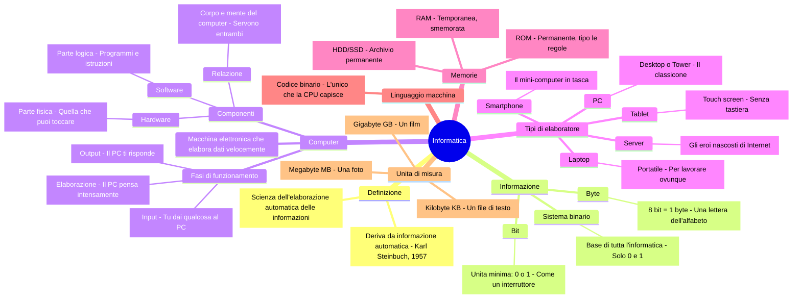

```mermaid
mindmap
  root((Informatica))
    Definizione
      ["Scienza dell'elaborazione automatica delle informazioni"]
      ["Deriva da informazione automatica - Karl Steinbuch, 1957"]
    Informazione
      Bit
        ["Unita minima: 0 o 1 - Come un interruttore"]
      Byte
        ["8 bit = 1 byte - Una lettera dell'alfabeto"]
      Sistema binario
        ["Base di tutta l'informatica - Solo 0 e 1"]
    Computer
      Macchina elettronica che elabora dati velocemente
      Fasi di funzionamento
        ["Input - Tu dai qualcosa al PC"]
        ["Elaborazione - Il PC pensa intensamente"]
        ["Output - Il PC ti risponde"]
      Componenti
        Hardware
          ["Parte fisica - Quella che puoi toccare"]
        Software
          ["Parte logica - Programmi e istruzioni"]
        Relazione
          ["Corpo e mente del computer - Servono entrambi"]
    Tipi di elaboratore
      PC
        ["Desktop o Tower - Il classicone"]
      Laptop
        ["Portatile - Per lavorare ovunque"]
      Tablet
        ["Touch screen - Senza tastiera"]
      Smartphone
        ["Il mini-computer in tasca"]
      Server
        ["Gli eroi nascosti di Internet"]
    Memorie
      ["ROM - Permanente, tipo le regole"]
      ["RAM - Temporanea, smemorata"]
      ["HDD/SSD - Archivio permanente"]
    Linguaggio macchina
      ["Codice binario - L'unico che la CPU capisce"]
    Unita di misura
      ["Kilobyte KB - Un file di testo"]
      ["Megabyte MB - Una foto"]
      ["Gigabyte GB - Un film"]
```
