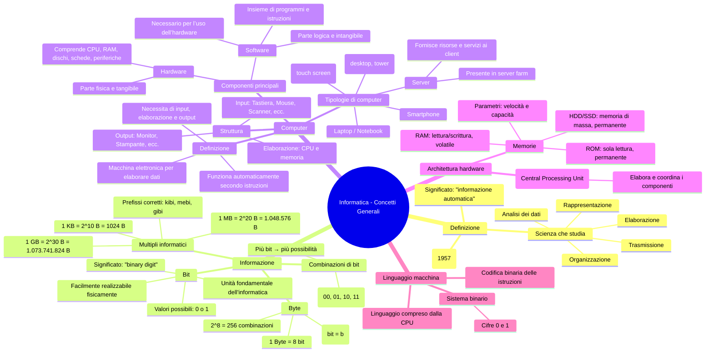

```mermaid
mindmap
  root((Informatica - Concetti Generali))
    Definizione
      Origine del termine: Karl Steinbuch (1957)
      Significato: "informazione automatica"
      Scienza che studia
        Analisi dei dati
        Rappresentazione
        Elaborazione
        Organizzazione
        Trasmissione
    Informazione
      Bit
        Significato: "binary digit"
        Valori possibili: 0 o 1
        Unità fondamentale dell'informatica
        Facilmente realizzabile fisicamente
      Combinazioni di bit
        Più bit → più possibilità
        Esempio: 2 bit = 4 combinazioni (00, 01, 10, 11)
      Byte
        1 Byte = 8 bit
        2^8 = 256 combinazioni
        Simbolo: B (bit = b)
      Multipli informatici
        1 KB = 2^10 B = 1024 B
        1 MB = 2^20 B = 1.048.576 B
        1 GB = 2^30 B = 1.073.741.824 B
        Prefissi corretti: kibi, mebi, gibi
    Computer
      Definizione
        Macchina elettronica per elaborare dati
        Funziona automaticamente secondo istruzioni
        Necessita di input, elaborazione e output
      Struttura
        Input: Tastiera, Mouse, Scanner, ecc.
        Output: Monitor, Stampante, ecc.
        Elaborazione: CPU e memoria
      Componenti principali
        Hardware
          Parte fisica e tangibile
          Comprende CPU, RAM, dischi, schede, periferiche
        Software
          Parte logica e intangibile
          Insieme di programmi e istruzioni
          Necessario per l’uso dell’hardware
      Tipologie di computer
        PC (desktop, tower)
        Laptop / Notebook
        Tablet (touch screen)
        Smartphone
        Server
          Fornisce risorse e servizi ai client
          Presente in server farm
    Architettura hardware
      CPU (Central Processing Unit)
        Elabora e coordina i componenti
      Memorie
        ROM: sola lettura, permanente
        RAM: lettura/scrittura, volatile
        HDD/SSD: memoria di massa, permanente
        Parametri: velocità e capacità
    Linguaggio macchina
      Sistema binario
        Cifre 0 e 1
      Codifica binaria delle istruzioni
      Linguaggio compreso dalla CPU
```

  