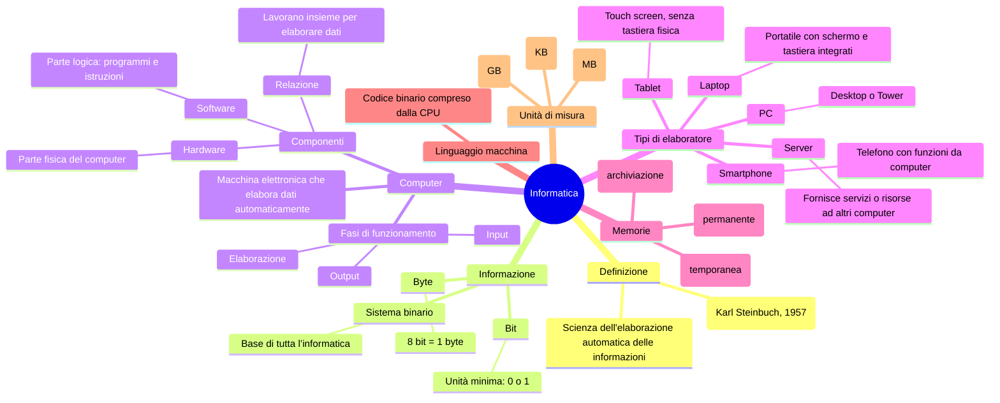

```mermaid
mindmap
  root((Informatica))
    Definizione
      Scienza dell'elaborazione automatica delle informazioni
      Deriva da "informazione automatica" (Karl Steinbuch, 1957)
    Informazione
      Bit
        Unità minima: 0 o 1
      Byte
        8 bit = 1 byte
      Sistema binario
        Base di tutta l’informatica
    Computer
      Macchina elettronica che elabora dati automaticamente
      Fasi di funzionamento
        Input
        Elaborazione
        Output
      Componenti
        Hardware
          Parte fisica del computer
        Software
          Parte logica: programmi e istruzioni
        Relazione
          Lavorano insieme per elaborare dati
    Tipi di elaboratore
      PC
        Desktop o Tower
      Laptop
        Portatile con schermo e tastiera integrati
      Tablet
        Touch screen, senza tastiera fisica
      Smartphone
        Telefono con funzioni da computer
      Server
        Fornisce servizi o risorse ad altri computer
    Memorie
      ROM (permanente)
      RAM (temporanea)
      HDD/SSD (archiviazione)
    Linguaggio macchina
      Codice binario compreso dalla CPU
    Unità di misura
      Kilobyte (KB)
      Megabyte (MB)
      Gigabyte (GB)
```

  