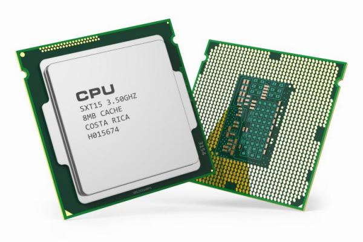
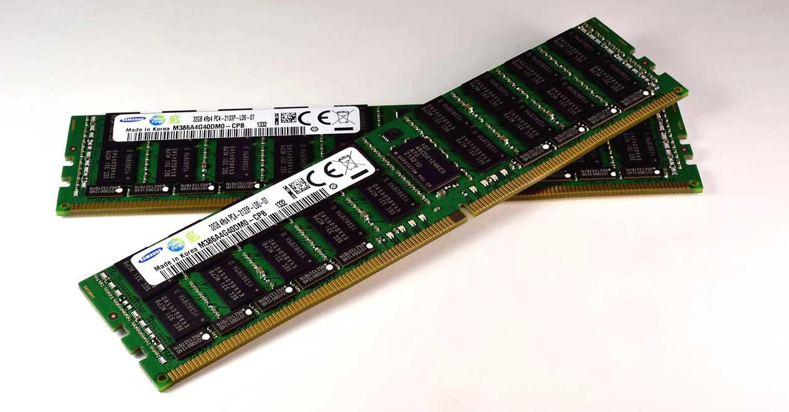
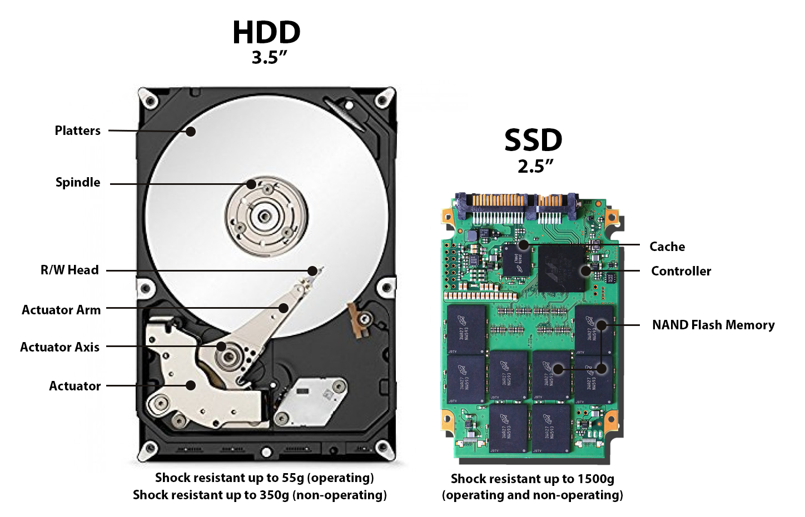

# Struttura e componenti di un elaboratore

---
Oggigiorno ci si riferisce comunemente al computer come ad un dispositivo elettronico e digitale, programmabile e a scopo generico, costruito secondo la cosiddetta `Architettura di Von Neumann` e funzionante secondo la logica indotta dalla `Macchina di Turing`.

Sì, lo so, suona super complicato. Ma in realtà è più semplice di quanto sembri! (E no, non dovete imparare questi nomi a memoria per l'interrogazione... forse.)

L'implementazione fisica di questi concetti è progredita enormemente col passare del tempo: dai computer grandi come stanze ai vostri smartphone. Quello che non è ancora cambiato è la base di partenza del processo di progettazione dei dispositivi. Il concetto è sempre lo stesso, solo molto più piccolo e veloce!

## Architettura di Von Neumann

L'architettura di Von Neumann prende nome dal matematico John von Neumann e fu sviluppata nella metà degli anni '40. Praticamente mentre i vostri bisnonni ballavano lo swing, questo tizio inventava come dovevano essere fatti i computer. Respect.

Lo schema si basa su cinque componenti fondamentali (e no, non potete togliere nessuno di questi senza far esplodere tutto):

1) La **CPU**: Central Processing Unit. Il "cervello" operativo della macchina. Pensa, calcola, elabora. È il vero protagonista.

2) La **Main Memory**: La memoria principale, utilizzata come memoria di lavoro. Tipo la scrivania dove appoggiate i libri quando studiate (se studiate).

3) Il **Bus**: Un canale che collega tutti i componenti fra loro. Come l'autostrada dei dati, ma senza code.

4) Le **Periferiche di Input**: Servono per l'inserimento dei dati da elaborare. Tastiera, mouse, microfono... tutto quello che vi serve per dire al PC cosa fare.

5) Le **Periferiche di Output**: Servono per visualizzare i risultati. Monitor, stampante, casse... tutto quello che il PC usa per rispondervi.

L'idea dietro all'architettura di Von Neumann è semplicemente questa: descrivere il flusso dei dati dal momento in cui li inserite, al momento in cui vengono elaborati, fino al momento in cui ottenete il risultato. Input → Elaborazione → Output. Facile!

**CPU**

La Central Processing Unit è il componente principale del computer. Praticamente il cervellone che fa tutti i calcoli.
Il _nastro infinito_ per le sue elaborazioni prende informazioni e scrive risultati sulla memoria centrale: tutte le interazioni della CPU sono solo verso la memoria centrale. È tipo un professore che lavora solo sulla sua scrivania e manda gli assistenti a prendere e portare roba.

**La Main Memory**

La memoria centrale (RAM) rappresenta il collegamento della CPU con il resto del mondo. È una memoria che funziona secondo principi elettrici: le sue uniche capacità sono quelle di **leggere** (copiare qualcosa dall'esterno) e di **scrivere** (copiare qualcosa da qualche parte). Easy.

**Il resto del mondo (dell'hardware)**

Con i due attori principali fatti così... come si fa a gestire tutte le funzionalità che vediamo in un computer?

Beh... _il trucco è far credere a CPU e Main Memory che tutto sia un file!!!_ 😎
Vuoi scrivere sullo schermo? Scrivi su questo file qui.
Vuoi sapere cosa ho digitato sulla tastiera? Leggi quel file.
Vuoi stampare? Scrivi su quest'altro file.
Vuoi vedere cosa mi sta arrivando dalla Rete? Leggi quell'altro file ancora...

È come Matrix, ma per il computer. Tutto è un file!

**Le periferiche**

Le periferiche di Input/Output fanno esattamente questo: implementano una funzionalità fisica (stampano, mostrano cose sullo schermo, emettono suoni) e interagiscono con il computer secondo la logica dei file. Furbe, no?

**Il Bus**

Il nome dà proprio l'idea del trasporto... solo che questo bus non trasporta persone, ma dati, comandi e informazioni! E fortunatamente non ci sono mai scioperi o ritardi. 🚌💨

## La CPU

L'unità centrale di elaborazione (CPU) è la parte del computer che esegue le istruzioni di un programma, facendo operazioni aritmetiche, logiche e di input/output. Praticamente fa somme, confronti e sposta roba qua e là. Tutto il giorno, ogni giorno.

Dal 1970 ad oggi le CPU sono diventate sempre più piccole, veloci e potenti. Oggi abbiamo CPU più potenti di quelle che hanno mandato l'uomo sulla Luna... e le usiamo per guardare video di gattini. Progress!

La CPU è un _microprocessore general purpose_ in grado di eseguire un set limitato di istruzioni chiamato **Linguaggio Macchina**. Non sa fare molto, ma quello che sa fare, lo fa MOLTO velocemente.

Le parole che una CPU legge hanno lunghezza fissa: questa lunghezza caratterizza l'intera CPU! Esempi: 8 bit, 16 bit, 32 bit, 64 bit. Più bit = più potenza. È come la cilindrata delle auto, ma per nerd.

**Come lavora la CPU:**
1. Legge un'istruzione
2. Carica i dati necessari
3. Fa l'elaborazione
4. Scrive il risultato
5. Passa all'istruzione successiva

E così via, miliardi di volte al secondo, dal momento in cui accendete il PC fino allo spegnimento. Povera CPU, non si riposa mai!

Questa ripetizione continua si chiama **ciclo del processore**. Il numero di cicli al secondo è la **frequenza** della CPU, misurata in Hz (o più probabilmente GHz, che sono miliardi di Hz). Una CPU a 3 GHz fa 3 miliardi di cicli al secondo. Impressionante, vero?

**Curiosità e approfondimenti** (per i più nerd tra voi)

-   Che differenza c'è fra un (micro)processore e un (micro)controllore?
-   Come si determinano le prestazioni di una CPU? Come si calcola la sua velocità?
-   Hai mai fatto un _benchmark_ della tua CPU? Vogliamo organizzarne uno di classe? (Gara a chi ha il PC più veloce!)
-   Quali sono le CPU attualmente in commercio? Quanto costano? (Spoiler: tanto. Molto tanto.)
-   Quali sono le aziende che producono CPU? (Team Intel o Team AMD?)
-   Quali tipologie di processori producono queste aziende?
-   . . . (aggiungi qui una domanda tua, se proprio vuoi) . . .

## Le memorie

Le memorie sono la parte del computer dove vengono conservate le informazioni. Tipo i cassetti, gli armadi e le scatole sotto il letto della vostra stanza, ma digitali.

In questa sezione vedremo le caratteristiche principali delle memorie e i tipi più comuni. Promettiamo di non annoiarvi troppo!

Iniziamo! Le memorie possono essere classificate secondo vari criteri:

-   **_Volatilità_** (cioè: si ricordano le cose o sono smemorate?)

    1) le **_memorie volatili_** perdono tutte le informazioni non appena si interrompe l'alimentazione. Tipo voi dopo una festa: spegnete il PC e POOF, tutto cancellato.

    2) le **_memorie permanenti_** mantengono le informazioni anche senza corrente elettrica. Sono quelle affidabili, che si ricordano tutto.
    

-   **_Tipo di accesso_** (cioè: come trovo le informazioni?)

    Secondo questa classificazione ritroviamo tre tipi:

    1) le **_memorie ad accesso sequenziale_** devono essere lette in ordine, una cosa dopo l'altra. Tipo quando cercate una canzone su una vecchia cassetta: dovete mandare avanti fino a trovarla. Lente e noiose. I nastri magnetici funzionano così.

    2) Le **_memorie ad accesso casuale_** (RAM) possono saltare direttamente a qualunque punto, sempre alla stessa velocità. Tipo Spotify: click e sei subito alla canzone che vuoi!

    3) le **_memorie ad accesso semi-casuale_** sono una via di mezzo: salti velocemente tra blocchi grandi, ma dentro ogni blocco devi andare in ordine.
    

-   **_Possibilità di scrittura_** (cioè: posso modificarle?)

    1) **_memorie a lettura-scrittura_**: le più comuni. Puoi leggere e modificare quanto vuoi. Libertà totale!

    2) **_memorie a sola lettura_** (ROM: Read Only Memory): puoi solo leggere, non modificare. Tipo le regole della scuola.

    3) **_memorie WORM_** (Write Once, Read Many): scrivi una volta sola, poi sono in sola lettura. Tipo quando scrivete con la penna: fatto è fatto!
    

-   **_Tecnologia di costruzione_** (cioè: come sono fatte?)

    Le tecnologie principali sono:

    -   **Elettriche**: usano condensatori e semiconduttori. Sono le RAM e gli SSD. Veloci ma hanno bisogno di corrente.

    -   **Magnetica**: usano materiali magnetici. Sono gli hard disk classici. Più lenti ma non perdono i dati senza corrente.

    -   **Ottica**: usano la luce! CD, DVD e Blu-Ray funzionano così. Sono tipo degli specchietti magici che riflettono la luce in modo diverso per memorizzare dati.
        

### Memorie RAM

**RAM** = "Random Access Memory" (memoria ad accesso casuale). È la memoria di lavoro del computer, dove vengono caricati i dati che la CPU deve elaborare. Tipo la scrivania dove appoggiate i libri quando studiate.

La RAM è **volatile**: si svuota quando spegnete il PC. Tutto quello che non avete salvato? Sparito. Per sempre. Quindi SALVATE i vostri file, gente!

Le RAM sono veloci, velocissime. Sono la memoria principale del computer e la CPU le usa continuamente. Più RAM avete, più programmi potete aprire contemporaneamente senza che il PC rallenti. (Sì, con 4 GB di RAM non potete avere 50 tab di Chrome aperti. Sorry.)

### Memorie ROM

**ROM** = "Read Only Memory" (memoria in sola lettura). È una memoria permanente sulla scheda madre che contiene le istruzioni fondamentali per far partire il computer.

Contiene il **BIOS** (Basic I/O System), cioè il software che parte PRIMA del sistema operativo e dice al computer come usare l'hardware. È tipo il manuale di istruzioni del PC, scritto nella pietra (digitale).

### Dischi magnetici (HDD)

Gli **HDD** (Hard Disk Drive) sono composti da dischi ricoperti di materiale magnetico che girano velocemente. Una testina mobile legge e scrive i dati magnetizzando diverse zone del disco. È tipo un giradischi, ma per i dati.

**Pro:** Costano poco e possono contenere tantissimi dati (anche terabyte!).

**Contro:** Sono lenti (rispetto alle RAM e agli SSD) e hanno parti meccaniche che si possono rompere se li fate cadere. Quindi attentatezza!

I dati sono organizzati in tracce e settori, tipo i solchi di un vinile. La testina salta da una traccia all'altra per trovare quello che serve.

### Dischi allo stato solido (SSD)

Gli **SSD** (Solid-State Drive) sono la versione moderna e figa degli hard disk. Usano memoria elettronica (tipo le RAM, ma permanente) invece di dischi magnetici.

**Pro:**
- **Velocissimi!** Fanno partire il PC in pochi secondi.
- Niente parti meccaniche = più resistenti agli urti.
- Silenziosi (gli HDD invece fanno rumore quando lavorano).

**Contro:**
- Costano di più degli HDD.
- In genere hanno meno capacità (ma sta migliorando).

Se volete un PC veloce, puntate su un SSD. La differenza è ENORME. Una volta provato non si torna indietro!

### La formattazione delle memorie

Per poter utilizzare una memoria, occorre **formattarla**. Ma cosa significa?

Formattare significa preparare la memoria organizzandola in un certo modo, creando una struttura (chiamata "file system") che permette di salvare e ritrovare i file. È tipo organizzare l'armadio con scaffali e cassetti prima di metterci dentro i vestiti.

**Attenzione:** formattare cancella TUTTO quello che c'è nella memoria! Quindi fate attenzione a cosa formattate. (Sì, quella chiavetta USB con tutte le foto... una volta formattata, addio foto.)

### Tabella riassuntiva delle caratteristiche

|Nome|Lettura (R)|Scrittura (W)|Permanente|
|:-:|:-:|:-:|:-:|
|RAM|X|X|/|
|ROM|X|/|X|
|Memorie di massa (HDD,SSD)|X|X|X|

## Le periferiche

Tutto quello che si collega al computer per fargli fare cose: monitor, tastiere, mouse, stampanti, cuffie, webcam...

**Possibili ricerche di gruppo** (per i più curiosi):

-   **Monitor**: schermi CRT (quelli vecchi grossi), Plasma, LCD, LED, OLED. Schermi touch.
-   **Tastiere**: meccaniche, a membrana, layout QWERTY vs AZERTY. Tavolette grafiche per disegnare.
-   **Mouse**: ottici, laser, wireless. Touchpad, trackball (per hipster del PC).
-   **Scheda madre**: come è implementato il BUS (l'autostrada dei dati).
-   **Audio**: microfoni, cuffie, auricolari, casse.
-   **Riproduzione**: stampanti (a inchiostro, laser, 3D!), scanner, multifunzione.
-   **Memorie permanenti**: HD, SSD, schede SD, penne USB, dischi esterni.
-   **Memorie ottiche**: CD, DVD, Blu-Ray (sì, esistono ancora!).
