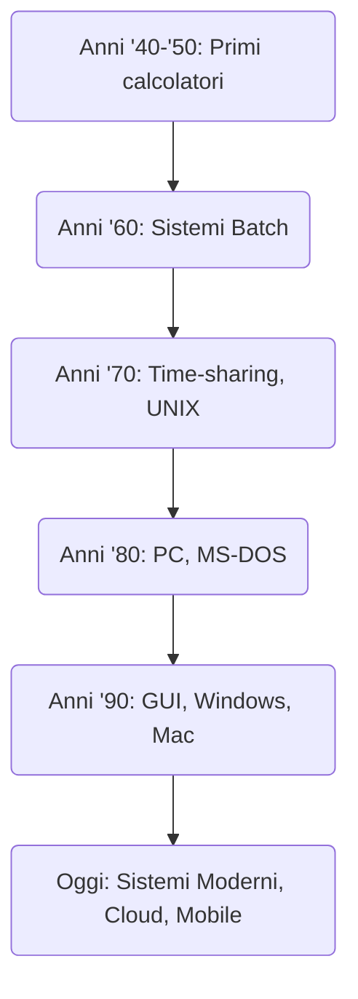

# Storia dei Sistemi Operativi

## Che cos'è un Sistema Operativo?
Prima di tuffarci nella storia, chiariamo cos'è un **Sistema Operativo** (o OS, per gli amici).

È quel software fondamentale che permette al computer di:

- **Gestire l'hardware**: fa da mediatore tra voi e CPU, memoria, dischi, ecc.
- **Organizzare i file**: crea cartelle, salva documenti, trova le vostre foto (anche quelle imbarazzanti)
- **Eseguire i programmi**: fa partire le app quando cliccate sulle icone
- **Interfacciarsi con l'utente**: vi mostra finestre, icone, menu (o solo testo, se siamo old school)

In pratica, il Sistema Operativo è il **direttore d'orchestra** del computer. Senza di lui, l'hardware non sa cosa fare.

## Breve Cronistoria

### 1. I primi calcolatori (anni '40 – '50)

- I computer erano **enormi macchine** a valvole o transistor, grandi come stanze intere e pesanti tonnellate.
- Si programmavano con **schede perforate** (tipo cartoncini bucati).
- **Non esisteva un vero sistema operativo**: il programmatore gestiva tutto a mano, dal caricamento del programma al controllo dell'hardware!

**Lo sapevi che...**:

- Alcuni programmi si "scrivevano" fisicamente con **cavi e levette**. Programmare significava letteralmente ricablare la macchina! Un errore di cablaggio poteva causare surriscaldamenti o addirittura **fumo e scintille**! 🔥
- I primi programmatori erano spesso donne (le famose "computer umani" della NASA). Respect!

### 2. I Sistemi Batch (anni '60)

- Nasce un **software di supervisione** che eseguiva in sequenza gruppi di "job" (programmi).
- L'utente consegnava un mazzo di **schede perforate** all'operatore del computer e aspettava il risultato... che arrivava spesso **ore o giorni dopo**. Tipo mandare una raccomandata e aspettare la risposta.
- Zero interattività: consegni, aspetti, preghi che funzioni.

**Curiosità tragica**:

- Se un mazzo di schede perforate **cadeva a terra**, bisognava rimetterlo in ordine **manualmente**... carta per carta. Immaginate la disperazione dell'operatore! (E se le mischiavi con un altro mazzo? Game over. Ricomincia da capo.) 😱

### 3. Tempo condiviso e UNIX (anni '70)

- Arrivano i sistemi **"time-sharing"**: finalmente più persone possono usare lo stesso computer contemporaneamente tramite terminali! Il computer divide il tempo tra gli utenti così velocemente che sembra dedicato solo a te.
- Nasce **UNIX** nei laboratori Bell (1969): un sistema operativo rivoluzionario creato da Ken Thompson e Dennis Ritchie.
- UNIX influenzerà profondamente **Linux** e **macOS**. Praticamente è il nonno di metà dei sistemi operativi moderni!

**Lo sapevi che...**:

- Thompson e Ritchie crearono UNIX su una **macchina DEC PDP-7 quasi inutilizzata** che nessuno voleva. La presero, ci smanettarono sopra, e crearono uno dei sistemi operativi più influenti della storia. Da un computer di scarto! 🤯
- Il nome "UNIX" è un gioco di parole su "Multics" (un vecchio sistema), con il prefisso "Uni-" (uno) invece di "Multi-" (molti). Nerd humor at its finest.

### 4. L'avvento dei Personal Computer e MS-DOS (anni '80)

- Il **Personal Computer** diventa accessibile! Non più solo per aziende e università, ma anche per case e scuole.
- **IBM** lancia l'IBM PC (1981), definendo lo standard dei PC moderni.
- **Microsoft** fornisce **MS-DOS**, un sistema operativo testuale (solo comandi da tastiera, niente grafica).

**Piccola Storia (shady)**:

- Microsoft comprò velocemente il codice di **QDOS** (Quick and Dirty Operating System, letteralmente "Sistema Operativo Veloce e Sporco") per pochi dollari, lo modificò e lo rivendette a IBM come MS-DOS. Affare del secolo! 💰
- MS-DOS era potente ma ostico: dovevi **memorizzare comandi** tipo `cd`, `dir`, `copy`... Sbagliavi una lettera? Errore. No autocomplete, no GUI. Tempi duri!

### 5. L'era delle Interfacce Grafiche (anni '80 e '90)

- **Apple** lancia il **Macintosh** (1984): finalmente **interfaccia grafica** con finestre, icone e mouse! Rivoluzione!
- **Microsoft** risponde con **Windows** (1985), inizialmente poco brillante, ma che diventa un successo con Windows 3.1 e poi **Windows 95** (ricordate il pulsante Start?).
- Nel **1991** uno studente finlandese di nome **Linus Torvalds** crea la prima versione di **Linux**: un sistema operativo UNIX-like ma **completamente gratuito e open source**!

**Lo sapevi che...**:

- **Steve Jobs** visitò il centro di ricerca **Xerox PARC** negli anni '70 e vide un prototipo di interfaccia grafica con finestre e mouse. Tornò alla Apple e disse praticamente "DOBBIAMO FARLO!" Il resto è storia.
- Xerox aveva inventato la GUI ma non l'ha sfruttata commercialmente. Probabilmente il più grande autogol della storia dell'informatica. 🤦
- Linus Torvalds aveva **21 anni** quando creò la prima versione di Linux. Una roba fatta per hobby che oggi gira su miliardi di dispositivi!

### 6. Sistemi Moderni e Oltre (anni 2000 - oggi)

- **Windows 10/11**: ancora il sistema più usato sui PC desktop.
- **macOS**: il sistema di Apple, elegante e costoso (come tutto ciò che fa Apple).
- **Linux**: mille distribuzioni diverse (Ubuntu, Fedora, Arch...), gratis e open source. Amato dai nerd.
- **Android e iOS**: dominano il mercato mobile (smartphone e tablet). Probabilmente state leggendo questo da uno di questi!
- **Cloud computing** e **virtualizzazione**: sempre più diffusi. Il futuro è nei data center!

**Curiosità che vi lasceranno a bocca aperta**:

- Oltre il **90% dei supercomputer** (tipo quelli che fanno ricerca scientifica e previsioni meteo) gira su **Linux**. Gratis, open source, e più potente di Windows e macOS messi insieme.
- **Android** (quello che gira su miliardi di smartphone) è basato su kernel **Linux**! Sì, il vostro telefono è un mini-computer Linux!
- I server che fanno girare Google, Facebook, Netflix... quasi tutti usano **Linux**. Internet è fatto di Linux!

---

## Mappa Concettuale

