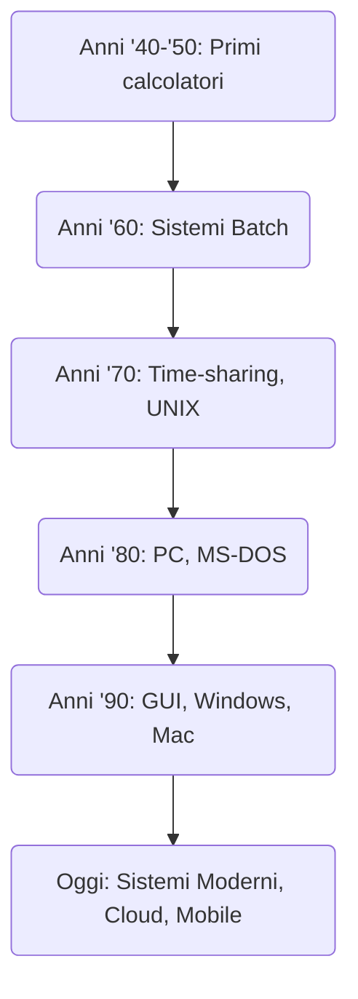

# Storia dei Sistemi Operativi

## Che cos’è un Sistema Operativo?
Prima di parlare di storia, ricordiamo che un **Sistema Operativo** è quel software che permette al computer di:

- Gestire l’hardware (CPU, memoria, dispositivi di input/output)
- Organizzare i file
- Eseguire i programmi
- Interfacciarsi con l’utente (tramite riga di comando o interfaccia grafica)

## Breve Cronistoria

### 1. I primi calcolatori (anni ’40 – ’50)

- I computer erano enormi macchine a valvole o a transistor, programmati con schede perforate.
- Non esisteva un vero “sistema operativo”: il programmatore gestiva tutto a mano!

**Lo sapevi che...**:  

- Alcuni programmi si “scrivevano” fisicamente con cavi e levette. Un errore di cablaggio poteva causare surriscaldamenti o addirittura fumo!

### 2. I Sistemi Batch (anni ’60)

- Nasce un software di supervisione che eseguiva in sequenza gruppi di “job” (programmi).
- L’utente consegnava le schede perforate all’operatore e aspettava il risultato (spesso ore o giorni).

**Curiosità**:  

- Se un mazzo di schede perforate cadeva a terra, bisognava rimetterlo in ordine manualmente… con grande disperazione dell’operatore!

### 3. Tempo condiviso e UNIX (anni ’70)

- Si sviluppano sistemi “time-sharing” che consentono a più persone di usare lo stesso computer tramite terminali.
- Nasce **UNIX** nei laboratori Bell: un sistema operativo innovativo che influenzerà profondamente Linux e macOS.

**Lo sapevi che...**:  

- Ken Thompson e Dennis Ritchie crearono UNIX in modo “artigianale” su una macchina DEC PDP-7 quasi inutilizzata: la personalizzarono per puro gusto di sperimentare.

### 4. L’avvento dei Personal Computer e MS-DOS (anni ’80)

- Il PC diventa un prodotto “alla portata di tutti”. IBM lancia l’IBM PC (1981).
- Microsoft fornisce **MS-DOS**, un sistema operativo testuale semplice ma diffuso.

**Piccola Storia**:

- Microsoft acquisì in fretta il codice di QDOS (Quick and Dirty Operating System) per trasformarlo nel futuro MS-DOS.

### 5. L’era delle Interfacce Grafiche (anni ’80 e ’90)

- Apple lancia i primi Macintosh con interfaccia grafica (1984).
- Microsoft risponde con Windows (1985 -> Windows 3.1 -> Windows 95).
- Nel 1991 Linus Torvalds crea la prima versione del kernel **Linux**, ispirato a UNIX ma open source.

**Lo sapevi che...**:

- Steve Jobs visitò il centro di ricerca Xerox PARC, dove vide il prototipo di un’interfaccia a finestre e l’uso del mouse: da lì prese spunto per la GUI del Macintosh.

### 6. Sistemi Moderni e Oltre

- Windows 10/11, macOS, varie distribuzioni Linux.  
- Smartphone (Android e iOS) dominano il mercato mobile.  
- Cloud computing e virtualizzazione sempre più diffusi.

**Curiosità**:

- Oltre il 90% dei supercomputer gira su **Linux**.  
- Android (per smartphone e tablet) è basato su kernel Linux.

---

## Mappa Concettuale

