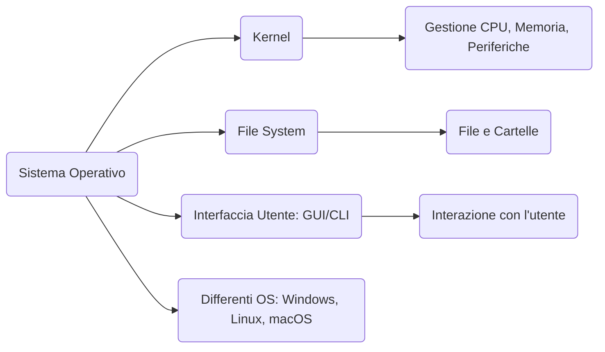

# Architettura di un Sistema Operativo

In questo file scopriremo che cos’è un sistema operativo, come è organizzato (kernel, file system e interfacce) e quali sono i principali OS utilizzati oggi. Il tutto con un tocco di leggerezza per mantenere la lettura piacevole.

---

## 1. Definizione e ruolo di un Sistema Operativo

Un **Sistema Operativo (SO)** è un insieme di programmi che gestisce l’hardware e coordina l’esecuzione del software. Possiamo paragonarlo a un direttore d’orchestra:
- **Coordina** l’uso della CPU tra i vari programmi.
- **Assegna** memoria ai programmi che devono essere eseguiti.
- **Organizza** i file sul disco, come se fossero libri in una libreria.
- **Comunica** con l’utente attraverso interfacce grafiche o testuali.

Senza un sistema operativo, il computer sarebbe un insieme di componenti hardware incapaci di dialogare tra loro in maniera utile.

---

## 2. Kernel, File System, Interfacce

### 2.1 Kernel
Il **kernel** è il cuore del sistema operativo e si occupa di:
- **CPU**: stabilisce quale programma può usare il processore e in che momento.
- **Memoria**: gestisce e assegna la RAM ai vari processi in modo che non si sovrappongano.
- **Periferiche**: fornisce le istruzioni per far comunicare i programmi con mouse, tastiera, stampante, scheda video e altre componenti.
- **Sicurezza di base**: separa lo spazio dell’utente da quello di sistema, impedendo ai programmi di effettuare operazioni non autorizzate.

### 2.2 File System
Il **file system** è la struttura con cui il sistema operativo organizza i dati su un disco (o su altre memorie di massa).  
- **Cartelle (directory)**: come scaffali di una libreria dove sono riposti i vari “libri”.  
- **File**: singoli documenti, programmi o qualsiasi contenuto memorizzato.
- **Permessi**: regole che stabiliscono chi può leggere, modificare o eseguire un file.
- **Esempi**: NTFS (Windows), ext4 (Linux), APFS (macOS).

### 2.3 Interfacce Utente (GUI e CLI)
- **GUI (Graphical User Interface)**: l’utente interagisce con finestre, icone e pulsanti usando principalmente il mouse (Windows Explorer, macOS Finder, desktop environment in Linux).
- **CLI (Command Line Interface)**: un terminale testuale in cui si digitano comandi (Prompt dei comandi/PowerShell in Windows, shell Bash o Zsh in Linux/macOS).

*Figura 1: Il Sistema Operativo tra hardware e software (fonte: Wikimedia Commons)*

---

## 3. Caratteristiche Generali dei Principali Sistemi Operativi

### 3.1 Microsoft Windows
- **Licenza**: Proprietaria (Microsoft).  
- **Interfaccia**: GUI con un file explorer (Esplora File) e desktop a icone.  
- **Punti di forza**: Ampio supporto software e hardware; molto diffuso in ambito domestico e aziendale.  
- **Considerazioni**: A pagamento, spesso preinstallato sui PC acquistati in negozio.

### 3.2 GNU/Linux
- **Licenza**: Open Source.  
- **Interfaccia**: Generalmente GUI (GNOME, KDE, ecc.) e un terminale potente.  
- **Punti di forza**: Gratuito, flessibile, sicuro, con grandi community di supporto.  
- **Considerazioni**: Disponibile in numerose distribuzioni (Ubuntu, Debian, Fedora, ecc.).

### 3.3 macOS (Apple)
- **Licenza**: Proprietaria (Apple).  
- **Interfaccia**: GUI curata (Finder, Dock), con terminale Unix-like disponibile.  
- **Punti di forza**: Integrazione hardware-software, stabilità, design elegante.  
- **Considerazioni**: Funziona ufficialmente solo su computer Apple.

---

## 4. Differenze Principali (Tabella Riassuntiva)

| Caratteristica             | **Windows**         | **GNU/Linux**              | **macOS**                 |
|----------------------------|---------------------|----------------------------|---------------------------|
| **Licenza**               | Proprietaria        | Open Source                | Proprietaria (Apple)      |
| **Interfaccia Principale**| Grafica (GUI)       | Grafica + Terminale        | Grafica (GUI)             |
| **Costo**                 | A pagamento*        | Gratuito (varie distro)    | Incluso nell'acquisto Mac |
| **Flessibilità**          | Medio-alta          | Molto alta (personalizz.)  | Bassa (chiuso)            |
| **Ambiti d'uso**          | PC domestici, uffici, gaming | Server, desktop, IoT  | Computer Apple (creativi, professionisti) |

*\* Spesso Windows è preinstallato, ma la licenza è comunque a pagamento e inclusa nel prezzo.*

---

## 5. Conclusione

Abbiamo esplorato il **kernel** (che gestisce CPU, memoria, periferiche), il **file system** (che organizza i dati in file e cartelle) e le **interfacce utente** (GUI e CLI).  
Abbiamo anche dato uno sguardo alle differenze principali tra Windows, GNU/Linux e macOS, cercando di fornire un quadro generale su quali siano le peculiarità e i contesti d’uso di ciascuno.

---

### Mappa Concettuale

