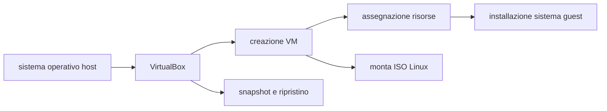

# Macchine virtuali e creazione di una VM Linux con VirtualBox

In questo file vedremo cos’è una **macchina virtuale**, perché è utile nello studio dei sistemi operativi e come installare una distribuzione Linux (ad esempio Ubuntu) utilizzando **VirtualBox**.

---

## 1. Cos’è una macchina virtuale

Una **macchina virtuale** è un ambiente software che “simula” un vero computer, permettendo di installare un sistema operativo (guest) all’interno di un altro (host).  

- **Isolamento**: il sistema operativo guest è separato dal sistema principale (host).  
- **Sicurezza**: eventuali virus o crash all’interno della macchina virtuale non influiscono sull’host.  
- **Flessibilità**: si possono provare nuovi sistemi operativi o software senza modificare il computer fisico.

Un esempio pratico: se hai Windows come host, puoi far girare una VM con Linux in una finestra, come fosse un normale programma.

---

## 2. VirtualBox

[VirtualBox](https://www.virtualbox.org/) è un’applicazione di virtualizzazione gratuita (open source, con componenti proprietarie opzionali) sviluppata da Oracle. Permette di:

- **creare** macchine virtuali,
- **assegnare risorse** (RAM, CPU, disco, rete),
- **montare file ISO** per installare sistemi operativi,
- **gestire snapshot** per tornare a una configurazione precedente in caso di problemi.

_Figura 1: l’interfaccia di VirtualBox con alcune macchine virtuali (fonte: Wikimedia Commons)._

---

## 3. Creare una VM Linux (esempio con Ubuntu)

### 3.1 Requisiti di base

- **VirtualBox** installato sul tuo sistema operativo host
- **File ISO** di una distribuzione Linux (ad esempio Ubuntu)

[Scarica qui la ISO Ubuntu 24.04 LTS (Long Term Support)!!!](https://releases.ubuntu.com/24.04.1/ubuntu-24.04.1-desktop-amd64.iso)

### 3.2 Procedura passo-passo

1. **Apri VirtualBox** sul tuo host.  
2. **Clicca su “Nuova”** (in alto a sinistra).  
3. Inserisci un **nome** per la VM, ad esempio “Ubuntu VM”.  
4. Seleziona il **tipo** di OS: “Linux” e la **versione** corrispondente (ad esempio “Ubuntu (64-bit)” se la ISO è a 64 bit).  
5. **Assegna la RAM**: almeno 2 GB (2048 MB) per una buona esperienza.  
6. **Crea un disco virtuale**: scegli un nuovo file di tipo VDI, 10-20 GB di spazio consigliati.  
7. **Impostazioni aggiuntive (opzionali)**:  
   - CPU: se hai più core, puoi assegnarne alcuni alla VM  
   - Scheda grafica: puoi abilitare o meno l’accelerazione 3D  
8. **Monta la ISO di Ubuntu**: nella sezione “Archiviazione” di VirtualBox, scegli di caricare la ISO come CD o DVD virtuale.  
9. **Avvia la VM**: si comporterà come un PC che fa il boot dalla ISO di Ubuntu. Segui le istruzioni di installazione (scelta lingua, partizione, creazione utente).

---

## 4. Primi passi dopo l’installazione

1. **Riavvia** la VM quando richiesto dal programma di installazione.  
2. **Rimuovi la ISO**: se il sistema avvisa che la ISO è ancora montata, smontala o al prossimo avvio ripartirà l’installazione.  
3. **Guest Additions** (opzionali, ma consigliate):  
   - Dal menu “Devices” di VirtualBox, scegli “Insert Guest Additions CD image…”  
   - Segui le istruzioni all’interno della VM (Ubuntu)  
   - Aggiungono funzionalità come il copia/incolla tra host e guest e una migliore resa grafica

---

## 5. Vantaggi e possibili usi

- **Sperimentazione**: provare software, configurazioni o altre distro Linux senza toccare il sistema principale.  
- **Didattica**: gli studenti possono avviare diverse VM (es. Ubuntu, Fedora) sullo stesso PC.  
- **Backup**: creare snapshot per tornare a un punto precedente se qualcosa va storto.

---

## 6. Mappa concettuale (Mermaid)

## 7. Conclusione

Le macchine virtuali offrono un modo pratico e sicuro per testare diversi sistemi operativi sullo stesso computer. Con VirtualBox puoi creare una VM Linux (per esempio Ubuntu), installarla come faresti su un normale PC e imparare ad amministrare un ambiente Linux senza dover riorganizzare o partizionare il disco fisico.
