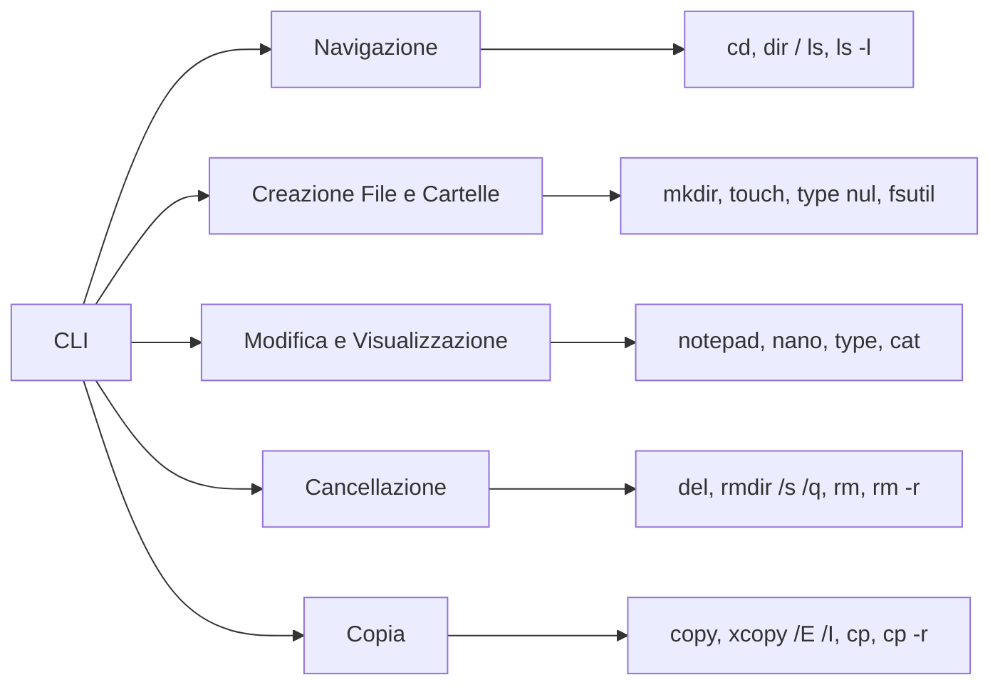

# Interfaccia da linea di comando (CLI)

Questo documento descrive come navigare, creare, modificare, copiare e cancellare file e cartelle usando la riga di comando in Windows e Linux. Vengono presentati esempi realistici con prompt, comandi e output simulati, che mostrano il comportamento di un sistema operativo reale.

---

## 1. Introduzione alla CLI

La Command Line Interface (CLI) consente di eseguire comandi testuali per interagire direttamente con il sistema operativo.

• In Windows si accede tramite il Prompt dei comandi o PowerShell.  
• In Linux si utilizza il Terminale (con shell come bash o zsh).

Esempio simulato in Windows:

```cmd
    C:\Users\User> echo Welcome to the Windows CLI!  
    Welcome to the Windows CLI!
```

Esempio simulato in Linux:

```bash
    user@ubuntu:~$ echo "Welcome to the Linux CLI!"  
    Welcome to the Linux CLI!
```

---

## 2. Navigare e visualizzare contenuti

### 2.1 Navigazione in Windows

Per spostarsi in una cartella si usa il comando cd.

Esempio:

```bash
    C:\Users\User> cd Desktop  
    C:\Users\User\Desktop>
```

Per elencare il contenuto della directory si usa il comando dir.

Esempio:

```bash
    C:\Users\User\Desktop> dir  
    Volume in drive C has no label.  
    Volume Serial Number is XXXX-XXXX  
    Directory of C:\Users\User\Desktop  
    01/01/2021  10:00 AM    <DIR>         .  
    01/01/2021  10:00 AM    <DIR>         ..  
    01/01/2021  10:05 AM             1,024 sample.txt  
                       1 File(s)          1,024 bytes  
                       2 Dir(s)  100,000,000,000 bytes free
```

### 2.2 Navigazione in Linux

Per spostarsi in una directory:

```bash
    user@ubuntu:~$ cd /home/user/Desktop  
    user@ubuntu:~/Desktop$
```

Per elencare i file:

```bash
    user@ubuntu:~/Desktop$ ls  
    Documenti  Immagini  Progetti
```

Per una visualizzazione dettagliata:

```bash
    user@ubuntu:~/Desktop$ ls -l  
    total 8  
    drwxr-xr-x 2 user user 4096 Jan  1 10:00 Documenti  
    drwxr-xr-x 2 user user 4096 Jan  1 10:05 Immagini  
    drwxr-xr-x 2 user user 4096 Jan  1 10:10 Progetti
```

  
*Figura 2: Terminale in Ubuntu (fonte: Wikimedia Commons).*

---

## 3. Creazione di file e cartelle

### 3.1 In Windows

**Creare una cartella:**

```cmd
    C:\Users\User> mkdir NuovaCartella
```

**Creare un file vuoto:**

```cmd
    C:\Users\User> type nul > file_vuoto.txt 
```

**Creare un file e scriverci del testo:**

- Metodo "copy con":
  
```bash
        C:\Users\User> copy con testo.txt
```

        (Digitare: "Questo è un esempio di testo." e premere Ctrl+Z, poi Invio)  
        Output simulato: "1 file copiato."

- Metodo "echo":  

```bash
        C:\Users\User> echo Ciao mondo! > testo.txt  
```

        Questo comando crea o sovrascrive "testo.txt" con il testo "Ciao mondo!"  
        Per aggiungere una riga senza cancellare il contenuto esistente:

```bash
        C:\Users\User> echo Seconda riga >> testo.txt
```

> Nota: Il simbolo ">" crea il file o sostituisce il contenuto esistente, mentre ">>" aggiunge il nuovo testo in coda mantenendo il contenuto già presente. Quando si definiscono macro con doskey, l'effetto di ">" e ">>" può differire dal comportamento standard usato con echo.

### 3.2 In Linux

**Creare una cartella:**

```bash
    user@ubuntu:~$ mkdir NuovaCartella
```

**Creare un file vuoto:**

```bash
    user@ubuntu:~$ touch file_vuoto.txt
```

**Creare un file con contenuto:**

- Metodo "echo":

```bash
        user@ubuntu:~$ echo "Ciao mondo!" > testo.txt  
```

        Per aggiungere una riga senza cancellare il contenuto esistente:

```bash
        user@ubuntu:~$ echo "Altra riga" >> testo.txt
```

- Metodo interattivo:

```bash
        user@ubuntu:~$ cat > testo.txt
```

        (Digitare il testo desiderato, poi premere Ctrl+D per terminare)

---

## 4. Modifica e visualizzazione del contenuto

### 4.1 In Windows

**Visualizzare il contenuto di un file:**

```bash
    C:\Users\User> type testo.txt
```

**Modificare il file in Notepad:**

```bash
    C:\Users\User> notepad testo.txt
```

    (Viene aperto il Blocco note per modificare il file)

### 4.2 In Linux

**Visualizzare il contenuto di un file:**

```bash
    user@ubuntu:~$ cat testo.txt
```

**Modificare il file in Nano:**

```bash
    user@ubuntu:~$ nano testo.txt
```

    (In Nano, premere Ctrl+O per salvare e Ctrl+X per uscire)

---

## 5. Cancellazione di file e cartelle

### 5.1 In Windows

**Cancellare un file:**

```bash
    C:\Users\User> del esempio.txt
```

**Cancellare una cartella vuota:**

```bash
    C:\Users\User> rmdir CartellaDiTest
```

**Cancellare una cartella e tutto il suo contenuto:**

```bash
    C:\Users\User> rmdir /s /q CartellaDiTest
```

### 5.2 In Linux

**Cancellare un file:**

```bash
    user@ubuntu:~$ rm esempio.txt 
```

    (Se necessario, usare "rm -f esempio.txt" per forzare la cancellazione)

**Cancellare una cartella e tutto il suo contenuto:**

```bash
    user@ubuntu:~$ rm -r NomeCartella
```

---

## 6. Copia di file e cartelle

### 6.1 In Windows

**Copiare un file:**

```bash
    C:\Users\User> copy "C:\Percorso\Origine\file.txt" "C:\Percorso\Destinazione\file.txt"
```

**Copiare una cartella (inclusi i sottocartelle e file) usando xcopy:**

```bash
    C:\Users\User> xcopy "C:\Percorso\Origine\Cartella" "C:\Percorso\Destinazione\Cartella" /E /I
```

> /E copia tutte le sottocartelle (comprese quelle vuote); /I assume la destinazione come cartella se non esiste.

### 6.2 In Linux

**Copiare un file:**

```bash
    user@ubuntu:~$ cp /percorso/origine/file.txt /percorso/destinazione/file.txt
```

**Copiare una cartella e il suo contenuto:**

```bash
    user@ubuntu:~$ cp -r /percorso/origine/Cartella /percorso/destinazione/Cartella
```

> L'opzione -r (ricorsiva) permette di copiare la cartella insieme a tutti i file e sottocartelle.

---

## 7. Esportazione dello storico della CLI

**In Windows (CMD):**

```bash
    C:\Users\User> doskey /history > history.txt  
    C:\Users\User> doskey /history >> history.txt
```

Questi comandi salvano la cronologia dei comandi della sessione corrente nel file "history.txt". Con ">" il contenuto esistente viene sovrascritto, mentre con ">>" il nuovo output viene aggiunto in coda.

**In Linux:**

```bash
    user@ubuntu:~$ history > history.txt
```

Questo comando esporta la cronologia dei comandi (come registrata nella sessione corrente) nel file "history.txt".

---

## 8. Esercizi pratici

### Esercizio 1: Navigazione e creazione di cartelle

**Windows:**

```bash
    C:\Users\User> cd Desktop  
    C:\Users\User\Desktop> mkdir LaboratorioCLI  
    C:\Users\User\Desktop> cd LaboratorioCLI  
    C:\Users\User\Desktop\LaboratorioCLI> mkdir Progetti Test
```

**Linux:**

```bash
    user@ubuntu:~$ cd ~/Desktop  
    user@ubuntu:~/Desktop$ mkdir LaboratorioCLI  
    user@ubuntu:~/Desktop$ cd LaboratorioCLI  
    user@ubuntu:~/Desktop/LaboratorioCLI$ mkdir Progetti Test
```

### Esercizio 2: Creazione di file e scrittura

**Windows:**

```bash
    C:\Users\User\Desktop\LaboratorioCLI\Test> echo "Questo è un esempio." > notes.txt  
    C:\Users\User\Desktop\LaboratorioCLI\Test> type notes.txt
```

*Output atteso:*

```bash
    Questo è un esempio.
```

**Linux:**

```bash
    user@ubuntu:~/Desktop/LaboratorioCLI/Test$ echo "Questo è un esempio." > notes.txt  
    user@ubuntu:~/Desktop/LaboratorioCLI/Test$ cat notes.txt
```

*Output atteso:*

```bash
    Questo è un esempio.
```

### Esercizio 3: Aggiunta di contenuto

**Windows:**

```bash
    C:\Users\User\Desktop\LaboratorioCLI\Test> echo "Nuova riga aggiunta." >> notes.txt  
    C:\Users\User\Desktop\LaboratorioCLI\Test> type notes.txt
```

*Output atteso:*

```bash
    Questo è un esempio.  
    Nuova riga aggiunta.
```

**Linux:**

```bash
    user@ubuntu:~/Desktop/LaboratorioCLI/Test$ echo "Nuova riga aggiunta." >> notes.txt  
    user@ubuntu:~/Desktop/LaboratorioCLI/Test$ cat notes.txt
```

*Output atteso:*

```bash
    Questo è un esempio.  
    Nuova riga aggiunta.
```

### Esercizio 4 (facoltativo): Utilizzo di un editor testuale

**Windows:**

```bash
    C:\Users\User\Desktop\LaboratorioCLI\Test> notepad notes.txt
```

**Linux:**

```bash
    user@ubuntu:~/Desktop/LaboratorioCLI/Test$ nano notes.txt  
    (Modifica il file, aggiungi qualche frase, salva ed esci)
```

### Esercizio 5: Copia di file e cartelle

**Windows:**

1. Copia un file da una cartella a un'altra:

```bash
        C:\Users\User> copy "C:\Origine\file.txt" "C:\Destinazione\file.txt"
```

2. Copia una cartella (con tutti i suoi file e sottocartelle) usando xcopy:

```bash
        C:\Users\User> xcopy "C:\Origine\Cartella" "C:\Destinazione\Cartella" /E /I
```

**Linux:**

1. Copia un file:

```bash
        user@ubuntu:~$ cp /percorso/origine/file.txt /percorso/destinazione/file.txt
```

2. Copia una cartella e tutto il suo contenuto:

```bash
        user@ubuntu:~$ cp -r /percorso/origine/Cartella /percorso/destinazione/Cartella
```

---

## 9. Mappa concettuale


  