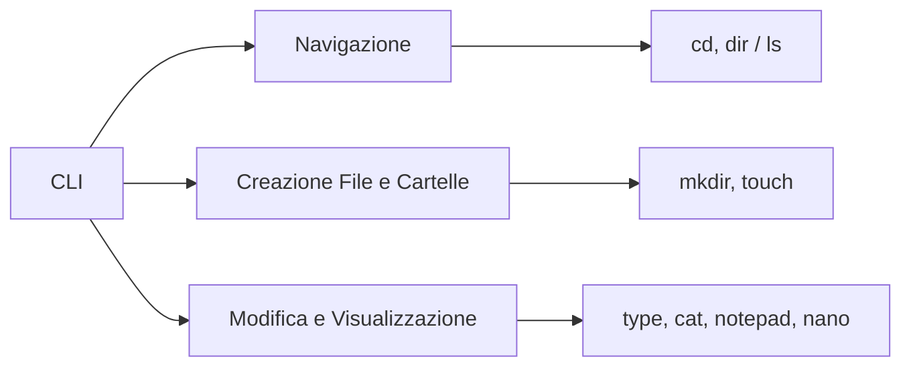

# Interfaccia da linea di comando (CLI)

Questo documento descrive come navigare, creare e modificare file e cartelle usando la riga di comando in Windows e Linux. Verranno mostrati esempi realistici, con prompt, comandi e output simulati, per rappresentare il comportamento di un sistema operativo reale.

---

## 1. Introduzione alla CLI

La Command Line Interface (CLI) consente di eseguire comandi testuali per interagire direttamente con il sistema operativo.

- **Windows:** Si accede tramite il Prompt dei comandi o PowerShell.
- **Linux:** Si utilizza il Terminale (con shell come bash o zsh).

Esempio simulato in Windows:

    C:\Users\User> echo Welcome to the Windows CLI!
    Welcome to the Windows CLI!

Esempio simulato in Linux:

    user@ubuntu:~$ echo "Welcome to the Linux CLI!"
    Welcome to the Linux CLI!

---

## 2. Navigare e visualizzare contenuti

### 2.1 Navigazione su Windows

Per spostarsi in una cartella si usa il comando cd:

    C:\Users\User> cd Desktop
    C:\Users\User\Desktop>

Per elencare il contenuto della directory, si usa il comando dir:

    C:\Users\User\Desktop> dir
     Volume in drive C has no label.
     Volume Serial Number is XXXX-XXXX
     Directory of C:\Users\User\Desktop
     01/01/2021  10:00 AM    <DIR>          .
     01/01/2021  10:00 AM    <DIR>          ..
     01/01/2021  10:05 AM             1,024 sample.txt
                   1 File(s)          1,024 bytes
                   2 Dir(s)  100,000,000,000 bytes free

### 2.2 Navigazione su Linux

Per spostarsi in una directory:

    user@ubuntu:~$ cd /home/user/Desktop
    user@ubuntu:~/Desktop$

Per elencare i file:

    user@ubuntu:~/Desktop$ ls
    Documenti  Immagini  Progetti

Per una visualizzazione dettagliata:

    user@ubuntu:~/Desktop$ ls -l
    total 8
    drwxr-xr-x 2 user user 4096 Jan  1 10:00 Documenti
    drwxr-xr-x 2 user user 4096 Jan  1 10:05 Immagini
    drwxr-xr-x 2 user user 4096 Jan  1 10:10 Progetti

  
*Figura 2: Terminale in Ubuntu (fonte: Wikimedia Commons).*

---

## 3. Creazione di file e cartelle

### 3.1 Su Windows

**Creare una cartella:**

    C:\Users\User> mkdir NuovaCartella

**Creare un file vuoto:**

    C:\Users\User> type nul > file_vuoto.txt
    (Oppure: fsutil file createnew file_vuoto.txt 0)

**Creare un file e scriverci del testo:**

- **Metodo "copy con":**

    C:\Users\User> copy con testo.txt  
    Questo è un esempio di testo.  
    [Premere Ctrl+Z e poi Invio]  
    1 file copiato.

- **Metodo "echo":**

    C:\Users\User> echo Ciao mondo! > testo.txt  
    C:\Users\User> echo Seconda riga >> testo.txt

### 3.2 Su Linux

**Creare una cartella:**

    user@ubuntu:~$ mkdir NuovaCartella

**Creare un file vuoto:**

    user@ubuntu:~$ touch file_vuoto.txt

**Creare un file con contenuto:**

- **Metodo "echo":**

    user@ubuntu:~$ echo "Ciao mondo!" > testo.txt  
    user@ubuntu:~$ echo "Altra riga" >> testo.txt

- **Metodo interattivo:**

    user@ubuntu:~$ cat > testo.txt  
    (Digitare il testo desiderato, poi premere Ctrl+D per terminare)

---

## 4. Modifica e visualizzazione del contenuto

### 4.1 Su Windows

**Visualizzare il contenuto di un file:**

    C:\Users\User> type testo.txt

**Modificare il file in Notepad:**

    C:\Users\User> notepad testo.txt  
    (Si apre il Blocco note per modificare il file)

### 4.2 Su Linux

**Visualizzare il contenuto di un file:**

    user@ubuntu:~$ cat testo.txt

**Modificare il file in Nano:**

    user@ubuntu:~$ nano testo.txt  
    (In Nano, premere Ctrl+O per salvare, poi Ctrl+X per uscire)

---

## 5. Esercizi pratici

### Esercizio 1: Navigazione e creazione di cartelle

**Windows:**

    C:\Users\User> cd Desktop
    C:\Users\User\Desktop> mkdir LaboratorioCLI
    C:\Users\User\Desktop> cd LaboratorioCLI
    C:\Users\User\Desktop\LaboratorioCLI> mkdir Progetti Test

**Linux:**

    user@ubuntu:~$ cd ~/Desktop
    user@ubuntu:~/Desktop$ mkdir LaboratorioCLI
    user@ubuntu:~/Desktop$ cd LaboratorioCLI
    user@ubuntu:~/Desktop/LaboratorioCLI$ mkdir Progetti Test

### Esercizio 2: Creazione di file e scrittura

**Windows:**

    C:\Users\User\Desktop\LaboratorioCLI\Test> echo "Questo è un esempio." > notes.txt
    C:\Users\User\Desktop\LaboratorioCLI\Test> type notes.txt

*Output atteso:*

    Questo è un esempio.

**Linux:**

    user@ubuntu:~/Desktop/LaboratorioCLI/Test$ echo "Questo è un esempio." > notes.txt
    user@ubuntu:~/Desktop/LaboratorioCLI/Test$ cat notes.txt

*Output atteso:*

    Questo è un esempio.

### Esercizio 3: Aggiunta di contenuto

**Windows:**

    C:\Users\User\Desktop\LaboratorioCLI\Test> echo "Nuova riga aggiunta." >> notes.txt
    C:\Users\User\Desktop\LaboratorioCLI\Test> type notes.txt

*Output atteso:*

    Questo è un esempio.
    Nuova riga aggiunta.

**Linux:**

    user@ubuntu:~/Desktop/LaboratorioCLI/Test$ echo "Nuova riga aggiunta." >> notes.txt
    user@ubuntu:~/Desktop/LaboratorioCLI/Test$ cat notes.txt

*Output atteso:*

    Questo è un esempio.
    Nuova riga aggiunta.

### Esercizio 4 (facoltativo): Utilizzo di un editor testuale

**Windows:**

    C:\Users\User\Desktop\LaboratorioCLI\Test> notepad notes.txt

**Linux:**

    user@ubuntu:~/Desktop/LaboratorioCLI/Test$ nano notes.txt

Modifica il file, aggiungi qualche frase, salva ed esci.

---

## 6. Mappa concettuale

Di seguito una mappa concettuale che riassume i concetti trattati:

---

## 7. Conclusione

Questi esempi mostrano come utilizzare la riga di comando per navigare tra le directory, creare file e cartelle e modificare i contenuti dei file. I comandi sono simili in Windows e Linux, anche se la sintassi varia. Con la pratica, la CLI diventerà uno strumento potente per gestire il sistema in modo rapido ed efficiente.

---
