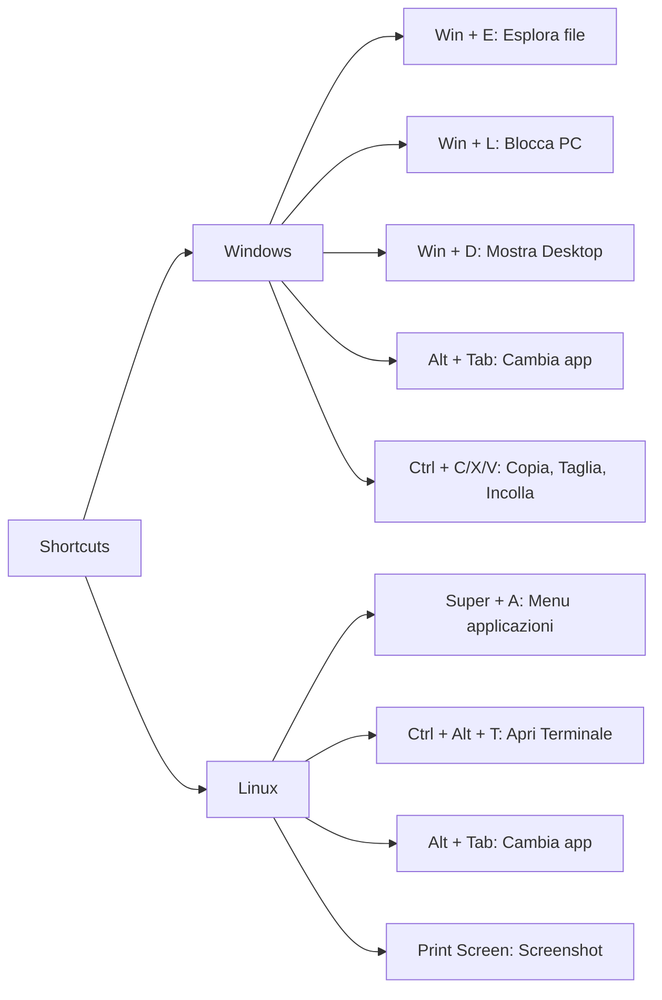

# Scorciatoie da tastiera (Shortcuts)

Questo documento raccoglie le scorciatoie da tastiera (shortcuts) più usate in Windows e Linux. Vengono mostrati esempi realistici che simulano il comportamento di un sistema operativo, includendo prompt, comandi e output.

---

## 1. Shortcuts per Windows

### Navigazione e Sistema

- **Win + E**: Apri Esplora file.
- **Win + L**: Blocca il computer.
- **Win + D**: Mostra il desktop (nasconde le finestre aperte).
- **Win + R**: Apri la finestra di dialogo "Esegui".
- **Win + I**: Apri le Impostazioni.
- **Win + S**: Avvia la ricerca.
- **Win + Tab**: Mostra Task View (visualizza tutte le applicazioni aperte).
- **Win + A**: Apre il Centro Notifiche.
- **Win + Print Screen**: Cattura uno screenshot e lo salva automaticamente.

### Gestione delle Finestre e Applicazioni

- **Alt + Tab**: Passa da un’applicazione aperta all’altra.
- **Alt + F4**: Chiude la finestra attiva.
- **Ctrl + Shift + Esc**: Apre il Task Manager.
- **Ctrl + C / Ctrl + X / Ctrl + V**: Copia, taglia e incolla.
- **Ctrl + Z / Ctrl + Y**: Annulla e ripristina l'azione.

---

## 2. Shortcuts per Linux

Le scorciatoie in Linux possono variare a seconda dell’ambiente desktop; qui sono riportate quelle comuni, tipiche di Ubuntu (GNOME):

### Navigazione e Sistema

- **Super (Win) + A**: Apre il menu delle applicazioni o l’Activities Overview.
- **Super (Win) + L**: Blocca lo schermo (dipende dall’ambiente desktop).
- **Ctrl + Alt + T**: Apre il Terminale.
- **Alt + Tab**: Passa da un’applicazione aperta all’altra.
- **Print Screen**: Cattura uno screenshot (a volte combinato con Shift o Alt per opzioni diverse).

### Gestione delle Finestre e Applicazioni

- **Alt + F4**: Chiude la finestra attiva.
- **Ctrl + C / Ctrl + X / Ctrl + V**: Funziona per copiare, tagliare e incollare in molte applicazioni.
- **Ctrl + Alt + Del**: In alcuni ambienti, apre il menu di logout o di gestione delle sessioni.

---

## 3. Mappa concettuale (Mermaid)

Di seguito una mappa concettuale che riassume le scorciatoie:

---

## 4. Conclusione

Utilizzare le scorciatoie da tastiera è fondamentale per aumentare la produttività. Sia in Windows che in Linux, conoscere e padroneggiare questi shortcut permette di eseguire operazioni comuni in modo rapido ed efficiente, semplificando l'interazione con il sistema operativo.
