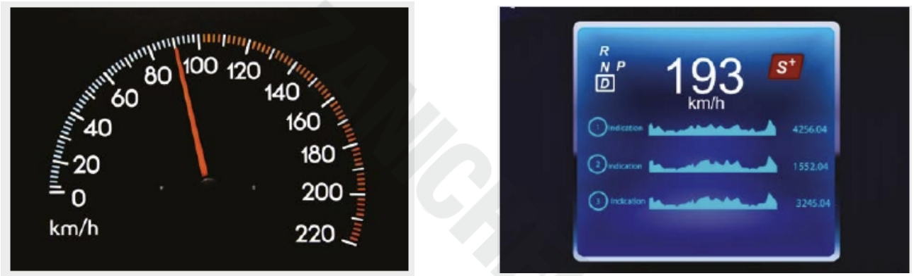
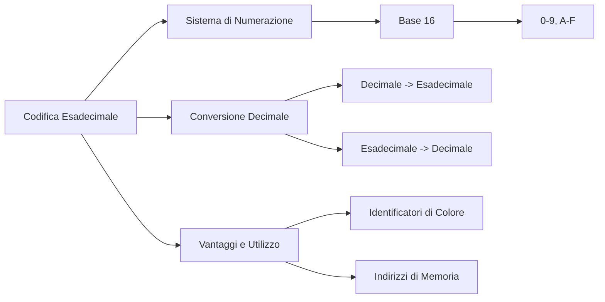

# Rappresentazione delle Informazioni

In questo capitolo vedremo come funziona sommariamente il sistema di numerazione binario e lo utilizzeremo per cercare di rappresentare alcune delle informazioni
di base più importanti!

## Analogico e Digitale

Tutti noi abbiamo esperienza di dispositivi analogici e digitali, ad esempio chi non ha mai visto un tachimetro analogico dell'auto? che differenza c'è con uno digitale?

Nei dispositivi analogici i dati variano in modo **continuo** -> In ogni istante abbiamo un'informazione, non ci sono "buchi"

Nei dispositivi digitali i dai variano un modo **discreto** -> Vengono scelti solo alcuni momenti (di più o di meno dipende da quanto vogliamo essere "fedeli" all'originale) e tutto diventa un numero

> **Analogico** : procedimento che rappresenta un fenomeno con continuità <br><br>
> **Digitale** : procedimento che rappresenta lo stesso fenomeno traducendolo in cifre (dall'inglese *digit*, cifra) e quindi un modo discontinuo



Ma perché abbiamo bisogno di convertire qualcosa di analogico in qualcosa di digitale?

**Perché il computer per lavorare ha bisogno di numeri**


E come sono "fatti" i numeri che sa elaborare il PC?

**Sono i numeri codificati in *binario***

<!--  xxxxxxxxxxxxxxxxxxxxxxxxxxxxxxxxxxxxxxxxxxxxxxxxxxxxxxxxxxxxxxxxxxxxxxxxxxxxxxxxxxxxxxxxxxxxxxxxxxxxxxxxxxxxxxxxxxxxx -->
## Il sistema binario

Il sistema di numerazione binario è un sistema numerico ***posizionale*** e ***in base 2***, cioè che utilizza solo 2 cifre, solitamente 0 e 1, 
per la rappresentazione di tutti i numeri.

Un sistema di numerazione posizionale è quello che da valore alle cifre di un numero a seconda della posizione che queste vi occupano.

Ad esempio nel numero decimale 37 tutti sappiamo benissimo che nonostante la cifra 3 sia più piccola della cifra 7, questa valga di più perché occupa la posizione delle decine, 
mentre la cifra più grande vale meno perché occupa la posizione delle unità

```
37   =   3 x 10   +   7 x 1
```

Questo modo di ragionare e di scrivere i numeri deriva dal fatto che siamo abituati a lavorare in base 10, poiché abbiamo 10 dita e fin da bambini il 10 era sempre il punto d'arrivo della conta sulla dita.

Nonostante ciò, altri modi di contare si sono sviluppati nella storia. Ad esempio le uova si contano a dozzine (per questo si vendono solitamente a gruppi di 6: due gruppi = una dozzina), i minuti e i secondi si contano a gruppi di sessanta, le ore a gruppi di 24 e così via.

Nell'aritmetica decimale esistono 10 cifre diverse (da 0 a 9) e quando si deve indicare un numero più grande di 9, si comincia a raggruppare mettendo in evidenza “a gruppi di 10”. 
Ecco che

```
37   =   3 decine   +   7 unità
```

Allo stesso modo si continua con le centinaia, che sono formate da 10 decine e così via. Ad esempio:

```
582   =       500       +      80      +       2

      =   5 centinaia   +   8 decine   +   2 unità

      =     5 x 100     +    8 x 10    +     2x1

      =     5 x 10 alla 2    +   8 x 10 alla 1   +   2 x 10 alla 0
```

Notiamo soprattutto l'ultima rappresentazione. In questo modo si può indicare ogni gruppo con un indice dato dalla potenza da assegnare alla base per ottenerne il peso. Infatti le unità sono il gruppo 0 (10<sup>0</sup> = 1), le decine sono il gruppo 1 (10<sup>1</sup> = 10), le centinaia il gruppo 2 (10<sup>2</sup> = 100) e così via praticamente all'infinito.

Se lavoriamo in base 2 con solo 2 cifre, gli unici numeri facili da rappresentare saranno proprio 0 e 1, mentre per 2 dovremo già iniziare a raggruppare. Così ad esempio:

```
3 = 1 coppia  + 1 unità

5 = 1 doppia coppia + 0 coppie + 1 unità
```

Vediamo i primi 10 numeri rappresentati nel sistema di numerazione binaria:

<br>

|**Decimale**|**Binario**|
|         -: |        -: |
|0|0|
|1|1|
|2|10|
|3|11|
|4|100|
|5|101|
|6|110|
|7|111|
|8|1000|
|9|1001|

<br>

Seguendo l'esempio precedente potremo stabilire una rappresentazione dei valori indicati in un numero binario:


> 1001  =<br>
> <br>
> =  1 x 2<sup>3</sup>  +  0 x 2<sup>2</sup>  +  0 x 2<sup>1</sup>  +  1 x 2<sup>0</sup>  = <br>
> <br>
> =   1 x 8   +   0 x 4   +   0 x 2   +   1 x 1   = <br>
> <br>
> =     8     +     0     +     0     +     1     =   9


In questo modo dato un qualsiasi numero binario (una sequenza di zeri e uni), potremo stabilire quale quantità esso rappresenti in decimale semplicemente applicando la metodologia appresa.

Quale valore rappresenta il numero binario `101011`?


> 101011 =<br>
> <br>
> =  1 x 2<sup>5</sup>  +  0 x 2<sup>4</sup>  +  1 x 2<sup>3</sup>  +  0 x 2<sup>2</sup>  +  1 x 2<sup>1</sup>  +  1 x 2<sup>0</sup>  = <br>
> <br>
> =   1 x 32  +   0 x 16  +   1 x 8   +   0 x 4   +   1 x 2   +  1 x 1  = <br>
> <br>
> =    32    +    0     +    8    +    0    +    2     +    1    = <br>
> <br>
> =   43


Al contrario se vogliamo capire qual è la rappresentazione binaria di un numero decimale dobbiamo utilizzare la tecnica delle divisioni (intere) successive.

Ad esempio, dato il numero 35, la sua rappresentazione binaria si ottiene dividendo (con resto) successivamente il numero fino ad ottenere quoziente zero; 
alla fine si prende la fila dei resti ottenendo una sequenza di zeri e uni che sono il numero binario.

```
35 / 2 = 17 con resto di 1

17 / 2 =  8 con resto di 1

 8 / 2 =  4 con resto di 0
 
 4 / 2 =  2 con resto di 0
 
 2 / 2 =  1 con resto di 0
 
 1 / 2 =  0 con resto di 1
```
 
da cui si desume che 

```
35 (in base 10) = 100011 (in base 2)
```

Alcune definizioni


> **Bit** : Ogni cifra di un numero binario <br>
> **Byte (*B*)** : Insieme di 8 bit <br>
> **Nibble** : Insieme di 4 bit -> 1 B = 8 bit = 2 nibble

Di seguito un tabella con le grandezze in byte:

|Unità di misura|Simbolo|Equivale a|Pari a circa|Può codificare|
|-|-|-|-|-|
|byte|B|8 bit||un carattere alfanumerico|
|kilobyte|kB|1024 byte = 2<sup>10</sup>|10<sup>3</sup> byte|un terzo di una pagina di testo|
|megabyte|kB|1024 kilobyte = 2<sup>20</sup>|10<sup>6</sup> byte|circa 300 pagine di testo|
|gigabyte|kB|1024 megabyte = 2<sup>30</sup>|10<sup>9</sup> byte|circa 300 mila pagine di testo|
|terabyte|kB|1024 gigabyte = 2<sup>40</sup>|10<sup>12</sup> byte|circa 300 milioni di pagine di testo|


### Esercizi


**Esercizio 301**

Convertire in binario i seguenti numeri decimali:

```
23, 65, 109, 15, 48, 77, 12
```

<hr>

**Esercizio 302**

Convertire in decimale i seguenti numeri binari:

```
10, 100, 1100, 10101010, 11001100, 11110000, 10010010, 10010110
```

> [Esercitati e gioca online!!](https://learningcontent.cisco.com/games/binary/index.html)

## La Codifica Esadecimale

La **codifica esadecimale** è un sistema di numerazione in base 16, molto usato in informatica per rappresentare dati binari in modo più compatto e leggibile rispetto alla base 2 (binario).

### Cos'è il Sistema Esadecimale?

Il sistema esadecimale utilizza 16 simboli:
- Le cifre da 0 a 9, che hanno lo stesso valore come nel sistema decimale.
- Le lettere dalla A alla F, che rappresentano i valori dal 10 al 15.

| Valore Decimale | Esadecimale |
|-----------------|-------------|
| 0               | 0           |
| 1               | 1           |
| ...             | ...         |
| 10              | A           |
| 11              | B           |
| 12              | C           |
| 13              | D           |
| 14              | E           |
| 15              | F           |

Questa tabella mostra come i primi 16 numeri decimali si mappano in esadecimale.

### Conversione da Decimale a Esadecimale

Per convertire un numero decimale in esadecimale, si divide il numero per 16, memorizzando il resto. Ad esempio, vediamo come convertire 156 in esadecimale:

1. **Divisione**: 156 diviso 16 dà 9 come quoziente e 12 come resto.
2. **Corrispondenza del resto**: Il resto 12 corrisponde a `C` in esadecimale.
3. **Risultato**: Partendo dall'alto, scriviamo il quoziente seguito dal resto, ottenendo **9C**.

Quindi, 156 in decimale è uguale a **9C** in esadecimale.

### Conversione da Binario a Esadecimale

Il sistema esadecimale è particolarmente utile per rappresentare i numeri binari perché ogni cifra esadecimale rappresenta esattamente **4 bit (nibble)**.

| Binario | Esadecimale |
|---------|-------------|
| 0000    | 0           |
| 0001    | 1           |
| 0010    | 2           |
| 0011    | 3           |
| 0100    | 4           |
| 0101    | 5           |
| 0110    | 6           |
| 0111    | 7           |
| 1000    | 8           |
| 1001    | 9           |
| 1010    | A           |
| 1011    | B           |
| 1100    | C           |
| 1101    | D           |
| 1110    | E           |
| 1111    | F           |

#### Esempio di Conversione Binaria

Prendiamo in esempio un numero binario: `11010110`.

1. **Dividiamo il numero in gruppi di 4 bit**: `1101` e `0110`.
2. **Convertiamo ogni gruppo**:
   - `1101` diventa `D`
   - `0110` diventa `6`

Il numero `11010110` in binario è **D6** in esadecimale.

> [Gioca online e distruggi i nemici esadecimali](https://flippybitandtheattackofthehexadecimalsfrombase16.com/)

### Vantaggi della Codifica Esadecimale

1. **Compattezza**: Gli esadecimali permettono di scrivere numeri lunghi con meno cifre.
2. **Facilità di lettura**: Per molti scopi, soprattutto in programmazione e configurazioni, è più facile leggere numeri in esadecimale che in binario.
3. **Rapporto diretto con il binario**: La conversione tra esadecimale e binario è semplice, dato che ogni cifra esadecimale corrisponde a 4 bit.

### Conclusione

La codifica esadecimale è fondamentale in informatica per rappresentare dati in modo compatto e leggibile, soprattutto quando si lavora con il sistema binario. Conoscere l'esadecimale è un'abilità essenziale per gli sviluppatori e gli operatori di sistema.

### Mappa concettuale



### Esercizi

1. Converti i seguenti numeri decimali in esadecimale: 45, 128, 255.
2. Converti i seguenti numeri esadecimali in decimale: `1A`, `7F`, `2B`.
3. Usa la tabella di conversione per rappresentare il numero binario `10101010` in esadecimale.
