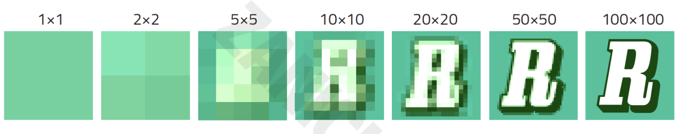
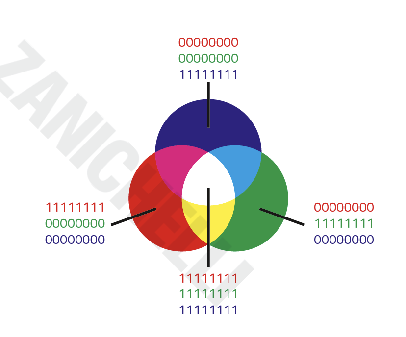
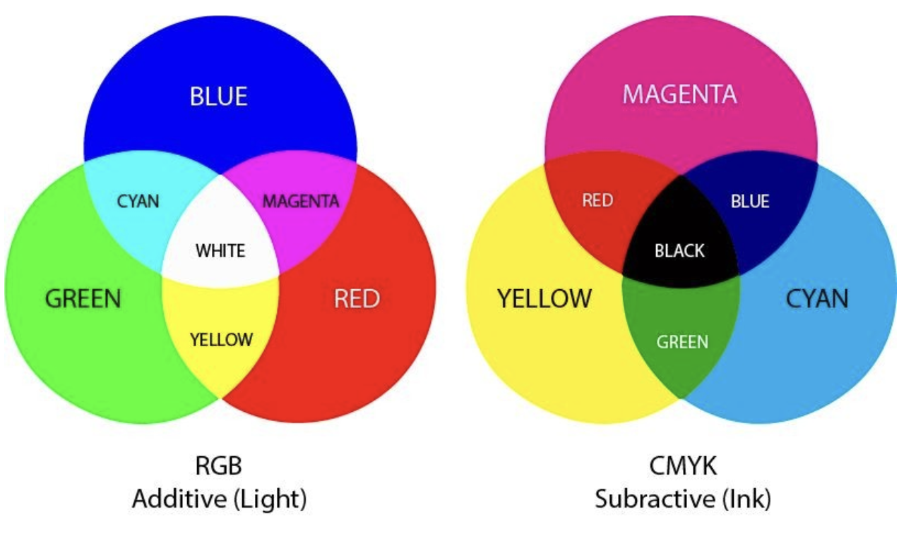

# Rappresentazione delle Informazioni

In questo capitolo vedremo come funziona sommariamente il sistema di numerazione binario e lo utilizzeremo per cercare di rappresentare alcune delle informazioni
di base più importanti!

## Analogico e Digitale 

Tutti noi abbiamo esperienza di dispositivi analogici e digitali, ad esempio chi non ha mai visto un tachimetro analogico dell'auto? che differenza c'è con uno digitale?

Nei dispositivi analogici i dati variano in modo **continuo** -> In ogni istante abbiamo un'informazione, non ci sono "buchi"

Nei dispositivi digitali i dai variano un modo **discreto** -> Vengono scelti solo alcuni momenti (di più o di meno dipende da quanto vogliamo essere "fedeli" all'originale) e tutto diventa un numero

> **Analogico** : procedimento che rappresenta un fenomeno con continuità <br><br>
> **Digitale** : procedimento che rappresenta lo stesso fenomeno traducendolo in cifre (dall'inglese *digit*, cifra) e quindi un modo discontinuo


Ma perché abbiamo bisogno di convertire qualcosa di analogico in qualcosa di digitale?

**Perché il computer per lavorare ha bisogno di numeri**


E come sono "fatti" i numeri che sa elaborare il PC?

**Sono i numeri codificati in *binario***

<!--  xxxxxxxxxxxxxxxxxxxxxxxxxxxxxxxxxxxxxxxxxxxxxxxxxxxxxxxxxxxxxxxxxxxxxxxxxxxxxxxxxxxxxxxxxxxxxxxxxxxxxxxxxxxxxxxxxxxxx -->
## Il sistema binario

Il sistema di numerazione binario è un sistema numerico ***posizionale*** e ***in base 2***, cioè che utilizza solo 2 cifre, solitamente 0 e 1, 
per la rappresentazione di tutti i numeri.

Un sistema di numerazione posizionale è quello che da valore alle cifre di un numero a seconda della posizione che queste vi occupano.

Ad esempio nel numero decimale 37 tutti sappiamo benissimo che nonostante la cifra 3 sia più piccola della cifra 7, questa valga di più perché occupa la posizione delle decine, 
mentre la cifra più grande vale meno perché occupa la posizione delle unità

```
37   =   3 x 10   +   7 x 1
```

Questo modo di ragionare e di scrivere i numeri deriva dal fatto che siamo abituati a lavorare in base 10, poiché abbiamo 10 dita e fin da bambini il 10 era sempre il punto d'arrivo della conta sulla dita.

Nonostante ciò, altri modi di contare si sono sviluppati nella storia. Ad esempio le uova si contano a dozzine (per questo si vendono solitamente a gruppi di 6: due gruppi = una dozzina), i minuti e i secondi si contano a gruppi di sessanta, le ore a gruppi di 24 e così via.

Nell'aritmetica decimale esistono 10 cifre diverse (da 0 a 9) e quando si deve indicare un numero più grande di 9, si comincia a raggruppare mettendo in evidenza “a gruppi di 10”. 
Ecco che

```
37   =   3 decine   +   7 unità
```

Allo stesso modo si continua con le centinaia, che sono formate da 10 decine e così via. Ad esempio:

```
582   =       500       +      80      +       2

      =   5 centinaia   +   8 decine   +   2 unità

      =     5 x 100     +    8 x 10    +     2x1

      =     5 x 10 alla 2    +   8 x 10 alla 1   +   2 x 10 alla 0
```

Notiamo soprattutto l'ultima rappresentazione. In questo modo si può indicare ogni gruppo con un indice dato dalla potenza da assegnare alla base per ottenerne il peso. Infatti le unità sono il gruppo 0 (10<sup>0</sup> = 1), le decine sono il gruppo 1 (10<sup>1</sup> = 10), le centinaia il gruppo 2 (10<sup>2</sup> = 100) e così via praticamente all'infinito.

Se lavoriamo in base 2 con solo 2 cifre, gli unici numeri facili da rappresentare saranno proprio 0 e 1, mentre per 2 dovremo già iniziare a raggruppare. Così ad esempio:

```
3 = 1 coppia  + 1 unità

5 = 1 doppia coppia + 0 coppie + 1 unità
```

Vediamo i primi 10 numeri rappresentati nel sistema di numerazione binaria:

<br>

|**Decimale**|**Binario**|
|         -: |        -: |
|0|0|
|1|1|
|2|10|
|3|11|
|4|100|
|5|101|
|6|110|
|7|111|
|8|1000|
|9|1001|

<br>

Seguendo l'esempio precedente potremo stabilire una rappresentazione dei valori indicati in un numero binario:


> 1001  =<br>
> <br>
> =  1 x 2<sup>3</sup>  +  0 x 2<sup>2</sup>  +  0 x 2<sup>1</sup>  +  1 x 2<sup>0</sup>  = <br>
> <br>
> =   1 x 8   +   0 x 4   +   0 x 2   +   1 x 1   = <br>
> <br>
> =     8     +     0     +     0     +     1     =   9


In questo modo dato un qualsiasi numero binario (una sequenza di zeri e uni), potremo stabilire quale quantità esso rappresenti in decimale semplicemente applicando la metodologia appresa.

Quale valore rappresenta il numero binario `101011`?


> 101011 =<br>
> <br>
> =  1 x 2<sup>5</sup>  +  0 x 2<sup>4</sup>  +  1 x 2<sup>3</sup>  +  0 x 2<sup>2</sup>  +  1 x 2<sup>1</sup>  +  1 x 2<sup>0</sup>  = <br>
> <br>
> =   1 x 32  +   0 x 16  +   1 x 8   +   0 x 4   +   1 x 2   +  1 x 1  = <br>
> <br>
> =    32    +    0     +    8    +    0    +    2     +    1    = <br>
> <br>
> =   43


Al contrario se vogliamo capire qual è la rappresentazione binaria di un numero decimale dobbiamo utilizzare la tecnica delle divisioni (intere) successive.

Ad esempio, dato il numero 35, la sua rappresentazione binaria si ottiene dividendo (con resto) successivamente il numero fino ad ottenere quoziente zero; 
alla fine si prende la fila dei resti ottenendo una sequenza di zeri e uni che sono il numero binario.

```
35 / 2 = 17 con resto di 1

17 / 2 =  8 con resto di 1

 8 / 2 =  4 con resto di 0
 
 4 / 2 =  2 con resto di 0
 
 2 / 2 =  1 con resto di 0
 
 1 / 2 =  0 con resto di 1
```
 
da cui si desume che 

```
35 (in base 10) = 100011 (in base 2)
```

Alcune definizioni


> **Bit** : Ogni cifra di un numero binario <br>
> **Byte (*B*)** : Insieme di 8 bit

Di seguito un tabella con le grandezze in byte:

|Unità di misura|Simbolo|Equivale a|Pari a circa|Può codificare|
|-|-|-|-|-|
|byte|B|8 bit||un carattere alfanumerico|
|kilobyte|kB|1024 byte = 2<sup>10</sup>|10<sup>3</sup> byte|un terzo di una pagina di testo|
|megabyte|kB|1024 kilobyte = 2<sup>20</sup>|10<sup>6</sup> byte|circa 300 pagine di testo|
|gigabyte|kB|1024 megabyte = 2<sup>30</sup>|10<sup>9</sup> byte|circa 300 mila pagine di testo|
|terabyte|kB|1024 gigabyte = 2<sup>40</sup>|10<sup>12</sup> byte|circa 300 milioni di pagine di testo|


### Esercizi


**Esercizio 301**

Convertire in binario i seguenti numeri decimali:

```
23, 65, 109, 15, 48, 77, 12
```

<hr>

**Esercizio 302**

Convertire in decimale i seguenti numeri binari:

```
10, 100, 1100, 10101010, 11001100, 11110000, 10010010, 10010110
```

[Esercitati e gioca online!!](https://learningcontent.cisco.com/games/binary/index.html)

## Digitalizzare immagini

Digitalizzare un'immagine significa trasformare la luce che entra nella nostra fotocamera (e che ci permette di vedere forme e colori) in una serie di numeri

Per fare ciò dovete immaginare che l'immagine sia divisa in tante "caselle" uguali tra di loro come una griglia, ognuna di queste caselle si chiama **pixel** ( Ad esempio, la fotocamera del vostro cellulare quanti pixel ha? se ha 60 Mpx significa che ogni volta che scattate una foto l'immagine è dapprima divisa in 60 milioni di pixel )

Ogni pixel può assumere un solo colore, quindi ognuno di loro verà tradotto in un numero che rappresenta il colore che più di tutti è presente in quel pixel

La **qualità** di una foto digitale dipende dalla sua **risoluzione**, cioè dal numero di pixel del sensore della fotocamera.

> Domanda : che differenza c'è quindi tra una foto scattata a 100 px e una a 
> 60 Mpx? quale delle due sembrerà "quadrettata" e poco simile alla realtà?



Come detto in precedenza ad ogni pixel viene associato un colore, attraverso una codifica che si chiama **RGB (Red Green Blue)**.

Ogni colore può essere rappresentato come una somma di intensità di luce di ognuo dei 3 colori primari della **sintesi additiva**, così chiamata perché la somma delle 3 componenti al massimo da come risultato il BIANCO.

Quando vediamo una foto nel monitor del pc riproduciamo i colori in ogni pixel aumentando o diminuendo una o tutte le 3 componenti, nel caso del colore bianco le 3 intensità sono tutte la massimo.

Ognuo dei 3 colori è rappresentato da un byte ( 8 bit ), quindi ogni pixel è rappresentato da 3 byte ( 24 bit ) e ogni colore è una combinazione di valori



*1111111 è il valore più grande che può assumere ogni byte*


Ma cosa succede quando vogliamo stampare una foto? Perché le stampanti a cartucce non hanno i colori RGB e invece troviamo le cartucce *Ciano (C, Cyan), Magenta (M) e Giallo (Y, Yellow)*

Quando dobbiamo portare un'immagine su carta non emettiamo più luce (come nel caso del monitor ) ma la luce sarà riflessa su carta.

In questo caso i colori hanno una resa milgiore se composti utilizzando come basi i colori primari della sintesi sottrattiva, così chiamata perché "ruba luce" e la loro somma fa NERO.

Significa che se noi avessimo 3 lampade di quei 3 colori e le accendessimo tutte insieme avremmo il buio!!

N.B. : anche se usassimo i colori primari RGB mischiati insieme avremmo un colore scuro (tipo un marroncino) ma in generale i colori sono un pò sbiancati, ed è difficile ottenere colori vivaci, proprio a causa del "furto della luce"

Molte volte, quasi sempre in realtà, accanto alle cartucce colorate c'è sempre una cartuccia del *Nero* ( *K* , dal termine inglese *key*, poiché il nero è colore chiave o importante nella stampa di anni fa). Ciò dipende dal fatto che mischiando i 3 colori non si ottengono mai tinte scure precise e in generale aggiungendo nero si ottengono molte più tonalità di colore per rendere la stampa sempre più vicina all'originale in foto



In sintesi:

1. **RGB (Red, Green, Blue)**

      * **Dove viene usato**: nei dispositivi che emettono luce, come monitor, televisori, smartphone.
      * **Modalità di colore**: sintesi additiva (i colori si formano aggiungendo luce).
      * **Come funziona**: mescolando i colori rosso, verde e blu alla massima intensità, si ottiene il bianco.
      * **Gamma cromatica**: RGB ha una gamma di colori più ampia (più colori) rispetto a CMYK, rendendo i colori più vivaci su schermo.
      * **Utilizzo**: ideale per immagini digitali, grafica web, video e tutto ciò che si visualizza su schermo.

1. **CMYK (Cyan, Magenta, Yellow, Key/Black)**

      * **Dove viene usato**: nelle stampanti e nei sistemi di stampa, poiché utilizza pigmenti fisici.
      * **Modalità di colore**: sintesi sottrattiva (i colori si ottengono assorbendo la luce riflessa).
      * **Come funziona**: mescolando i colori ciano, magenta e giallo, si ottiene un colore molto scuro (quasi nero). Il nero viene aggiunto per ottenere neri più intensi e dettagli precisi.
      * **Gamma cromatica**: CMYK ha una gamma cromatica più ridotta rispetto a RGB, quindi alcuni colori appaiono meno vivaci su carta.
      * **Utilizzo**: adatto per stampe fisiche su carta, come libri, poster, e tutto ciò che deve essere stampato.
