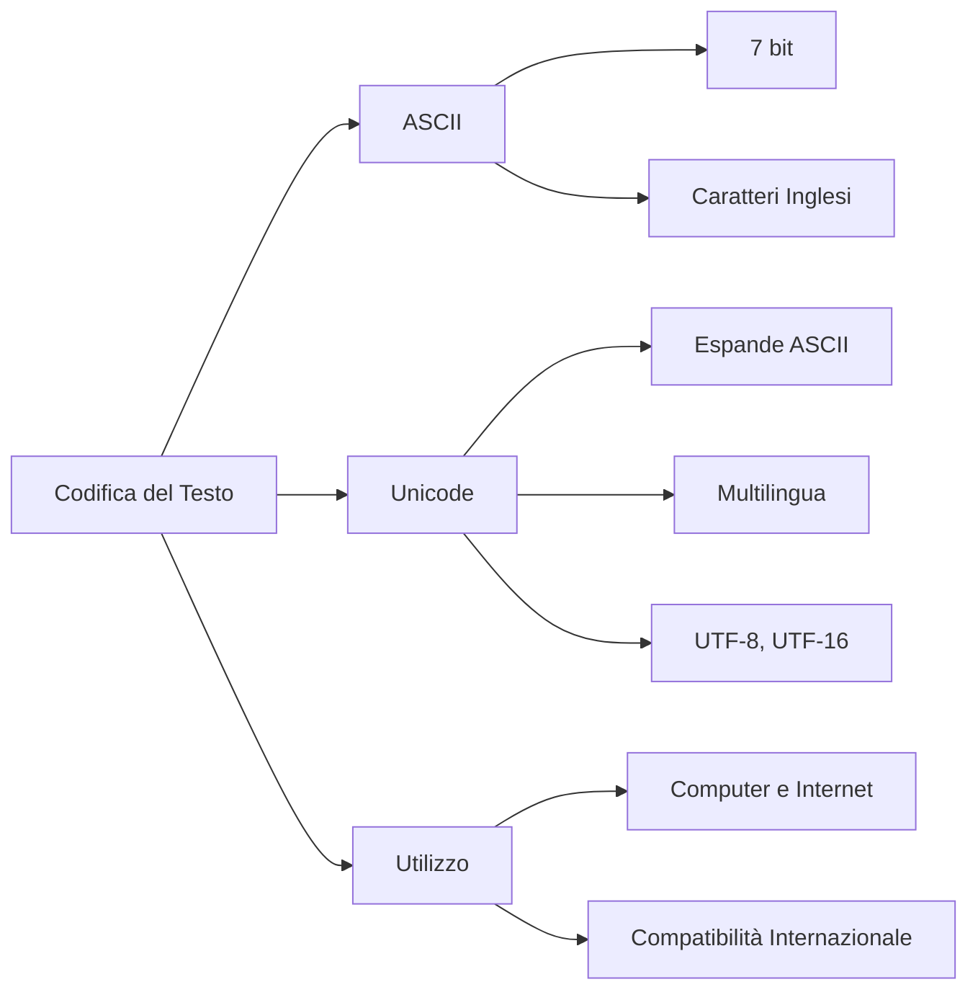

# La Codifica del Testo: ASCII e Unicode

La **codifica del testo** è un sistema che associa un insieme di simboli a dei valori numerici, permettendo ai computer di memorizzare e interpretare il testo. Senza un sistema di codifica, un computer non sarebbe in grado di capire se una sequenza di bit rappresenta una lettera, un numero o un simbolo speciale.

## ASCII: American Standard Code for Information Interchange

**ASCII** è uno dei primi standard di codifica del testo, sviluppato negli anni '60. Utilizza 7 bit per rappresentare 128 simboli unici, che includono:

- Lettere maiuscole e minuscole (A-Z, a-z)
- Numeri (0-9)
- Simboli speciali (come `!`, `@`, `#`, ecc.)
- Caratteri di controllo, come `Enter` (codice 13) o `Tab` (codice 9)

### Tabella dei Caratteri ASCII

| Simbolo | Codice Decimale | Codice Binario |
|---------|------------------|----------------|
| A       | 65               | 01000001       |
| B       | 66               | 01000010       |
| a       | 97               | 01100001       |
| b       | 98               | 01100010       |
| 0       | 48               | 00110000       |
| 1       | 49               | 00110001       |
| @       | 64               | 01000000       |
| !       | 33               | 00100001       |

### Limiti di ASCII

ASCII funziona bene per l'inglese e alcune lingue europee, ma non è adatto per rappresentare simboli di altre lingue, come le lettere accentate francesi o i caratteri cinesi. Per questo, si è sviluppata una codifica più estesa, chiamata **Unicode**.

## Unicode: Un Codice Universale

**Unicode** è uno standard di codifica che include simboli da quasi tutte le lingue del mondo. 

Uno dei formati più usati per rappresentare Unicode è **UTF-(8/16)**:

* **UTF-(8/16)** è una codifica variabile, che utilizza da 1 (UTF-8) a 2 byte (UTF-16) per ogni simbolo.
* È compatibile con ASCII: tutti i simboli ASCII occupano 1 byte in UTF-8 e hanno lo stesso valore numerico.

Questa caratteristica rende UTF-8 ideale per documenti e pagine web, permettendo di rappresentare testo in diverse lingue mantenendo la compatibilità con il testo ASCII.

## Differenze tra ASCII e Unicode

| Caratteristica        | ASCII                                | Unicode                         |
|-----------------------|--------------------------------------|---------------------------------|
| Bit utilizzati        | 7 bit (128 simboli)                 | Variabile (UTF-8, UTF-16, ecc.) |
| Supporto per lingue   | Solo inglese e simboli base         | Tutte le lingue e simboli       |
| Compatibilità UTF-8   | Compatibile                         | UTF-8 è una codifica di Unicode |
| Utilizzo principale   | Vecchi sistemi e dati semplici      | Pagine web, applicazioni moderne|

## Perché è importante la codifica del testo?

La codifica del testo è fondamentale per la comunicazione globale e per il corretto funzionamento di applicazioni software e pagine web. Con Unicode e UTF-8, possiamo rappresentare testi in qualsiasi lingua e utilizzare simboli e emoji, mantenendo la compatibilità con ASCII.

## Esercizi

1. Scrivi il codice binario per i caratteri `C` e `i` utilizzando la codifica ASCII.
2. Converti la frase "Hello!" in binario usando la codifica ASCII.

## Mappa concettuale

