# La Codifica del Testo: ASCII e Unicode

Come fa il computer a capire la differenza tra la lettera "A" e il numero 65? Semplice: usa una **codifica del testo**, cioè una tabella che associa ogni simbolo (lettera, numero, emoji) a un valore numerico.

Senza un sistema di codifica, il computer vedrebbe solo una sequenza di bit tipo `01000001` e non saprebbe se è una lettera, un numero o che altro. Con la codifica invece sa che `01000001` = "A"!

## ASCII: American Standard Code for Information Interchange

**ASCII** è il nonno di tutti i sistemi di codifica del testo, sviluppato negli **anni '60** (quando i computer erano grandi come armadi).

Usa **7 bit** per rappresentare **128 simboli** diversi:

- **Lettere maiuscole e minuscole**: A-Z, a-z (sì, maiuscole e minuscole hanno codici diversi!)
- **Numeri**: 0-9 (attenzione: il carattere "0" è diverso dal numero 0!)
- **Simboli speciali**: `!`, `@`, `#`, `$`, `%`...
- **Caratteri di controllo**: tipo `Enter` (a capo), `Tab` (tabulazione), `Backspace`...

### Tabella dei Caratteri ASCII

| Simbolo | Codice Decimale | Codice Binario |
|---------|------------------|----------------|
| A       | 65               | 01000001       |
| B       | 66               | 01000010       |
| a       | 97               | 01100001       |
| b       | 98               | 01100010       |
| 0       | 48               | 00110000       |
| 1       | 49               | 00110001       |
| @       | 64               | 01000000       |
| !       | 33               | 00100001       |

### Limiti di ASCII (spoiler: non basta!)

ASCII funziona bene per l'**inglese**, ma ha un problemone: non ha spazio per lettere accentate (àèéìòù), simboli di altre lingue (ñ, ü, ç), caratteri cinesi, giapponesi, arabi, emoji... niente di tutto questo!

Provate a scrivere "caffè" in ASCII puro: diventa "caff?" perché la "è" non esiste nella tabella ASCII. Disastro!

Per questo è nato **Unicode**...

## Unicode: Il Codice Universale (finalmente!)

**Unicode** è lo standard moderno che include simboli da **quasi tutte le lingue del mondo**: latino, greco, cirillico, arabo, cinese, giapponese, coreano, hindi... e anche le **emoji**! 🎉

Il formato più usato è **UTF-8** (e il suo fratello **UTF-16**):

* **UTF-8**: codifica variabile che usa da 1 a 4 byte per simbolo, a seconda di quanto è "esotico". Lettere inglesi = 1 byte, caratteri cinesi = 3-4 byte.
* **È retrocompatibile con ASCII**: tutti i simboli ASCII occupano esattamente 1 byte in UTF-8 con lo stesso valore. Geniale!

Questa compatibilità rende UTF-8 perfetto per il web: può mostrare testi in qualsiasi lingua, emoji incluse, senza problemi. 🌍

**Fun fact**: Esistono oltre 143.000 caratteri Unicode, incluse emoji, simboli matematici, note musicali, e perfino geroglifici egizi!

## Differenze tra ASCII e Unicode

| Caratteristica        | ASCII                                | Unicode                         |
|-----------------------|--------------------------------------|---------------------------------|
| Bit utilizzati        | 7 bit (128 simboli)                 | Variabile (UTF-8, UTF-16, ecc.) |
| Supporto per lingue   | Solo inglese e simboli base         | Tutte le lingue e simboli       |
| Compatibilità UTF-8   | Compatibile                         | UTF-8 è una codifica di Unicode |
| Utilizzo principale   | Vecchi sistemi e dati semplici      | Pagine web, applicazioni moderne|

## Perché è importante la codifica del testo?

Senza codifiche standardizzate, Internet non funzionerebbe! Immaginate:
- Email con caratteri strani tipo "cafè" invece di "caffè"
- Siti web incomprensibili se usano lingue diverse dall'inglese
- Emoji che appaiono come quadratini vuoti ▯

Grazie a **Unicode** e **UTF-8** oggi possiamo scrivere in qualsiasi lingua, usare emoji 😎, e tutto funziona ovunque. Internet è veramente globale!

## Esercizi (per chi vuole smanettare)

1. Usando la tabella ASCII, scrivi il codice binario per i caratteri `C` e `i`.
2. Converti la frase "Hello!" in binario usando ASCII (suggerimento: guardate i codici di H, e, l, l, o, !).
3. Perché il codice ASCII di "A" (65) è diverso da quello di "a" (97)? Cosa possiamo dedurre?

## Mappa concettuale

```mermaid
flowchart LR
    A[Codifica del Testo] --> B[ASCII]
    A --> C[Unicode]
    B --> D[7 bit]
    B --> E[Caratteri Inglesi]
    C --> F[Espande ASCII]
    C --> G[Multilingua]
    C --> H[UTF-8, UTF-16]
    A --> I[Utilizzo]
    I --> J[Computer e Internet]
    I --> K[Compatibilità Internazionale]
```

