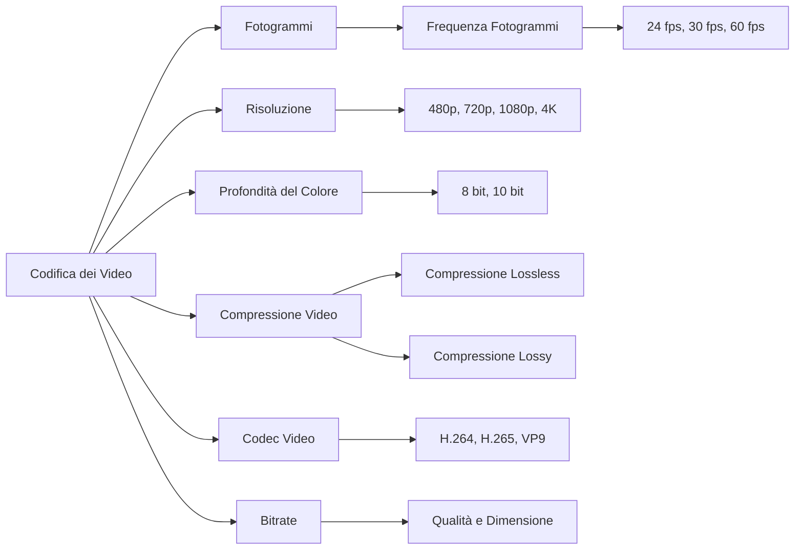

# La Codifica dei Video

La **codifica dei video** è il processo di trasformazione dei dati video in un formato digitale che può essere memorizzato, trasmesso e visualizzato su diversi dispositivi. Dato che i video consistono in una serie di immagini in movimento, la loro codifica richiede tecniche specifiche per garantire che il file sia di dimensioni contenute, ma mantenga una buona qualità.

## Cos'è un Video Digitale?

Un video digitale è composto da una sequenza di **fotogrammi** (o frame), che sono immagini statiche mostrate una dopo l'altra per creare l'illusione del movimento. La velocità con cui questi fotogrammi vengono mostrati si chiama **frequenza dei fotogrammi** (misurata in fotogrammi al secondo, o **fps**). Alcuni valori comuni di fps includono:

* **24 fps** – Standard per il cinema.
* **30 fps** – Usato in molte trasmissioni televisive.
* **60 fps** – Usato per video ad alta definizione e giochi.

<video src="https://www.youtube.com/watch?v=3UXyKoT-cog" controls></video>

## Risoluzione del Video

La **risoluzione** rappresenta il numero di pixel in ogni fotogramma, ed è solitamente indicata come larghezza × altezza (in pixel). Alcune risoluzioni comuni includono:

* **480p** (Standard Definition, o SD) – 640 × 480 pixel.
* **720p** (High Definition, o HD) – 1280 × 720 pixel.
* **1080p** (Full HD) – 1920 × 1080 pixel.
* **4K** (Ultra HD) – 3840 × 2160 pixel.

Maggiore è la risoluzione, più dettagliato e nitido sarà il video, ma anche maggiori saranno le dimensioni del file.

## Campionamento e Profondità del Colore

Ogni pixel in un video ha un **colore** rappresentato da una combinazione di rosso, verde e blu (RGB). La **profondità del colore** indica quanti bit vengono utilizzati per rappresentare il colore di ciascun pixel:

* **8 bit** per colore (24 bit totali per pixel) è uno standard comune per i video.
* **10 bit** per colore (30 bit totali per pixel) è usato per video ad alta gamma dinamica (HDR).

Più alta è la profondità del colore, maggiore è il numero di colori che possono essere rappresentati, migliorando la qualità dell'immagine.

## Compressione Video

La **compressione video** riduce la dimensione del file eliminando informazioni ridondanti. Ci sono due principali tipi di compressione:

* **Compressione senza perdita di dati (lossless)**: riduce la dimensione del file senza perdere qualità, ma non è molto efficiente per i video.
* **Compressione con perdita di dati (lossy)**: elimina parte delle informazioni per ridurre la dimensione del file. Questa è la più comune per i video.

### Codec Video

Un **codec** è un software o un algoritmo usato per comprimere e decomprimere i file video. Alcuni codec video popolari includono:

* **H.264**: utilizzato per la maggior parte dei video su Internet e nei Blu-ray.
* **H.265 (HEVC)**: migliorato rispetto a H.264, è usato per video 4K e HDR.
* **VP9**: un'alternativa open-source usata da YouTube per lo streaming.

## Bitrate

Il **bitrate** indica quanti bit vengono trasmessi ogni secondo nel video. Si misura in **kbps** (kilobit al secondo) o **Mbps** (megabit al secondo). Un bitrate più alto generalmente indica una qualità video migliore, ma anche file più grandi.

### Esempio di Bitrate

* Un video 1080p con un bitrate di 4 Mbps sarà più nitido rispetto allo stesso video con un bitrate di 2 Mbps.
* Un video 4K richiede solitamente un bitrate più alto rispetto a un video HD per mantenere la stessa qualità.

## Conclusione

La codifica dei video è un processo complesso che bilancia qualità visiva e dimensioni dei file. Attraverso tecniche di campionamento, compressione e regolazione della risoluzione e del bitrate, è possibile ottenere video che siano facili da trasmettere e visualizzare su una varietà di dispositivi.

### Esercizi

1. Qual è la risoluzione di un video Full HD? Quanti pixel ha?
2. Qual è la differenza tra compressione con perdita e senza perdita? Qual è la più comune per i video?
3. Perché un video con un bitrate di 2 Mbps è di qualità inferiore rispetto a uno con bitrate di 5 Mbps, pur avendo la stessa risoluzione?

## Mappa concettuale

