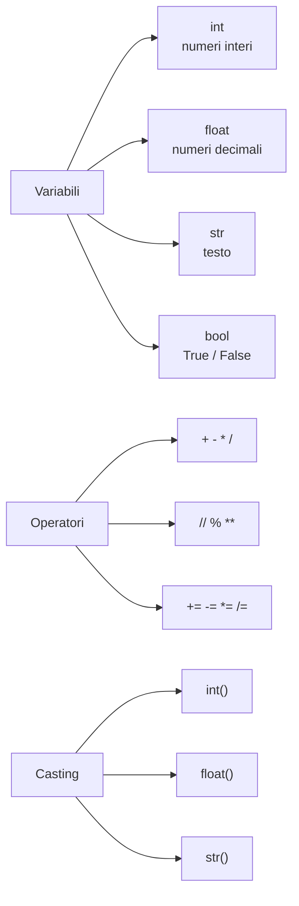

# Variabili, tipi di dati e operatori

## Cos'è una variabile?

Una variabile è tipo una **scatola con un'etichetta**. Ci metti dentro un valore, le dai un nome, e poi la usi quando ti serve. Facile, no?

In Python creare una variabile è semplicissimo: le dai un nome, metti `=`, e ci piazzi il valore. Fine. Niente dichiarazioni tipo `Declare Integer x` come in Flowgorithm — Python è più rilassato!

```pyodide
nome = "Mario"
eta = 16
altezza = 1.75

print(nome)
print(eta)
print(altezza)
```

!!! tip "Niente dichiarazioni!"

    In Flowgorithm dovevi fare `Declare Integer x` prima di usare una variabile. In Python? **Fregatene**, crei la variabile e basta. Python capisce da solo che tipo è guardando il valore. Meno burocrazia, più divertimento! 🎉

---

## I tipi di dati fondamentali

Python ha 4 tipi di dati base. Pensa a loro come le 4 "categorie" in cui Python organizza le informazioni:

| Tipo      | Nome Python | Esempio          | Tradotto                 |
|-----------|-------------|------------------|--------------------------|
| Intero    | `int`       | `42`, `-7`, `0`  | Numeri senza virgola     |
| Decimale  | `float`     | `3.14`, `-0.5`   | Numeri con il punto!     |
| Stringa   | `str`       | `"ciao"`, `'ok'` | Testo tra virgolette     |
| Booleano  | `bool`      | `True`, `False`  | Vero o Falso, tipo sì/no |

```pyodide
# La funzione type() ti dice che tipo è una variabile
# Utile quando non capisci perché il codice non funziona!
intero = 42
decimale = 3.14
testo = "ciao"
booleano = True

print(type(intero))
print(type(decimale))
print(type(testo))
print(type(booleano))
```

!!! warning "Il punto, non la virgola!"

    In Python (e in tutti i linguaggi) i decimali usano il **punto**, non la virgola! `3.14` è giusto, `3,14` è SBAGLIATO. Lo so, è strano per noi italiani, ma ci si abitua!

---

## Regole per i nomi delle variabili

Non puoi dare un nome a caso alle variabili (anche se a volte vorresti chiamarle "roba123"). Ecco le regole:

- **Possono contenere**: lettere, numeri e underscore `_`
- **Devono iniziare** con una lettera o underscore (mai con un numero!)
- **Sono case-sensitive**: `nome` e `Nome` sono variabili DIVERSE (sì, Python è pignolo)
- **Non possono** essere parole riservate (`if`, `for`, `print`... Python se le tiene per sé)

| Nome          | Valido? | Perché                              |
|---------------|---------|--------------------------------------|
| `eta`         | Sì      | Solo lettere, tutto ok               |
| `nome_utente` | Sì      | Lettere e underscore, perfetto       |
| `x1`          | Sì      | Lettera seguita da numero            |
| `1nome`       | No      | Inizia con un numero, vietato!       |
| `nome utente` | No      | Lo spazio non è ammesso              |
| `for`         | No      | Parola riservata, Python si arrabbia |

!!! tip "Convenzione snake_case 🐍"

    In Python si usa lo **snake_case**: parole minuscole separate da underscore. Tipo: `area_rettangolo`, `base_maggiore`, `nome_utente`. Si chiama "snake" perché sembra un serpente che striscia... e Python è un serpente... coincidenza? Non credo!

---

## Operatori aritmetici

Ok, qui siamo nel territorio della matematica, ma niente panico: Python sa fare i conti meglio di te (nessuna offesa 😄).

| Operatore | Significato         | Esempio    | Risultato |
|-----------|---------------------|------------|-----------|
| `+`       | Addizione           | `5 + 3`    | `8`       |
| `-`       | Sottrazione         | `5 - 3`    | `2`       |
| `*`       | Moltiplicazione     | `5 * 3`    | `15`      |
| `/`       | Divisione           | `5 / 2`    | `2.5`     |
| `//`      | Divisione intera    | `5 // 2`   | `2`       |
| `%`       | Resto (modulo)      | `5 % 2`    | `1`       |
| `**`      | Potenza             | `5 ** 2`   | `25`      |

```pyodide
a = 17
b = 5

print("Addizione:", a + b)
print("Sottrazione:", a - b)
print("Moltiplicazione:", a * b)
print("Divisione:", a / b)
print("Divisione intera:", a // b)
print("Resto:", a % b)
print("Potenza:", a ** b)
```

!!! tip "Il resto `%` è più utile di quanto pensi!"

    L'operatore `%` (modulo) restituisce il **resto** della divisione. Sembra inutile? Invece è utilissimo! Ad esempio: `numero % 2 == 0` ti dice se un numero è **pari**. Magia! ✨

### Precedenza degli operatori

Come in matematica, le operazioni hanno un **ordine di esecuzione**. Se te lo sei dimenticato, tranquillo, è uguale a quello che hai imparato a scuola:

1. `**` (potenza) — si esegue per prima
2. `*`, `/`, `//`, `%` (moltiplicazione & co.)
3. `+`, `-` (addizione e sottrazione)

E se vuoi cambiare l'ordine? Usa le **parentesi** `()`, esattamente come in matematica!

```pyodide
# Senza parentesi: prima * poi +
risultato1 = 2 + 3 * 4
print("2 + 3 * 4 =", risultato1)

# Con parentesi: prima + poi *
risultato2 = (2 + 3) * 4
print("(2 + 3) * 4 =", risultato2)
```

---

## Conversione dei tipi (casting)

A volte devi **convertire** un valore da un tipo all'altro. È come tradurre da una lingua all'altra, ma per i dati:

| Funzione   | Converte in | Esempio                     |
|------------|-------------|-----------------------------|
| `int()`    | Intero      | `int("42")` → `42`         |
| `float()`  | Decimale    | `float("3.14")` → `3.14`   |
| `str()`    | Stringa     | `str(42)` → `"42"`         |
| `bool()`   | Booleano    | `bool(1)` → `True`         |

```pyodide
# Conversione stringa → numero
testo = "100"
numero = int(testo)
print(numero + 50)  # Ora funziona!

# Conversione numero → stringa
eta = 16
messaggio = "Ho " + str(eta) + " anni"
print(messaggio)
```

### La trappola dell'input (te l'avevo detto!)

Ricordi l'avvertimento della sezione precedente? Ecco, questo è il momento in cui capisci perché era importante:

```pyodide
# CORRETTO: converto in int prima di calcolare
numero = int(input("Scrivi un numero: "))
doppio = numero * 2
print("Il doppio è:", doppio)
```

Se non metti `int()` intorno a `input()`, Python pensa che sia testo e invece di moltiplicare... **ripete la stringa**! Scrivi 5, ti aspetti 10, e ottieni "55". Benvenuto nel club "ho perso mezz'ora per un errore stupido" 😂

---

## Operatori di assegnazione composti

Scrivere `x = x + 3` funziona, ma è un po' lungo. Python ti offre delle **scorciatoie** perché anche lui è pigro:

| Operatore | Equivale a        | In pratica        |
|-----------|--------------------|-------------------|
| `+=`      | `x = x + valore`  | aggiunge          |
| `-=`      | `x = x - valore`  | toglie            |
| `*=`      | `x = x * valore`  | moltiplica        |
| `/=`      | `x = x / valore`  | divide            |

```pyodide
punti = 100
print("Punti iniziali:", punti)

punti += 50  # Guadagno 50 punti
print("Dopo bonus:", punti)

punti -= 30  # Perdo 30 punti
print("Dopo penalità:", punti)

punti *= 2   # Raddoppio! Jackpot!
print("Dopo moltiplicatore:", punti)
```

---

## Mappa concettuale



---

## Esercizi

### Esercizio 1: Conversione temperatura

Scrivi un programma che converta una temperatura da Celsius a Fahrenheit.
Formula: `F = C * 1.8 + 32`

```pyodide
# Completa il programma!
celsius = float(input("Temperatura in Celsius: "))

# Scrivi la formula qui sotto


# Stampa il risultato

```

??? success "Soluzione"

    ```pyodide
    celsius = float(input("Temperatura in Celsius: "))
    fahrenheit = celsius * 1.8 + 32
    print(f"{celsius}°C = {fahrenheit}°F")
    ```

### Esercizio 2: Calcolo sconto

Un prodotto costa 80 euro e ha uno sconto del 15%.
Calcola il prezzo scontato e mostra quanto risparmi!

```pyodide
prezzo = 80
sconto_percentuale = 15

# Calcola lo sconto e il prezzo finale


# Stampa il risultato

```

??? success "Soluzione"

    ```pyodide
    prezzo = 80
    sconto_percentuale = 15
    sconto = prezzo * sconto_percentuale / 100
    prezzo_finale = prezzo - sconto
    print(f"Prezzo originale: {prezzo} euro")
    print(f"Sconto: {sconto} euro")
    print(f"Prezzo finale: {prezzo_finale} euro")
    ```
