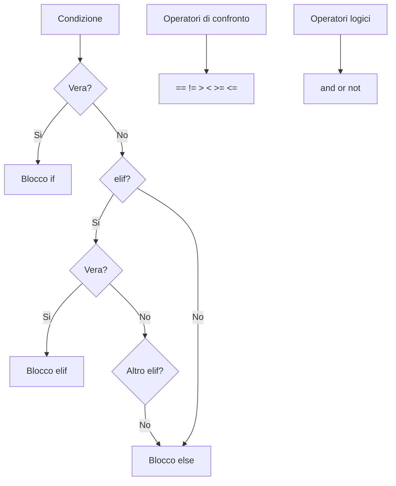

# Condizioni

## Prendere decisioni

Fino ad ora i nostri programmi eseguivano tutto in fila, dall'alto al basso, come un treno sui binari. Ma nella vita reale **si prendono decisioni**: "se piove prendo l'ombrello, altrimenti prendo gli occhiali da sole". E i programmi fanno uguale!

In Python (come con il blocco rombo di Flowgorithm) si usano `if`, `elif` e `else`. Sono le parole magiche delle decisioni!

---

## L'istruzione `if`

La forma più semplice: **se** la condizione è vera, fai qualcosa.

```pyodide
eta = int(input("Quanti anni hai? "))

if eta >= 18:
    print("Sei maggiorenne!")
    print("Puoi votare")
```

!!! danger "Due cose FONDAMENTALI!"

    1. **I due punti `:` dopo la condizione** — se li dimentichi, Python si arrabbia
    2. **L'indentazione** (4 spazi) — Python capisce cosa sta "dentro" l'if guardando gli spazi. Niente spazi = niente if. È tipo il rientro dei paragrafi, ma qui è obbligatorio!

---

## `if` ... `else`

Per gestire il caso "altrimenti" — perché nella vita non puoi solo dire "se sì" senza dire "se no":

```pyodide
eta = int(input("Quanti anni hai? "))

if eta >= 18:
    print("Sei maggiorenne")
else:
    print("Sei minorenne")
```

---

## `if` ... `elif` ... `else`

Per gestire **più condizioni** — tipo un menu con tante opzioni:

```pyodide
voto = int(input("Inserisci il voto (1-10): "))

if voto >= 9:
    print("Eccellente! Sei un genio! 🧠")
elif voto >= 7:
    print("Buono, bravo!")
elif voto >= 6:
    print("Sufficiente... ce l'hai fatta per un pelo!")
else:
    print("Insufficiente... tocca studiare di più 📚")
```

!!! tip "Come funziona?"

    Python controlla le condizioni **dall'alto verso il basso**. Appena ne trova una vera, esegue quel blocco e **salta tutte le altre**. È tipo un buttafuori che ti fa entrare alla prima porta aperta e ignora le altre!

---

## Operatori di confronto

Per scrivere le condizioni ti servono gli **operatori di confronto**. Eccoli tutti:

| Operatore | Significato       | Esempio    | Risultato |
|-----------|-------------------|------------|-----------|
| `==`      | Uguale a          | `5 == 5`   | `True`    |
| `!=`      | Diverso da        | `5 != 3`   | `True`    |
| `>`       | Maggiore di       | `5 > 3`    | `True`    |
| `<`       | Minore di         | `5 < 3`    | `False`   |
| `>=`      | Maggiore o uguale | `5 >= 5`   | `True`    |
| `<=`      | Minore o uguale   | `5 <= 3`   | `False`   |

```pyodide
x = 10
print(x == 10)   # True
print(x != 5)    # True
print(x > 15)    # False
print(x <= 10)   # True
```

!!! danger "L'ERRORE più classico di SEMPRE: `=` vs `==`"

    - `=` è l'**assegnazione** (dai un valore: "prendi questo!")
    - `==` è il **confronto** (fai una domanda: "sei uguale a...?")

    Se scrivi `if x = 5:` invece di `if x == 5:`, Python esplode. E tu perdi 20 minuti a cercare l'errore. Tutti ci sono passati, TUTTI. Non sentirti male 😅

---

## Operatori logici

A volte una condizione sola non basta. Tipo: "puoi guidare SE hai 18 anni **E** hai la patente". Per combinare più condizioni usi `and`, `or`, `not`:

| Operatore | Significato                       | Esempio                    |
|-----------|-----------------------------------|----------------------------|
| `and`     | Vero se **entrambe** sono vere    | `x > 0 and x < 10`        |
| `or`      | Vero se **almeno una** è vera     | `x == 0 or x == 1`        |
| `not`     | Inverte: vero diventa falso       | `not (x > 5)`             |

```pyodide
eta = int(input("Età: "))
patente = input("Hai la patente? (si/no): ")

if eta >= 18 and patente == "si":
    print("Puoi guidare! 🚗")
elif eta >= 18 and patente == "no":
    print("Puoi prendere la patente!")
else:
    print("Sei troppo giovane per guidare")
```

### Tabelle di verità (sì, servono anche queste)

**AND** — entrambe devono essere vere (tipo "voglio pizza E birra"):

| A     | B     | A and B |
|-------|-------|---------|
| True  | True  | True    |
| True  | False | False   |
| False | True  | False   |
| False | False | False   |

**OR** — almeno una deve essere vera (tipo "pizza O hamburger, basta che mangio"):

| A     | B     | A or B |
|-------|-------|--------|
| True  | True  | True   |
| True  | False | True   |
| False | True  | True   |
| False | False | False  |

```pyodide
# Verifica se un numero è in un intervallo
numero = int(input("Inserisci un numero: "))

if numero >= 1 and numero <= 10:
    print(f"{numero} è tra 1 e 10")
else:
    print(f"{numero} è fuori dall'intervallo 1-10")

# Verifica weekend
giorno = input("Che giorno è? ").lower()
if giorno == "sabato" or giorno == "domenica":
    print("È weekend! 🎉")
else:
    print("È un giorno lavorativo 😴")
```

---

## Condizioni annidate

Puoi mettere un `if` dentro un altro `if`. È tipo le matrioske russe, ma con il codice:

```pyodide
numero = int(input("Inserisci un numero: "))

if numero >= 0:
    if numero == 0:
        print("Il numero è zero")
    else:
        print("Il numero è positivo")
else:
    print("Il numero è negativo")
```

!!! tip "Non esagerare con l'annidamento!"

    Le condizioni annidate funzionano, ma se ne metti troppe il codice diventa illeggibile. Se ti ritrovi con 4-5 livelli di indentazione... fermati e ripensa la logica! Spesso `elif` e operatori logici risolvono meglio.

---

## Espressione condizionale (il one-liner)

Per condizioni semplici, puoi scrivere tutto in una riga. È tipo il fast food delle condizioni:

```pyodide
eta = int(input("Età: "))

stato = "maggiorenne" if eta >= 18 else "minorenne"
print(f"Sei {stato}")
```

Figo, vero? Ma non abusarne: se la condizione è complessa, usa il `if/else` normale. La leggibilità viene prima della figaggine!

---

## Confronto tra stringhe

Anche le stringhe si possono confrontare. Utile per verifiche tipo password, risposte, menu:

```pyodide
password_corretta = "python123"
tentativo = input("Inserisci la password: ")

if tentativo == password_corretta:
    print("Accesso consentito! 🔓")
else:
    print("Password sbagliata! 🔒")
```

---

## Mappa concettuale



---

## Esercizi

### Esercizio 1: Pari o dispari

Chiedi un numero e stampa se è pari o dispari. Hint: un numero è pari se `numero % 2 == 0`!

```pyodide
numero = int(input("Inserisci un numero: "))

# Verifica se è pari o dispari

```

??? success "Soluzione"

    ```pyodide
    numero = int(input("Inserisci un numero: "))
    if numero % 2 == 0:
        print(f"{numero} è pari")
    else:
        print(f"{numero} è dispari")
    ```

### Esercizio 2: Calcolatrice

Chiedi due numeri e un operatore (+, -, *, /) e stampa il risultato. Occhio alla divisione per zero!

```pyodide
n1 = float(input("Primo numero: "))
op = input("Operatore (+, -, *, /): ")
n2 = float(input("Secondo numero: "))

# Esegui l'operazione corretta in base all'operatore

```

??? success "Soluzione"

    ```pyodide
    n1 = float(input("Primo numero: "))
    op = input("Operatore (+, -, *, /): ")
    n2 = float(input("Secondo numero: "))

    if op == "+":
        print(f"Risultato: {n1 + n2}")
    elif op == "-":
        print(f"Risultato: {n1 - n2}")
    elif op == "*":
        print(f"Risultato: {n1 * n2}")
    elif op == "/":
        if n2 == 0:
            print("Errore: divisione per zero!")
        else:
            print(f"Risultato: {n1 / n2}")
    else:
        print("Operatore non valido!")
    ```

### Esercizio 3: Voto in lettere

Converti un voto numerico (0-100) in una lettera: A (90-100), B (80-89), C (70-79), D (60-69), F (sotto 60).

```pyodide
voto = int(input("Inserisci il voto (0-100): "))

# Converti in lettera e stampa

```

??? success "Soluzione"

    ```pyodide
    voto = int(input("Inserisci il voto (0-100): "))
    if voto >= 90:
        lettera = "A"
    elif voto >= 80:
        lettera = "B"
    elif voto >= 70:
        lettera = "C"
    elif voto >= 60:
        lettera = "D"
    else:
        lettera = "F"
    print(f"Voto {voto} = {lettera}")
    ```
